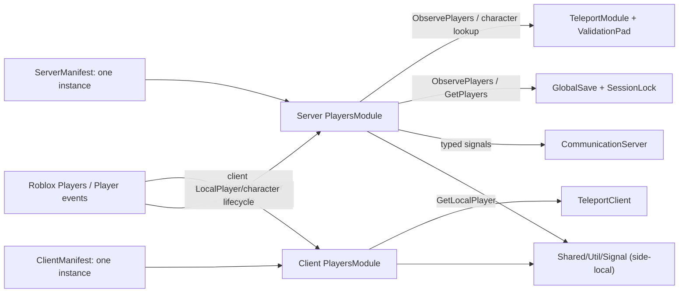

# PlayersModule Production Readiness Audit

## 1. Цель и концепция

Цель работы — доказательно установить production readiness серверного и клиентского `PlayersModule` как единственной side-specific границы Roblox player/character lifecycle. Это спецификация аудита и, только при наличии подтверждённых дефектов, минимальной ремедиации. Она не разрешает переписывать модуль ради стиля, вводить новую архитектуру или автоматически принимать замечания ревьюеров за дефекты.

Успешный результат должен одновременно доказать:

- полноту findings-first аудита всей назначенной области до первой source-правки;
- соответствие ранее согласованному публичному API и accepted architecture;
- корректность positive, negative и corner-case lifecycle-сценариев на сервере и клиенте;
- отсутствие утечек platform/character/observer resources в рамках определённого lifetime-контракта;
- единственность production instance на сторону через manifest composition при сохранении fresh injected instances для тестов;
- совместимость Save, Communication, Teleport, initialization и shutdown consumers;
- отсутствие дубликатов delivery и сверхлинейной работы относительно реально уведомляемых observers;
- успешность automated regression gates и feature-focused runtime QA без неожиданных warnings/errors.

Если полный аудит не подтверждает production-дефекты, production source остаётся без изменений. Если дефекты подтверждены, каждая правка должна быть минимальной, трассироваться к одному finding и сопровождаться regression test, который падает на доказанном старом поведении и проходит после исправления.

## 2. Контекст и границы области

### 2.1. Нормативные источники

Источники применяются в следующем порядке:

1. текущие явные указания пользователя: не переписывать модуль; замечания runtime reviewer-ов являются только hypotheses; требуется полный production-readiness аудит с impact analysis и регрессией; specification-review findings применяются как подтверждённые source clarifications в namespace `SRF-*`;
2. `docs/features/players-module/product-requirements.md`, revision 2, status `approved`, `approved_at: 2026-08-04T09:45:04Z`, exact-byte SHA-256 `9c8bb37605362347af41609892dd9714203c96e9090ba1072b0ac3b303a6e8fc`;
3. позднее подтверждённые решения текущего обсуждения о terminal lifecycle, connection-only public signal surface, dedicated client waiter и обязательном порядке audit/remediation;
4. подтверждённое обсуждение Codex task `019fa4c9-60ea-71c3-bff7-17927510b1b6`: прежний `GlobalSaveLifecycleModule` заменён полным `PlayersModule`; принят единый прямой wrapper с `GetPlayers`, `GetPlayerByUserId`, `ObservePlayers`, `PlayerAdded`, `PlayerRemoving` и existing-first delivery;
5. `.agents/rules/architecture.md`, `players.md`, `signals.md`, `initialization.md`, `testing.md`, а для regression boundaries — `save-system.md`, `communication.md`, `teleport.md`;
6. accepted template/ADR-0001, template/ADR-0005 и template/ADR-0019;
7. `docs/InitializationAndSaveSystem.md`, `docs/Signal.md`, `docs/Communication.md`, `docs/Teleport.md`, `docs/TeleportTesting.md` и `docs/TestCoverage.md`;
8. текущий authored source и executable tests как свидетельство фактического поведения, но не как основание ослаблять более высокий контракт.

При расхождении code/tests с источником более высокого приоритета фиксируется architectural drift. Текущее поведение не становится требованием только потому, что оно уже реализовано.

Documentation approval gate выполнен: PRD revision 2 утверждён в `2026-08-04T09:45:04Z`, technical specification revision 2 — в `2026-08-04T09:46:06Z`. Engineer handoff разрешён, но Luau source/test edits по-прежнему подчиняются inventory freeze и preflight gates §9.

### 2.2. Внутри области

- `src/ServerScriptService/Modules/Players/PlayersModule.luau`;
- `src/ReplicatedStorage/Client/Players/PlayersModule.luau`;
- соответствующие `PlayersInitializationCommand` и server/client manifest composition;
- публичные lookup, signal, observation и lifecycle contracts;
- platform service doubles, player doubles и connection/callback ownership в тестах;
- прямые и косвенные Players consumers, на которые может повлиять изменение контракта;
- focused tests, regression suites, clean Play и multi-client join/leave/respawn QA;
- краткое объяснение архитектурной цены wrapper-а для сопровождающего.

### 2.3. Вне области

- создание gameplay-oriented `PlayerService`;
- перенос Save, Teleport, Communication, gameplay или domain orchestration в `PlayersModule`;
- очередь или последовательный глобальный dispatcher без воспроизводимого consumer-specific ordering defect;
- аудит Teleport session continuity, DataStore, migration, communication protocol или save transaction за пределами их Players integration;
- любое изменение `Shared/Util/Signal`; Players-specific lifecycle gating и dedicated waiter принадлежат `PlayersModule`;
- оптимизация по субъективному ощущению или по искусственно выбранному численному budget;
- изменение canonical `place.rbxl`, Roblox cloud identity или scene content.

### 2.4. Установленный интеграционный baseline

Текущий source показывает один `PlayersModule.new()` в `ServerManifest` и один в `ClientManifest`. Серверный instance передаётся в `CommunicationServer`, `TeleportModule`, `TeleportValidationPad`, `GlobalSaveInitializationCommand`, `PersistenceScheduleInitializationCommand` и публикуется как `Services.Players`. Клиентский instance передаётся в `TeleportClient` и публикуется как `Services.Players`.

Прямые platform lifecycle subscriptions принадлежат side-specific `PlayersModule`. Другие обращения к Roblox `Players`, например чтение `Players.MaxPlayers` в client composition или доступ loading screen к `LocalPlayer`, сами по себе не являются дублирующей player/character lifecycle subscription и классифицируются отдельно.

### 2.5. Реестр specification-review clarifications

`SRF-*` фиксирует уже принятые clarifications этой specification и не является runtime defect namespace. Эти записи не проходят повторную evidence classification в Engineer audit. Будущие runtime findings используют только `F-*` по §5.2; исходные reviewer signals остаются `HYP-*` по §8.2.

| ID | Исходная проблема | Основание | Затронутые разделы | Статус |
|---|---|---|---|---|
| `SRF-001` | Предыдущий текст ошибочно требовал cancellation direct public-signal `Wait()` и мог расширить shared `Signal`. | Подтверждённое решение пользователя; PRD-REQ-007/013, PRD-AC-006/016. | §2.3, §4.2–§4.3, §5.1, §7.6–§7.7, §8, §9.2, §10. | Устранено в revision 2: connection-only surface, unchanged shared `Signal`, dedicated client waiter. |
| `SRF-002` | Source trace ссылался на устаревший PRD и не блокировал преждевременный Engineer handoff. | PRD revision 2 frontmatter и явное подтверждение пользователя. | Frontmatter, §2.1, TS-REQ-024, §9.5, §10. | Устранено в revision 2: exact approved trace и выполненный approval gate. |
| `SRF-003` | Characterization/test edits допускались до полного audit inventory freeze. | PRD-REQ-001/011/014, PRD-AC-001/017. | §7.8, TS-REQ-001/016/023, §8.4, §9.1–§9.3, §10. | Устранено в revision 2: read-only audit/freeze → tests → remediation → resweep → regressions. |
| `SRF-004` | Lifecycle не различал `initializing` и terminal `failed`, поэтому rollback/reentrant Stop были неоднозначны. | Подтверждённое решение пользователя; PRD-REQ-006/012, PRD-AC-014/015. | §4.2–§4.3, §5.1, §7.1/7.5/7.7, TS-REQ-008/009. | Устранено в revision 2: exact five-state lifecycle. |
| `SRF-005` | Test matrix не требовала symbol-level reuse/extend/missing mapping и опиралась на non-contract pre-initialize characterization. | Подтверждённое решение пользователя; PRD-AC-001/014–017. | §7.8, §8.3–§8.4, TS-REQ-016, §9.1–§9.2, §10. | Устранено в revision 2: pre-freeze mapping и post-freeze migration rule. |
| `SRF-006` | Разрешённые public actions и observable error contract по state были неполными. | Подтверждённое решение пользователя; PRD-REQ-006/012/013, PRD-AC-014–016. | §5.1, §7.7, TS-REQ-009/021/022, §8.3. | Устранено в revision 2: server/client state/action matrices и stable reason tokens. |
| `SRF-007` | Specification-review findings и будущие runtime audit findings использовали один `F-*` namespace. | Подтверждённое решение пользователя; PRD-AC-001. | §2.1/2.5, §5.2, §7.8, §8.1, §9.1/9.5. | Устранено в revision 2: `SRF-*` отделён от runtime `F-*`. |
| `SRF-008` | Initial `ObservePlayers` error/yield semantics оставались characterization-only и конфликтовали с `TeleportValidationPad`. | Подтверждённое решение пользователя; PRD-REQ-007, PRD-AC-006. | §4.2.3, §7.2/7.6, TS-REQ-007/010, §8.2–§8.4. | Устранено в revision 2: synchronous serial initial phase с isolated traceback errors и finite-yield caller delay. |
| `SRF-009` | Один общий preflight шаг не различал pre-freeze baseline Studio execution, первое post-freeze edit и последующие Studio operations. | Подтверждённое решение пользователя; repository `AGENTS.md`. | §9.1–§9.4, §10. | Устранено в revision 2: три явных preflight/selection gates. |
| `SRF-010` | Безусловное требование CodeGraph позволяло заявить graph-backed inventory при unavailable/uninitialized tool. | Подтверждённое решение пользователя; repository `AGENTS.md` Code intelligence. | §9.1, §9.5. | Устранено в revision 2: conditional CodeGraph и recorded `rg`/direct-read fallback. |
| `SRF-011` | Injected service types не задавали exact structural shapes и не называли допустимую invariance cast boundary. | Подтверждённое решение пользователя; PRD-REQ-008, PRD-AC-005; authored Players modules/tests/`Signal` types. | §4.2.1, §4.3.1, §8.1/8.5, §10. | Устранено в revision 2: exact connection/service/character boundaries и named narrow cast. |

## 3. Терминология и глоссарий

| Термин | Значение | Статус |
|---|---|---|
| Lifecycle boundary | Один side-specific project wrapper, который подписывается на Roblox player/character lifecycle и доставляет нормализованные side-local уведомления consumers. | Подтверждено |
| Production instance | Ровно один server или client instance, созданный соответствующим manifest composition root и инъецированный всем production consumers этой стороны. | Подтверждено как требование |
| Fresh test instance | Новый изолированный instance с injected fake, создаваемый отдельным тестом; не является вторым production owner. | Подтверждено |
| Observer | Consumer, зарегистрированный через `ObservePlayers(onAdded, onRemoving?)` и владеющий возвращённой disconnect-функцией. | Подтверждено |
| Public signal listener | Consumer, который вызывает `Connect`/`Once` у публичного side-local lifecycle signal и владеет возвращённым `Signal.Connection`. | Подтверждено |
| Existing-first delivery | Доставка игроков, которые уже присутствуют при создании observer, с последующей доставкой новых игроков без дублей и с повторной проверкой присутствия. | Подтверждено |
| Module lifetime | Интервал от успешного `Initialize` fresh instance до terminal `Stop`. Повторный `Initialize` допустим только до `Stop`; новый lifetime требует нового instance. | Подтверждено |
| Delivery | Один конечный вызов конкретного consumer callback для конкретного player/character lifecycle fact. | Подтверждено |
| Platform lookup | Вызов `GetPlayers`, `GetPlayerByUserId` или `GetPlayerFromCharacter` у injected/Roblox Players boundary. | Подтверждено |
| Finding inventory freeze | Момент, когда полный список findings, risks, допустимых решений и out-of-scope signals зафиксирован до начала source remediation. | Подтверждено |

Имена API, Luau-типы, пути и signal-поля являются signatures и определяются в decomposition/contract, а не дублируются как glossary terms.

## 4. Декомпозиция системы

### 4.1. Уровень 0 — PlayersModule lifecycle boundary

Тип: side-specific module boundary с production composition и contract verification.

Ответственность: адаптировать Roblox Players lifecycle к тестируемым lookup, observer и side-local signal contracts, не присваивая себе domain behavior consumers.

Не владеет: сохранением, телепортацией, коммуникационным протоколом, gameplay setup, очередями domain operations и межсерверным состоянием.

```text
PlayersModule lifecycle boundary (L0)
├── Server PlayersModule (L1)
│   ├── Server public contract (L2)
│   ├── Player/character tracking (L2)
│   └── ObservePlayers subscription (L2)
├── Client PlayersModule (L1)
│   ├── Client public contract (L2)
│   └── Local player/character binding (L2)
└── Production composition contract (L1)
    ├── Server manifest composition (L2)
    └── Client manifest composition (L2)

Outside L0: Roblox Players, Shared/Util/Signal, InitializationRunner,
CommunicationServer, GlobalSave, SessionLockModule, TeleportModule,
TeleportValidationPad, TeleportClient и их domain state.
```

### 4.2. Уровень 1 — Server PlayersModule

Привязка к проекту: `src/ServerScriptService/Modules/Players/PlayersModule.luau`.

Владелец жизненного цикла: server manifest создаёт один production instance; `PlayersInitializationCommand` запускает его раньше Communication и Teleport consumers.

#### 4.2.1. Server public contract

Обязательная наблюдаемая форма:

| Сигнатура | Контракт |
|---|---|
| `PlayersModule.new(playersService: ServerPlayersServiceBoundary?) -> PlayersModule` | Использует Roblox Players по умолчанию или exact structural injected double в изолированном тесте. |
| `Initialize() -> ()` | Из `fresh` атомарно проходит через `initializing`, устанавливает owner subscriptions, перечисляет current players/current characters и переходит в `active`; повторный вызов в `active` идемпотентен. Любой acquisition failure полностью откатывается в terminal `failed`; вызов из `failed`/`stopped` отклоняется. |
| `Stop() -> ()` | Terminal finalizer, а не runtime pause/restart: из любого non-terminal state прекращает новое lifecycle work, отключает platform/character connections, уничтожает module-owned signal listeners/connections и освобождает observers, callbacks и player membership references; повторный terminal cleanup идемпотентен. |
| `GetPlayers() -> { Player }` | Делегирует Players boundary и не возвращает внутреннюю mutable registry. |
| `GetPlayerByUserId(userId: number) -> Player?` | Делегирует authoritative platform lookup. |
| `GetPlayerFromCharacter(character: Model) -> Player?` | Делегирует authoritative character lookup. |
| `ObservePlayers(onAdded, onRemoving?) -> () -> ()` | Подписывает observer до enumeration, доставляет present и future players без дублей, recheck-ит presence и возвращает идемпотентный disconnect. |
| `PlayerAdded` | Connection-only `PlayersLifecycleSignal<Player>`. |
| `PlayerRemoving` | Connection-only `PlayersLifecycleSignal<Player>`. |
| `CharacterAdded` | Connection-only `PlayersLifecycleSignal<Player, Model>`. |
| `CharacterRemoving` | Connection-only `PlayersLifecycleSignal<Player, Model>`. |

`PlayersLifecycleSignal<T...>` — экспортируемая structural surface только с `Connect(callback: (T...) -> ()) -> Signal.Connection` и `Once(callback: (T...) -> ()) -> Signal.Connection`. Field может быть runtime-backed общим `Signal.Signal<T...>`, но public Players contract не экспортирует и не поддерживает `Wait`, `Fire` или `Destroy`. Доступ к самому field не является lifecycle operation; вызовы `Connect`/`Once` проверяются по state owning `PlayersModule` согласно §5.1.

Grounded structural types обязаны выражать текущие authored calls без helper API:

```luau
type DisconnectableConnection = {
	read Connected: boolean,
	Disconnect: (self: DisconnectableConnection) -> (),
}

type ConnectEvent<T...> = {
	Connect: (self: ConnectEvent<T...>, callback: (T...) -> ()) -> DisconnectableConnection,
}

type ServerPlayersServiceBoundary = {
	PlayerAdded: ConnectEvent<Player>,
	PlayerRemoving: ConnectEvent<Player>,
	GetPlayers: (self: ServerPlayersServiceBoundary) -> { Player },
	GetPlayerByUserId: (self: ServerPlayersServiceBoundary, userId: number) -> Player?,
	GetPlayerFromCharacter: (self: ServerPlayersServiceBoundary, character: Model) -> Player?,
}
```

`DisconnectableConnection` совпадает по наблюдаемой форме с authored `Signal.Connection`: readonly `Connected: boolean` и идемпотентный `Disconnect()`. Для каждого nominal `Player`, полученного через boundary, используемая character-event грань фиксирована как `UserId: number`, `Character: Model?`, `CharacterAdded: ConnectEvent<Model>` и `CharacterRemoving: ConnectEvent<Model>`; это перечень допустимых reads/subscriptions, а не замена public `Player` structural record-ом.

Grounding evidence: server/client constructor calls в соответствующих `PlayersModule.luau`; `Connection`/`Signal<T...>` exports в `src/ReplicatedStorage/Shared/Util/Signal.luau`; Signal-backed `makePlayersService` и nominal-player `makePlayer` fixture boundaries в `src/ServerScriptService/Tests/ProductionReadinessTestRunner.luau`.

`PlayersModule` должен экспортировать пригодный для consumers server contract. Публичные signal fields, `PlayersLifecycleSignal<T...>` и service boundary не могут оставаться `any`. Единственный разрешённый широкий cast внутри Players implementation называется **`PlayersServiceBoundaryCast`**: один constructor-local cast объекта `playersService or Players` к соответствующему exact structural service boundary, необходимый из-за Luau invariance/self types между Roblox Instance signals и Signal-backed fakes. Cast не может охватывать module instance, public fields, callback payloads, lookup arguments/results или character payloads. Existing test-only fixture builders могут отдельно создавать nominal `Player`/`Model` values на своей fixture boundary, но это не расширяет production cast.

Внутренние connection collections должны быть выражены как disconnectable contract, совместимый с Roblox и fake connections. Широкое допущение допустимо только в узком cast boundary, если конкретное ограничение Luau воспроизведено и записано в evidence matrix; оно не должно проникать в public payload contract.

#### 4.2.2. Player/character tracking

Ответственность:

- перед tracking подтвердить, что `GetPlayerByUserId(player.UserId)` всё ещё возвращает тот же `Player`;
- создать не более одной пары character subscriptions на tracked player;
- доставить `PlayerAdded`, затем current/future character facts без дубликата одного и того же факта;
- на player removal обеспечить необходимые character-removal semantics и отключить character connections идемпотентно;
- не удерживать player key, connection, callback или membership reference после removal/Stop;
- terminal `Stop` сначала закрывает возможность нового lifecycle work, затем освобождает все module-owned signals/connections/references так, чтобы тот же instance нельзя было активировать повторно; server Players contract не содержит wait helper и не поддерживает direct public-signal `Wait()`.

Граница: wrapper сообщает lifecycle facts, но не решает, как Save закрывает profile или Teleport завершает attempt. Порядок завершения разных consumer callbacks не гарантируется, потому что `Signal` запускает listeners независимо.

#### 4.2.3. ObservePlayers subscription

Владелец: consumer владеет возвращённой disconnect-функцией; module lifetime владеет двумя внутренними subscriptions observer-а к public signals.

Обязательные свойства:

- subscription к future signals устанавливается до `GetPlayers()` enumeration;
- per-observer membership предотвращает duplicate delivery в subscribe/enumerate race;
- каждый enumerated player recheck-ится непосредственно перед `onAdded`;
- removal очищает membership даже при отсутствии `onRemoving`;
- duplicate removal не вызывает duplicate callback;
- disconnect идемпотентен, отключает обе signal connections, очищает membership и освобождает `onAdded`/`onRemoving` references;
- terminal `Stop` делает каждый active observer inactive, отключает обе его signal connections, очищает membership и освобождает `onAdded`/`onRemoving`; возвращённый consumer disconnect после этого остаётся безопасным no-op;
- terminal `Stop` уничтожает module-owned public signal listeners/connections, поэтому active `Connect`/`Once` connections переходят в disconnected state и освобождают callback references; consumer domain cleanup при этом остаётся ответственностью consumer-а;
- callback task, уже начавший выполнять listener или observer consumer code до terminal transition, относится к consumer execution согласно template/ADR-0019: `Stop` не force-cancel-ит и не join-ит его; после teardown новый callback не начинает consumer code, а module не удерживает stored callback reference;
- initial existing-player enumeration выполняется синхронно и последовательно в coroutine вызывающего `ObservePlayers`: следующий existing player не начинает `onAdded`, пока предыдущий initial callback не завершился;
- каждый initial `onAdded` вызывается через `xpcall` с traceback handler; throw даёт диагностируемый traceback, не выходит из `ObservePlayers` и не препятствует следующему всё ещё present existing player;
- finite yield initial `onAdded` задерживает возврат `ObservePlayers` и следующие initial callbacks, но не блокирует Roblox/public-Signal publisher, потому что initial enumeration не выполняется внутри signal dispatch;
- future observer callbacks после initial phase продолжают использовать non-blocking/error-isolated shared `Signal` semantics;
- `TeleportValidationPad` может считать initial collection завершённой сразу после возврата `ObservePlayers`; эта synchronous completion boundary является regression contract.

#### 4.2.4. Взаимодействие внутри server boundary

1. Platform player add вызывает tracking, но не domain setup.
2. Tracking публикует side-local facts через общие typed signals.
3. `ObservePlayers` преобразует public player signals и snapshot enumeration в per-consumer exactly-once membership.
4. Platform player removal публикует removal fact и освобождает character ownership независимо от поведения consumers.
5. `Stop` закрывает wrapper-owned resources; consumers закрывают собственные domain operations и connections.

### 4.3. Уровень 1 — Client PlayersModule

Привязка к проекту: `src/ReplicatedStorage/Client/Players/PlayersModule.luau`.

Владелец жизненного цикла: client manifest создаёт один production instance и запускает его до `Communication` и `Teleport` commands.

#### 4.3.1. Client public contract

| Сигнатура | Контракт |
|---|---|
| `PlayersModule.new(playersService: ClientPlayersServiceBoundary?) -> ClientPlayersModule` | Использует Roblox Players или exact structural fake `{ LocalPlayer: Player? }`. |
| `Initialize() -> ()` | Из `fresh` атомарно проходит через `initializing`, привязывает local player, устанавливает character subscriptions, доставляет current character и переходит в `active`; повторный вызов в `active` идемпотентен. Любой acquisition failure полностью откатывается в terminal `failed`; вызов из `failed`/`stopped` отклоняется. |
| `Stop() -> ()` | Terminal finalizer: из любого non-terminal state прекращает новое lifecycle work, отключает character connections, завершает dedicated `WaitForCharacter` waiters terminal lifecycle error, уничтожает public signal listeners/connections, освобождает callbacks и очищает local player; повторный terminal cleanup идемпотентен. |
| `GetLocalPlayer() -> Player` | Возвращает player только в корректно initialized lifetime, иначе детерминированно отклоняет вызов. |
| `GetCharacter() -> Model?` | Возвращает current character активного local player либо `nil`. |
| `WaitForCharacter() -> Model` | Только в `active`: немедленно возвращает existing character либо регистрирует dedicated module-owned cancellation-aware waiter следующего character; при `Stop`/initialize failure завершается terminal lifecycle error. |
| `CharacterAdded` | Connection-only `PlayersLifecycleSignal<Model>`. |
| `CharacterRemoving` | Connection-only `PlayersLifecycleSignal<Model>`. |

```luau
type ClientPlayersServiceBoundary = {
	LocalPlayer: Player?,
}
```

После получения nominal `LocalPlayer` client использует ту же exact character-event грань: `Character: Model?`, `CharacterAdded: ConnectEvent<Model>` и `CharacterRemoving: ConnectEvent<Model>`, каждая subscription возвращает `DisconnectableConnection`. Client module должен экспортировать свой return/public type contract. `playersService: any?`, невыраженные public signals, неаннотированный return instance или cast за пределами `PlayersServiceBoundaryCast` не удовлетворяют type evidence.

#### 4.3.2. Local player/character binding

Ответственность:

- отсутствие `LocalPlayer` приводит к явному initialization failure, но не к ложно успешному/частично initialized состоянию;
- successful initialization устанавливает character subscriptions до current-character delivery;
- current character доставляется один раз; respawn/removal доставляются без callbacks после Stop;
- `WaitForCharacter` не должен зависеть от случайного wall-clock timing и реализуется отдельным module-owned waiter registry, а не через public lifecycle signal `Wait()`;
- каждый dedicated waiter либо возвращает character текущего `active` lifetime, либо при `Stop`/initialize failure возобновляется и завершается terminal lifecycle error; suspended waiter и module-owned callback reference не остаются;
- после `failed`/`stopped` getters, `WaitForCharacter`, `Initialize` и public-signal `Connect`/`Once` на том же instance детерминированно отклоняются; новый client lifetime создаётся только через fresh `PlayersModule.new()`.

### 4.4. Уровень 1 — Production composition contract

#### 4.4.1. Server manifest composition

Привязка к проекту: `src/ServerScriptService/Initialization/ServerManifest.luau` и server `PlayersInitializationCommand`.

Требуется доказать:

- один production constructor site;
- тот же object identity передан во все server consumers и `Services.Players`;
- `Players` command расположен до зависимых commands;
- ни один production module кроме server `PlayersModule` не подписывается напрямую на `Players.PlayerAdded`, `Players.PlayerRemoving` или player character lifecycle;
- test constructor sites не считаются production duplicates.

#### 4.4.2. Client manifest composition

Привязка к проекту: `src/ReplicatedStorage/Client/Initialization/ClientManifest.luau` и client `PlayersInitializationCommand`.

Требуется доказать:

- один production constructor site;
- тот же instance опубликован как `Services.Players` и передан `TeleportClient`;
- `Players` command расположен до client Communication/Teleport;
- чтение `Players.MaxPlayers` не смешивается с lifecycle ownership;
- других production subscriptions на local player/character lifecycle нет.

#### 4.4.3. Взаимодействие production composition

Manifest composition обеспечивает singleton-by-composition, но класс сохраняет `.new()` для тестируемости. Runtime singleton enforcement внутри constructor, module-global instance или service locator запрещены: они нарушили бы fresh-instance tests, не добавляя доказательств единственности production owner.

### 4.5. Внешние соседи L0 и impact set

| Сосед | Используемый контракт | Обязательное регрессионное доказательство |
|---|---|---|
| `CommunicationServer` | `PlayerRemoving:Connect` для `ForgetPlayer`. | Однократная очистка queue/epoch/rate state при removal; no callback after Players Stop. |
| `GlobalSaveInitializationCommand` | `ObservePlayers` для load/close, `GetPlayers` для shutdown. | Existing/join load, removal close, overlapping shutdown close без duplicate close. |
| `SessionLockModule` через `PersistenceSchedule` | `GetPlayers` в refresh worker. | Активные players перечисляются без внутренней registry и worker прекращается штатно. |
| `TeleportModule` | `ObservePlayers` для arrival/removal. | Existing arrival, join, departure exactly once, observer disconnect при Stop. |
| `TeleportValidationPad` | `ObservePlayers`, `GetPlayerFromCharacter`. | Synchronous complete initial batch on observer return, deterministic lowest UserId, isolated initial throw/finite-yield semantics, removal/recreation, idempotent Stop. |
| `TeleportClient` | `GetLocalPlayer`. | Local appearance rejection и snapshot validation используют тот же local player после bootstrap. |
| `Shared/Util/Signal` | typed side-local dispatch и connection lifecycle. | throwing/yielding listener isolation, traceback, disconnect/destroy contracts в `SystemTestRunner`. |
| Server/client manifests | construction, ordering, injection. | По одному identity на сторону и полный constructor/consumer inventory. |

Regression scope не разрешает менять внутреннюю domain-логику этих соседей, если их contract с `PlayersModule` не нарушен.

## 5. Модели данных

### 5.1. Production runtime state

`PlayersModule` не владеет persisted data или config.

Канонические lifecycle errors — Luau errors с устойчивым reason token: `PlayersModuleNotInitialized` для запрещённой операции в `fresh`, `PlayersModuleInitializing` для reentrant операции в `initializing` и `PlayersModuleTerminal` для `failed`/`stopped`, aborted `Initialize` и завершения dedicated waiter. Source-location prefix Luau не является частью token. Сам `Initialize`, завершившийся acquisition failure, передаёт исходную диагностируемую cause вызывающей coroutine после rollback; все последующие операции используют `PlayersModuleTerminal`.

| State | Вход | Owned state и выход |
|---|---|---|
| `fresh` | Успешный `.new()` | Нет приобретённых platform/character subscriptions, observers или dedicated waiters; только lifecycle-aware public signal fields. `Initialize` → `initializing`; `Stop` → `stopped`. |
| `initializing` | Единственный разрешённый `Initialize` из `fresh` | Каждое приобретение немедленно регистрируется для rollback. Полный success → `active`; любой acquisition failure → полный rollback → terminal `failed`; `Stop` → `stopped`, а выполняющийся `Initialize` обязан обнаружить terminal transition, unwind/abort и не перейти в `active`. |
| `active` | Полностью успешный `Initialize` | Side-specific normal operations разрешены. Повторный `Initialize` no-op; `Stop` → `stopped`. |
| `failed` | Любой initialization acquisition failure после полного rollback | Terminal state. `Stop` повторяет безопасный cleanup и оставляет state terminal `failed` (либо эквивалентный terminal state без разрешения нового lifetime); новый lifetime требует fresh instance. |
| `stopped` | `Stop` из `fresh`, `initializing` или `active` | Terminal state без module-owned connections/listeners/observers/waiters/player references. Только повторный `Stop` разрешён как no-op; новый lifetime требует fresh instance. |

#### 5.1.1. Server state/action matrix

| State | `Initialize` | `Stop` | Lookup helpers | `ObservePlayers` | Public signal `Connect`/`Once` |
|---|---|---|---|---|---|
| `fresh` | Начинает единственный initialization attempt. | Переходит в `stopped`, идемпотентно подтверждая отсутствие acquired resources. | `PlayersModuleNotInitialized`. | `PlayersModuleNotInitialized`. | `PlayersModuleNotInitialized`. |
| `initializing` | `PlayersModuleInitializing`; reentrant initialization запрещён. | Переходит в `stopped`; текущий `Initialize` unwind/abort с `PlayersModuleTerminal`. | `PlayersModuleInitializing`. | `PlayersModuleInitializing`. | `PlayersModuleInitializing`. |
| `active` | Идемпотентный no-op. | Выполняет terminal cleanup и переходит в `stopped`. | Разрешены согласно §4.2.1. | Разрешён согласно §4.2.3. | Разрешены; возвращают owned `Signal.Connection`. |
| `failed` | `PlayersModuleTerminal`. | Идемпотентный cleanup; state остаётся terminal. | `PlayersModuleTerminal`. | `PlayersModuleTerminal`. | `PlayersModuleTerminal`. |
| `stopped` | `PlayersModuleTerminal`. | Идемпотентный no-op. | `PlayersModuleTerminal`. | `PlayersModuleTerminal`. | `PlayersModuleTerminal`. |

#### 5.1.2. Client state/action matrix

| State | `Initialize` | `Stop` | `GetLocalPlayer`/`GetCharacter` | `WaitForCharacter` | Public signal `Connect`/`Once` |
|---|---|---|---|---|---|
| `fresh` | Начинает единственный initialization attempt. | Переходит в `stopped`, идемпотентно подтверждая отсутствие acquired resources. | `PlayersModuleNotInitialized`. | `PlayersModuleNotInitialized`. | `PlayersModuleNotInitialized`. |
| `initializing` | `PlayersModuleInitializing`; reentrant initialization запрещён. | Переходит в `stopped`; текущий `Initialize` unwind/abort с `PlayersModuleTerminal`. | `PlayersModuleInitializing`. | `PlayersModuleInitializing`. | `PlayersModuleInitializing`. |
| `active` | Идемпотентный no-op. | Завершает dedicated waiters, выполняет terminal cleanup и переходит в `stopped`. | Разрешены согласно §4.3.1. | Возвращает current/next character согласно §4.3.2. | Разрешены; возвращают owned `Signal.Connection`. |
| `failed` | `PlayersModuleTerminal`. | Идемпотентный cleanup; state остаётся terminal. | `PlayersModuleTerminal`. | `PlayersModuleTerminal`. | `PlayersModuleTerminal`. |
| `stopped` | `PlayersModuleTerminal`. | Идемпотентный no-op. | `PlayersModuleTerminal`. | `PlayersModuleTerminal`. | `PlayersModuleTerminal`. |

Public signal field access не является operation и допустим в любом state; вызов `Connect`/`Once` через полученную surface подчиняется текущему state owning module. `Wait`, `Fire` и `Destroy` отсутствуют в public Players surface независимо от state.

| Владелец | Runtime resources | Инвариант |
|---|---|---|
| Server PlayersModule | Owner platform connections; player → character connections; four lifecycle-aware public signal surfaces/backing signals | Нет connection/player/callback retention после removal/terminal cleanup; никакой state не возвращается в `fresh`/`active` после terminal transition. |
| Server observer | Player membership; two internal signal connections; callback references | Один active membership на player; disconnect и terminal cleanup освобождают references идемпотентно. |
| Client PlayersModule | Local player; two character connections; two lifecycle-aware public signal surfaces/backing signals; dedicated `WaitForCharacter` waiter registry | Partial initialization не считается success; каждый waiter завершается character либо `PlayersModuleTerminal`; terminal cleanup не допускает повторной активации instance. |
| Consumers | Save/Teleport/Communication/domain state; уже начатые callback tasks | Не хранится и не мутируется `PlayersModule`; consumer сам отменяет/завершает собственную yielded work. |

### 5.2. Запись аудиторского доказательства

Для каждого candidate signal и каждого нового finding ведётся одна запись:

| Поле | Содержание |
|---|---|
| `id` | Стабильный `HYP-*` или `F-*`. |
| `classification` | `confirmed-defect`, `confirmed-risk-or-test-gap`, `accepted-architecture`, `out-of-scope`. |
| `authority` | Точное правило, PRD/ADR/doc contract. |
| `code_evidence` | Path + line/symbol на frozen source revision. |
| `observable_evidence` | Test ID, counters, diagnostic или runtime reproduction. |
| `impact_set` | Consumers/tests/paths, которые могут измениться. |
| `remediation` | `none` либо минимальное исправление; не проектируется до inventory freeze. |
| `verification` | Regression tests и runtime gates. |

Запись без authority, code evidence и observable evidence не может иметь classification `confirmed-defect`.

### 5.3. Запись доказательства производительности

Instrumented fake фиксирует по scenario и observer count:

- platform connection count;
- `GetPlayers` calls;
- `GetPlayerByUserId` calls;
- `GetPlayerFromCharacter` calls;
- public `Signal:Fire` count;
- scheduled listener task count;
- конечные `onAdded`/`onRemoving`/character callback counts;
- retained active connections/callback references после cleanup.

Измерения выполняются для `0`, `1` и нескольких observers, а также для нескольких existing players. Численный latency/memory budget не вводится. Условие прохождения — отсутствие duplicate delivery, отсутствие retained resources и линейный рост работы относительно реально уведомляемых observers/players. Дополнительный lookup или scheduled task является дефектом только при доказанной ненужности либо сверхлинейности; race-safety и `Signal` semantics имеют приоритет перед микрооптимизацией.

## 6. Диаграмма системы



`Signal` на диаграмме не пересекает client/server boundary. Manifest arrows означают composition/injection, а не скрытый global lookup.

## 7. Поведенческие потоки

### 7.1. Server initialization и existing players

1. Server manifest создаёт один `PlayersModule` и передаёт тот же identity consumers.
2. `PlayersInitializationCommand` вызывает `Initialize` на fresh instance; stopped instance в этом потоке не переиспользуется.
3. Module полностью инициализирует platform add/remove subscriptions до enumeration.
4. Для каждого current player module повторно подтверждает membership, устанавливает не более одной пары character subscriptions и публикует current player/current character facts.
5. Повторный `Initialize` внутри активного lifetime ничего не дублирует.
6. Каждое acquisition регистрируется до следующего потенциально failing/yielding шага. Любая ошибка отключает все ранее приобретённые connections/listeners, очищает tracked references, переводит instance в terminal `failed` и передаёт исходную cause вызывающей coroutine.
7. `Stop` во время `initializing` переводит state в `stopped`; `Initialize` unwind-ит приобретённое, завершается `PlayersModuleTerminal` и не может позднее опубликовать fact либо перейти в `active`.

### 7.2. Поздний `ObservePlayers`

1. Создаётся empty per-observer membership.
2. Observer подключается к `PlayerAdded` и `PlayerRemoving` до enumeration.
3. `GetPlayers` возвращает snapshot.
4. Перед каждым `onAdded` выполняется same-object presence recheck.
5. Join, возникший между subscription и enumeration, даёт максимум один delivery.
6. Player, ушедший до своего enumeration turn, не доставляется.
7. Для каждого всё ещё present existing player `onAdded` выполняется serially в caller coroutine через `xpcall`: throw диагностируется traceback и enumeration продолжается; finite yield задерживает caller и следующий initial callback.
8. Параллельный platform/public-Signal publisher остаётся non-blocking, потому что initial callback не исполняется в его dispatch task.
9. Removal очищает membership даже без `onRemoving`.
10. Consumer disconnect либо module Stop делает observer inactive, отключает internal connections и освобождает callbacks.

### 7.3. Join и character lifecycle

1. Platform add поступает только server wrapper-у.
2. Stale/duplicate player отклоняется до создания duplicate connections.
3. `PlayerAdded` публикуется один раз на tracked presence.
4. Existing character и будущие spawn/respawn доставляются как `(player, character)`.
5. Character removal освобождает только character-bound consumer state; wrapper не запускает gameplay.
6. Race между `CharacterAdded` subscription и current `player.Character` check не должен дублировать один character fact.

### 7.4. Leave и повторная cleanup

1. При фактическом player removal wrapper публикует необходимый current-character removal fact не более одного раза.
2. Затем публикуется player removal fact.
3. Per-player character connections отключаются и удаляются.
4. Observer membership удаляется независимо от наличия removal callback.
5. Повторный removal/cleanup не создаёт second delivery и не бросает ошибку.
6. Save, Communication и Teleport independently выполняют собственную идемпотентную cleanup; wrapper не ожидает их завершения и не задаёт cross-listener order.

### 7.5. Client initialization и respawn

1. Fresh client wrapper читает injected/Roblox `LocalPlayer`; terminally stopped instance не переиспользуется.
2. При `nil` или любом следующем acquisition failure initialization полностью откатывается, переводит instance в terminal `failed` и передаёт исходную cause без retained connections/listeners/waiters.
3. При наличии player wrapper устанавливает character subscriptions и публикует existing character, если он уже есть.
4. Removal и следующий character spawn доставляются через typed client signals.
5. `WaitForCharacter` немедленно возвращает current character либо регистрирует dedicated cancellation-aware waiter next add в active lifetime; public signal `Wait()` для этого не используется.
6. Повторный `Initialize` в active lifetime не создаёт duplicate connections/delivery.
7. После terminal `Stop` platform events не вызывают lifecycle callbacks, а новый lifetime требует fresh client instance.

### 7.6. Listener isolation

1. Внутренний backing `Signal:Fire` snapshots active `Connect`/`Once` listeners и независимо schedules каждый listener в registration order; `Fire` и `Wait` не входят в consumer-visible Players signal surface.
2. Yield одного listener не приостанавливает publisher и не мешает запуску остальных.
3. Throw одного listener создаёт ожидаемый traceback diagnostic и не подавляет последующих listeners.
4. `PlayersModule` не добавляет redundant `pcall` вокруг `Signal:Fire`.
5. Initial callbacks `ObservePlayers` не являются Signal dispatch: они выполняются synchronously/serially в caller coroutine через `xpcall`; throw изолируется с traceback и не прерывает subsequent existing players, а finite yield намеренно задерживает caller и subsequent initial callback.
6. Future observer callbacks используют shared `Signal` и потому остаются independently scheduled, non-blocking и error-isolated как остальные `Connect`/`Once` listeners.
7. Callback task, начавший consumer code до terminal transition, не force-cancel-ится и не join-ится module-ом; consumer владеет cancellation своей yielded work. Lifecycle gate запрещает task, ещё не начавшему consumer code к моменту teardown, начать его после teardown.

### 7.7. Terminal Stop и новый instance

1. `Stop` не вызывается в normal server/client operation; если он вызван, module сначала атомарно переходит в terminal state и больше не принимает новое lifecycle work.
2. Module отключает все owner platform и per-player/per-character connections.
3. Module деактивирует каждый `ObservePlayers`, отключает его internal signal connections, очищает membership и освобождает callback references; public `Connect`/`Once` connections также отключаются с освобождением stored callback references.
4. Client module возобновляет все pending dedicated `WaitForCharacter` waiters с `PlayersModuleTerminal`; server public contract не имеет waiter-а, а public lifecycle signals на обеих сторонах не поддерживают `Wait()`.
5. Module уничтожает backing signals и очищает player/local-player/membership/waiter references, не меняя `Shared/Util/Signal`.
6. Повторный `Stop` является безопасным no-op и не повторяет cleanup/delivery.
7. Все public operations того же stopped instance, кроме повторного `Stop`, отклоняются `PlayersModuleTerminal`; public signal field можно прочитать, но его `Connect`/`Once` также отклоняются.
8. Новый lifetime начинается только с fresh `PlayersModule.new()`; его первый `Initialize` полностью устанавливает platform subscriptions и перечисляет/доставляет current player/current character state.
9. Consumer-owned domain cleanup и уже начатая listener/observer callback work остаются ответственностью consumer-а, хотя module-owned subscription objects и stored callback references не переживают terminal `Stop`.

### 7.8. Findings-first аудит и ремедиация

1. Зафиксировать source SHA/status и выполнить полный read-only audit server/client modules, manifests, commands, consumers, test doubles и существующих tests.
2. Сформировать полный path/symbol/constructor/subscription/consumer impact inventory и проверить static contract, все state/action transitions, ownership, error, performance и test gaps.
3. Только запускать существующие baseline suites и читать их source; Luau test/characterization edit до freeze запрещён.
4. Сопоставить каждый `PL-*` с точным существующим test file/suite/symbol и status `reuse`, `extend` либо `genuinely-missing`.
5. Присвоить classification каждой `HYP-*` и каждому новому runtime `F-*`; `SRF-*` остаются закрытыми source clarifications и не классифицируются повторно. Для confirmed runtime defect определить impact set и failing Test ID.
6. Заморозить полный finding/impact/test-mapping inventory. До этого момента запрещена любая Luau source edit, включая tests.
7. После freeze сначала добавить/расширить необходимое test coverage, затем одним minimal batch исправить только confirmed production defects.
8. После remediation выполнить полный read-only resweep исходного scope, а затем focused, integration, aggregate и runtime regressions на одном recorded source state.

## 8. Ограничения реализации и проверяемые требования

### 8.1. Нормативные требования аудита

- **TS-REQ-001:** До любой Luau source-правки, включая characterization/regression tests, должен существовать замороженный полный read-only finding/impact/test-mapping inventory для server/client modules, public types, lifecycle, observers, manifests, consumers и tests.
- **TS-REQ-002:** Каждая исходная reviewer hypothesis должна получить ровно одну evidence-backed classification по модели §5.2.
- **TS-REQ-003:** Аудит не прекращается после первого finding и повторно проверяет всю область после remediation.
- **TS-REQ-004:** Production composition создаёт ровно один Players wrapper на сторону; `.new()` остаётся доступным fresh injected tests.
- **TS-REQ-005:** Server public signal payloads и Players service dependency имеют узкие static contracts; public lifecycle signals экспортируют только `Connect`/`Once` и connection contract, а необоснованный `any` не допускается.
- **TS-REQ-006:** Client module экспортирует узкий public type, connection-only typed character signals/service dependency и отдельный cancellation-aware `WaitForCharacter` contract.
- **TS-REQ-007:** `ObservePlayers` выполняет subscribe-before-enumerate, presence recheck, per-observer deduplication, removal membership cleanup и idempotent disconnect. Initial existing players доставляются synchronous/serial caller phase через per-callback `xpcall` с traceback isolation; future callbacks используют shared Signal dispatch.
- **TS-REQ-008:** Terminal `Stop` идемпотентно освобождает все platform/character connections, observers, public `Connect`/`Once` connections, backing signals, stored callbacks, memberships, player references и dedicated client waiters. Уже начавшая consumer code callback work не прерывается и не join-ится, но ни один новый callback не начинает consumer code после teardown.
- **TS-REQ-009:** Server и client строго реализуют state/action matrices §5.1: полный initialization success ведёт в `active`; любой acquisition failure полностью откатывается в terminal `failed`; `Stop` во время `initializing` заставляет `Initialize` unwind/abort; `failed`/`stopped` нельзя использовать для нового lifetime.
- **TS-REQ-010:** Public lifecycle `Connect`/`Once` listeners и future observer callbacks наследуют non-blocking/error-isolation contract неизменённого общего `Signal`; initial `ObservePlayers` enumeration отдельно сохраняет synchronous serial caller semantics с `xpcall`/traceback isolation. Players wrapper добавляет owning-lifecycle gate и не меняет shared dispatch policy.
- **TS-REQ-011:** Cross-listener completion order не гарантируется; последовательные domain operations объединяются в одном consumer workflow.
- **TS-REQ-012:** Нет отдельной глобальной lifecycle queue; её отсутствие не является дефектом без воспроизводимого consumer contract violation.
- **TS-REQ-013:** Performance verdict опирается на counters §5.3 и linear/no-duplicate behavior, а не на выдуманный latency budget.
- **TS-REQ-014:** Любая production remediation минимальна, сохраняет public API/centralized boundary и трассируется к confirmed finding.
- **TS-REQ-015:** Каждый изменённый contract проверяется всеми consumers §4.5 и соответствующими regression suites.
- **TS-REQ-016:** Tests используют public contracts, fresh instances, injected fakes, finite timeouts и failure-safe cleanup; они не утверждают private table layout. До test edits каждый `PL-*` обязан иметь exact existing test file/suite/symbol mapping и status `reuse`, `extend` либо `genuinely-missing`.
- **TS-REQ-017:** Expected listener failure diagnostic явно утверждается тестом; любой другой warning/error проваливает gate.
- **TS-REQ-018:** Архитектурная сложность считается оправданной только если новый разработчик может по manifest, public API, rules и focused tests определить ownership и cleanup без изучения Save/Teleport internals.
- **TS-REQ-019:** Если source change меняет durable public lifecycle/ownership contract или противоречит Accepted ADR, Engineer останавливает локальную ремедиацию и следует architecture-decision workflow; локальный bug fix, сохраняющий decision, не создаёт новый ADR автоматически.
- **TS-REQ-020:** Финальный production-ready verdict запрещён при незакрытом blocking finding, непройденном обязательном gate или незафиксированной причине omitted conditional check.
- **TS-REQ-021:** Direct `Wait()` на public lifecycle signals не поддерживается и отсутствует в exported Players signal surface; единственный Players-specific wait helper — client `WaitForCharacter` с dedicated module-owned waiter registry и `PlayersModuleTerminal` на `Stop`/initialize failure.
- **TS-REQ-022:** Public signal field access сам по себе не является operation; `Connect`/`Once` проверяют owning module state. Fresh/reentrant/terminal error tokens и разрешённые действия соответствуют §5.1 без альтернативного implicit behavior.
- **TS-REQ-023:** После inventory freeze phase order неизменяем: необходимое test coverage → минимальная production remediation → полный read-only resweep исходного scope → все обязательные regressions.
- **TS-REQ-024:** Engineer handoff запрещён, пока PRD revision 2 и technical specification revision 2 не утверждены явно; status `draft` либо `approved_at: null` является blocking documentation gate.
- **TS-REQ-025:** `SRF-*` является закрытым specification-review/source-clarification registry и не получает runtime classification; Engineer создаёт evidence-backed runtime findings только в `F-*`, а исходные reviewer hypotheses классифицирует в `HYP-*`.
- **TS-REQ-026:** Initial existing-player phase `ObservePlayers` synchronous и serial в caller coroutine, изолирует каждый throw через `xpcall`/traceback и продолжает enumeration; finite yield задерживает caller/следующий initial callback, но не platform/Signal publisher; `TeleportValidationPad` видит complete collection после возврата.
- **TS-REQ-027:** Три preflight gates §9.1–§9.4 независимы: pre-freeze baseline Studio execution с explicit canonical selection; post-freeze непосредственно перед first Luau edit; повторный preflight/selection перед первой subsequent Studio operation.
- **TS-REQ-028:** CodeGraph используется только при available+initialized state; иначе полный `rg`/direct-read fallback и limitation record обязательны, а graph-backed claims запрещены.
- **TS-REQ-029:** Injected services и character event access соответствуют exact structural shapes §4.2.1/§4.3.1; единственный production broad cast — named constructor-local `PlayersServiceBoundaryCast`, public payload/getter types остаются nominal `Player`/`Model`.

### 8.2. Reviewer hypotheses и критерии классификации

| ID | Исходный сигнал | Требуемое доказательство и правило классификации |
|---|---|---|
| `HYP-001` | `any` в signals/service contract | Confirmed defect, если connection-only `PlayersLifecycleSignal<T...>`/structural service type выражает контракт и negative static fixture показывает потерю проверки. Ограничение допустимо только при воспроизведённом Luau limitation и узком cast boundary. |
| `HYP-002` | Класс допускает несколько instances | Accepted architecture, если static composition доказывает один production constructor site на сторону и fresh test sites изолированы. Defect только при втором production owner или второй прямой platform lifecycle subscription. |
| `HYP-003` | `Stop` + `ObservePlayers` удерживает resources | Confirmed defect, если после terminal `Stop` остаётся active internal/public-signal/observer connection, stored callback, membership, player reference или dedicated client waiter либо прежний observer получает delivery. Уже начатая consumer work не считается module leak; тот же instance не может создавать новый lifetime. |
| `HYP-004` | Лишние накладные расходы delivery path | Confirmed defect только для duplicate/superlinear/unjustified work по §5.3. Один race-safety lookup и один task на фактически вызываемый Signal listener не объявляются дефектом без сравнимого безопасного варианта. |
| `HYP-005` | Нет обработки ошибок callbacks | Future `self.*:Fire` проверяется против template/ADR-0019 и shared `Signal` tests; redundant local protection и изменение shared Signal запрещены. Initial existing-player `onAdded` обязан иметь отдельный per-callback `xpcall`/traceback isolation; отсутствие этого observable behavior является runtime defect. |
| `HYP-006` | Нет очередности событий | Accepted architecture/out of scope, пока нет конкретного sequential consumer contract и reproduction. `Signal` намеренно non-blocking; порядок зависимых операций принадлежит одному domain workflow. |
| `HYP-007` | Нет отдельного `PlayerService` | Out of scope и противоречит template/ADR-0005, если подразумевает перенос Save/gameplay/domain behavior. Может стать отдельной feature только по новым product requirements. |
| `HYP-008` | Абстракция увеличивает сложность | Accepted tradeoff при прохождении onboarding criterion `TS-REQ-018`; иначе `confirmed-risk-or-test-gap`, но не разрешение переписать runtime boundary. |

### 8.3. Positive, negative и corner-case test matrix

| ID теста | Тип | Сценарий | Наблюдаемый результат |
|---|---|---|---|
| `PL-S-001` | Позитивный | Server Initialize с existing player без character | Один `PlayerAdded`; одна пара character connections; повторный Initialize ничего не дублирует. |
| `PL-S-002` | Позитивный | Existing player с existing character | По одному player add и character add для этого presence/character. |
| `PL-S-003` | Позитивный | Join после Initialize | Один public signal delivery и один `onAdded` на active observer. |
| `PL-S-004` | Позитивный | Character spawn, removal, respawn | Payload `(Player, Model)` точен; каждый факт доставлен один раз. |
| `PL-S-005` | Позитивный | Player leave с current character | Требуемые character/player removal facts и полная character cleanup. |
| `PL-S-006` | Позитивный | Все lookup helpers в `active` | Результаты совпадают с injected service; absent value даёт `nil`. |
| `PL-O-001` | Позитивный | Late observer после `Initialize` при нескольких present players | Каждый всё ещё present player доставлен ровно один раз до steady-state use. |
| `PL-O-002` | Позитивный | Observer с/без `onRemoving` | Membership очищается в обеих ветках; последующий valid re-add доставляется. |
| `PL-O-003` | Негативный | Consumer disconnect дважды | Нет ошибки, callbacks после disconnect отсутствуют, references освобождены. |
| `PL-O-004` | Корнер-кейс | Add между signal subscription и enumeration | Ровно один `onAdded`; текущий System race test сохраняется. |
| `PL-O-005` | Корнер-кейс | Leave во время enumeration | Ушедший player не доставляется. |
| `PL-O-006` | Корнер-кейс | Duplicate add/remove facts | Нет duplicate membership delivery или duplicate cleanup. |
| `PL-O-007` | Корнер-кейс | Несколько observers, один отключается в callback | Отключённый observer не получает future delivery; остальные независимы. |
| `PL-O-008` | Негативный | Invalid/missing `onAdded` | Детерминированное contract failure до retained connections. |
| `PL-O-009` | Негативный | Несколько existing players; первый initial `onAdded` throws | Первый throw даёт утверждённый traceback diagnostic; `ObservePlayers` не бросает наружу и serially доставляет каждого следующего всё ещё present player ровно один раз. |
| `PL-O-010` | Корнер-кейс | Первый initial `onAdded` yield-ит на manually controlled coroutine gate при нескольких existing players; параллельно возникает platform/public-Signal event | Возврат `ObservePlayers` и следующий initial callback задержаны до explicit resume; publisher и future Signal dispatch не блокируются; после resume initial order завершается serially без wall-clock timing и дублей. |
| `PL-L-001` | Негативный | Server Stop дважды, затем platform add/remove/character events | Нет новых lifecycle callbacks; platform/character connection counters на baseline. |
| `PL-L-002` | Корнер-кейс | Stop с active observers/public listeners, затем late consumer disconnect | Все module-owned subscriptions, memberships и callback references освобождены; late disconnect безопасен и идемпотентен. |
| `PL-L-003` | Корнер-кейс | Stop → Initialize того же instance; затем Initialize fresh instance с current player/character | Старый instance детерминированно отклоняет Initialize; fresh instance полностью инициализируется и доставляет current player/current character ровно один раз. |
| `PL-L-004` | Негативный | Failure после каждого server initialization acquisition | Каждая ранее acquired connection/listener отключена; state `failed`; исходная cause передана; все последующие operations кроме `Stop` дают `PlayersModuleTerminal`; fresh instance независим. |
| `PL-L-005` | Негативный | Active public `Connect`/`Once` listeners, затем Stop и late connection disconnect | Connections уничтожены, stored callbacks освобождены, late disconnect безопасен, новый callback после teardown не начинается; shared Signal source/semantics не меняются. |
| `PL-L-006` | Негативный | Server `fresh`: lookup/observer/`Connect`/`Once`; затем Stop дважды | До Stop каждая запрещённая operation даёт `PlayersModuleNotInitialized`; первый Stop → `stopped`, второй no-op. |
| `PL-L-007` | Корнер-кейс | Server `initializing`: reentrant public operations и Stop между acquisition points | Reentrant operations дают `PlayersModuleInitializing`; Stop переводит в `stopped`; Initialize unwind-ит всё acquired и завершается `PlayersModuleTerminal`, не публикуя late facts. |
| `PL-L-008` | Негативный | Server `failed`: исчерпывающий вызов Initialize/lookups/observer/`Connect`/`Once`/Stop | Только Stop безопасен и идемпотентен; остальные operations дают `PlayersModuleTerminal`; retained resources равны нулю. |
| `PL-L-009` | Негативный | Server `stopped`: исчерпывающий вызов Initialize/lookups/observer/`Connect`/`Once`/Stop | Только Stop является no-op; остальные operations дают `PlayersModuleTerminal`; field access не вызывает operation. |
| `PL-L-010` | Корнер-кейс | Public listener/observer callback уже начал и yield-ит до Stop; другой callback scheduled, но ещё не начал consumer code | Уже начатая work остаётся consumer-owned и не join-ится; scheduled callback не начинает consumer code после teardown; module не удерживает stored references. |
| `PL-C-001` | Позитивный | Client existing LocalPlayer и existing character | Один character add; getters возвращают current values. |
| `PL-C-002` | Позитивный | Client character removal и respawn | По одному typed removal/add; `WaitForCharacter` с existing value возвращает немедленно. |
| `PL-C-003` | Позитивный | `WaitForCharacter` до next spawn | Waiter завершается точным spawned Model без wall-clock race. |
| `PL-C-004` | Негативный | `LocalPlayer == nil` | `Initialize` передаёт исходную cause, полностью откатывается в `failed`; последующие operations дают `PlayersModuleTerminal`; retained resources отсутствуют. |
| `PL-C-005` | Негативный | Повторный Initialize в active lifetime | Нет duplicate character connections/delivery. |
| `PL-C-006` | Негативный | Client Stop дважды, затем character event/getter | Нет callback; LocalPlayer и module-owned resources очищены; повторный Stop no-op; getter детерминированно отклоняется. |
| `PL-C-007` | Корнер-кейс | Pending dedicated `WaitForCharacter` пересекает Stop; затем Initialize старого и fresh instance | Waiter возобновляется с `PlayersModuleTerminal` без suspended coroutine; старый instance отклоняет operations; fresh instance доставляет existing local character один раз. Public signal `Wait()` не используется. |
| `PL-C-008` | Негативный | Failure после каждого client initialization acquisition | Все ранее acquired connections/listeners/waiters освобождены; state `failed`; исходная cause передана; fresh instance независим. |
| `PL-C-009` | Негативный | Client `fresh`: getters/WaitForCharacter/`Connect`/`Once`; затем Stop дважды | До Stop operations дают `PlayersModuleNotInitialized`; первый Stop → `stopped`, второй no-op. |
| `PL-C-010` | Корнер-кейс | Client `initializing`: reentrant public operations и Stop между acquisition points | Reentrant operations дают `PlayersModuleInitializing`; Stop переводит в `stopped`; Initialize unwind-ит всё acquired и завершается `PlayersModuleTerminal`. |
| `PL-C-011` | Негативный | Client `failed` и `stopped`: исчерпывающий public action matrix | Только Stop безопасен/идемпотентен; остальные operations и `Connect`/`Once` дают `PlayersModuleTerminal`; field access разрешён. |
| `PL-C-012` | Корнер-кейс | Callback уже начал и yield-ит до Stop; другой callback scheduled, но ещё не начал consumer code | Уже начатая work остаётся consumer-owned и не join-ится; scheduled callback не начинает consumer code после teardown; module не удерживает stored references. |
| `PL-R-001` | Корнер-кейс | Character spawn между subscription и current-character check | Один fact для одного Model, не два. |
| `PL-R-002` | Корнер-кейс | CharacterRemoving уже доставлен, затем PlayerRemoving при stale `player.Character` | Один domain character-removal fact и idempotent cleanup. |
| `PL-R-003` | Корнер-кейс | Stale Player object с совпадающим/заменённым UserId | Same-object recheck не доставляет stale presence и не снимает ownership нового object. |
| `PL-SIG-001` | Негативный | Один public `Connect`/`Once` listener бросает | Traceback diagnostic ожидаем и утверждён; следующий listener запускается. |
| `PL-SIG-002` | Корнер-кейс | Один public `Connect`/`Once` listener yield-ит | Publisher и другие listeners не блокируются. |
| `PL-SIG-003` | Корнер-кейс | Shared Signal Disconnect/Once/Destroy во время dispatch | Общий Signal contract остаётся зелёным; wrapper не меняет его semantics, а consumer-visible Players surface не экспортирует `Destroy`. |
| `PL-PERF-001` | Граничный | Join при 0/1/N observers | Deliveries не более N; lookup/task growth линейный; все counts записаны. |
| `PL-PERF-002` | Граничный | M existing players при 0/1/N observers | Каждый observer получает максимум M; нет duplicate/superlinear hidden pass. |
| `PL-PERF-003` | Граничный | Leave/cleanup при 0/1/N observers | Removal deliveries не более active memberships; retained count после cleanup равен нулю. |
| `PL-I-001` | Интеграционный | GlobalSave existing/join/removal/shutdown | Load один раз, Close single-flight, shutdown uses current `GetPlayers`; save ordering не меняется. |
| `PL-I-002` | Интеграционный | Communication player removal | `ForgetPlayer` очищает state один раз; duplicate cleanup безопасна. |
| `PL-I-003` | Интеграционный | Teleport existing/join/removal | Arrival/departure один раз; Stop observer cleanup; target arrival semantics не меняются. |
| `PL-I-004` | Интеграционный | ValidationPad initial players/removal/touch lookup | Initial collection deterministic, lowest UserId stable, no duplicate pad, Stop clean. |
| `PL-I-005` | Интеграционный | TeleportClient snapshot/appearance | `GetLocalPlayer` identity корректно исключает local appearance до/после bootstrap. |
| `PL-I-006` | Интеграционный | TeleportValidationPad initial collection через `ObservePlayers` | Сразу после возврата observer-а synchronous initial collection полна, deterministic lowest UserId выбран как раньше; isolated throw/finite yield semantics не создают duplicate pad или premature completion. |
| `PL-M-001` | Статический | Constructor/subscription inventory | Один production `.new()` на сторону; нет запрещённых direct lifecycle subscriptions. |
| `PL-T-001` | Статический | Public type contract | Typed signal/service payloads и `Connect`/`Once` проходят Script Analysis; `Wait`/`Fire`/`Destroy` недоступны через exported Players surface; incompatible callback/payload обнаруживается там, где Luau это поддерживает. |
| `PL-T-002` | Статический позитивный | Exact server/client injected doubles и connection/character boundaries | Positive fixture принимает все shapes §4.2.1/§4.3.1 без broad public/payload cast; getters и callbacks сохраняют nominal `Player`/`Model`. |
| `PL-T-003` | Статический негативный | По одному mismatch для connection, callback arity/payload, lookup self/arg/result, LocalPlayer, character event и запрещённых public signal methods | Каждый fixture case даёт ожидаемую Luau diagnostic; source scan находит production broad cast только в named `PlayersServiceBoundaryCast`. |
| `PL-DOC-001` | Сопровождаемость | Новый разработчик проходит ownership trace | По четырём источникам — manifest, public API, rules, focused tests — правильно определяет owner, disconnect и место domain sequencing. |

Каждый test использует `TestHarness`, finite timeout и `scope:Defer` для Connections, Signals, Instances и fakes. Instrumentation остаётся test-only и не добавляет production counters/API.

### 8.4. Размещение test coverage

До inventory freeze audit создаёт для каждого `PL-*` одну read-only mapping row: `PL ID → exact repository-relative test file → suite/describe symbol → test symbol/name → reuse|extend|genuinely-missing → finding/requirement`. `extend` означает, что существующий symbol сохраняется и после freeze получает недостающее assertion/scenario; `genuinely-missing` разрешает новый test только после доказанного отсутствия подходящего symbol. Ни один test нельзя добавлять только по абстрактной строке матрицы без этого поиска и классификации.

- `SystemTestRunner`: общий `Signal` contract; `ObservePlayers` subscribe/enumerate/removal races; static-like public behavior, не зависящее от real Players.
- `ProductionReadinessTestRunner`: server/client PlayersModule positive/negative/corner lifecycle и connection cleanup на fresh injected instances.
- `ProductionIntegrationTestRunner`: GlobalSave, SessionLock, Communication removal/shutdown paths, если Players contract или delivery semantics менялись.
- `TeleportModuleTestRunner`: TeleportModule/ValidationPad/TeleportClient regressions всех затронутых Players interactions.
- `AllTestsRunner`: итоговый deterministic aggregate. Новые focused tests должны войти через уже существующие suites, а не через auto-running Script.
- `docs/TestCoverage.md`: обновляется только если production contract или release gate фактически изменён.

Текущий System test, вызывающий `ObservePlayers` до `Initialize`, является characterization существующего non-contract behavior. Он не определяет public contract: после inventory freeze его exact symbol должен быть помечен `extend` или связан с replacement test, затем assertion/placement мигрирует к state matrix §5.1, где `fresh ObservePlayers` обязан дать `PlayersModuleNotInitialized`. До freeze этот test только читается и классифицируется, но не редактируется.

### 8.5. Static type evidence

Rojo build сам по себе не доказывает отсутствие `any`. Audit должен дополнительно:

1. проверить exported server/client module types, `PlayersLifecycleSignal<T...>`, `DisconnectableConnection`, `ConnectEvent<T...>`, `ServerPlayersServiceBoundary` и `ClientPlayersServiceBoundary` в `--!strict` source;
2. подтвердить `Connected: boolean` read-only, `Disconnect(self) -> ()`, exact `Connect` callback arity, exact lookup `self`/arguments/results, `LocalPlayer: Player?` и character event `(Model) -> ()` payload;
3. подтвердить, что public `PlayerAdded`/`PlayerRemoving` payloads и lookup returns остаются `Player`, server character signals остаются `(Player, Model)`, client character signals/getters остаются `Model`/`Model?`, а connection-only surface не открывает `Wait`/`Fire`/`Destroy`;
4. запустить доступный project/Studio Luau Script Analysis без установки нового внешнего dependency;
5. приложить negative temporary type fixture либо эквивалентное diagnostic evidence, которое по отдельности отвергает: connection без `Connected`/`Disconnect`, wrong event callback payload/arity, `GetPlayers -> { Model }`, неверный `userId`/`character` argument, lookup result `Model`, client `LocalPlayer: Model?`, character event payload `Player` и обращение к public `Wait`/`Fire`/`Destroy`;
6. приложить positive fixture для exact server/client structural doubles и public callback payloads;
7. статически и через `rg` доказать, что broad production cast существует только как constructor-local `PlayersServiceBoundaryCast`; cast module instance/public fields/payloads/getter results запрещён;
8. если toolchain не способен проверить конкретную invariance edge, записать точное limitation, сохранить positive/negative evidence для остальных граней и не расширять cast.

Отсутствующий analyzer не превращает broad `any` в pass и не разрешает заявить `PRD-AC-005` выполненным без эквивалентного evidence.

## 9. Обязательный подход к выполнению

### 9.1. Scope-complete audit до правок

1. Зафиксировать `HEAD`, `git status`, hashes назначенных source/test files и наличие пользовательских изменений.
2. Read-only прочитать все назначенные server/client implementations, manifests, commands, direct/indirect consumers, fakes и tests. CodeGraph использовать только когда tool доступен и repository graph initialized; каждый graph-backed claim подтверждать authored source. Если CodeGraph unavailable/uninitialized, выполнить полный `rg` + direct-read fallback, записать limitation и не заявлять graph-backed evidence.
3. Сформировать production constructor/consumer/subscription inventory и проверить каждый public contract, state/action transition, acquisition/rollback owner, type boundary, test case и integration edge.
4. **Preflight gate A — pre-freeze baseline Studio execution:** непосредственно перед первой такой Studio operation выполнить canonical Rojo preflight из `AGENTS.md`, надёжно перечислить Studio instances и явно выбрать matching canonical instance текущего repository. Только после выбора разрешено запускать существующие focused suites как read-only baseline execution; baseline run не разрешает Luau edits.
5. Для каждого `PL-*` записать exact existing test file/suite/symbol и status `reuse`, `extend` либо `genuinely-missing`; существующий `ObservePlayers`-before-Initialize System test классифицировать как characterization non-contract behavior.
6. Заполнить `HYP-001`…`HYP-008`, новые runtime `F-*`, complete impact set и verification path; проверить применение `SRF-*` как authority, не создавая для них runtime classification rows.
7. Объявить finding/impact/test-mapping inventory frozen. До этого шага запрещена любая Luau source edit, включая characterization, regression и fixture tests.

### 9.2. Минимальная remediation

После freeze работа выполняется только следующими фазами:

**Preflight gate B — first Luau edit:** сразу после freeze и непосредственно перед первой Luau test либо production source edit выполнить canonical Rojo preflight из `AGENTS.md`. Approval PRD/spec и успешный gate B обязательны до edit; baseline preflight gate A его не заменяет.

1. **Test coverage:** расширить `extend` symbols и добавить только доказанные `genuinely-missing` positive/negative/corner tests, чтобы каждый confirmed defect имел failing assertion на старом behavior.
2. **Production remediation:** одним minimal coherent batch исправить только confirmed defects; корректные соседние paths не редактировать.
3. **Read-only resweep:** повторно прочитать и проверить весь исходный scope, а не только изменённые файлы или последний finding; дополнить inventory только обнаруженными regressions и устранить их в том же controlled cycle.
4. **Regression:** после clean resweep выполнить все focused, impacted integration, aggregate и runtime gates §9.3–§9.4 на одном recorded source state.

Для каждого `confirmed-defect` production remediation обязана:

1. указать violated authority и failing Test ID;
2. выбрать smallest coherent change, сохраняющий signatures и boundary;
3. перечислить каждый затронутый consumer/path;
4. не редактировать корректные соседние участки ради единообразия;
5. не менять Save/Teleport/Communication internals, если public Players interaction не требует этого;
6. пройти полный resweep и regression sequence выше.

`Shared/Util/Signal` не изменяется: connection-only export, lifecycle gate и dedicated client waiter реализуются внутри Players boundary. Terminal lifecycle не может повторно активировать `failed`/`stopped` instance. Public API break за пределами подтверждённого narrowing, новый owner, queue или новый service требуют отдельного решения вместо предположения.

### 9.3. Automated release gates

После source/test change обязательны:

1. подтверждённый успешный post-freeze preflight gate B перед первой Luau edit;
2. `rojo build default.project.json --output <temporary path outside repository>`;
3. `SystemTestRunner`;
4. `ProductionReadinessTestRunner`;
5. `ProductionIntegrationTestRunner` для Save/Communication/removal/shutdown regression;
6. `TeleportModuleTestRunner` для Players-based arrival/removal/client/validation regression;
7. `AllTestsRunner` с `failed = 0` у aggregate и каждой suite;
8. `scripts/validate-repository-layout.ps1` для repository/static boundary evidence;
9. exact output inspection: ожидаемые future Signal listener и initial `ObservePlayers` traceback diagnostics утверждены своими negative tests; все остальные warnings/errors классифицированы как failure.

`RealDataStoreSmokeTest` не запускается для этого audit автоматически. Он нужен только если remediation затрагивает persistence/storage behavior, чего настоящая область не предполагает. Published multi-place Teleport E2E условен: обязателен только если Players change изменяет Teleport arrival/removal ordering, save close handoff или иной реальный transport-facing contract; иначе он отмечается как not applicable, поскольку production readiness самого Teleport не является целью этой feature.

### 9.4. Feature-focused runtime QA

**Preflight gate C — subsequent Studio operation:** после inventory freeze и непосредственно перед первой следующей Studio operation повторно выполнить canonical Rojo preflight, надёжно перечислить Studio instances и явно выбрать matching canonical instance текущего template по recorded place identity; чужие sessions не инспектировать. Gate A или B не заменяет gate C.

Runtime QA включает:

1. чистый single-client Play: полный server/client bootstrap, existing local player/character, `ClientInitialized=true`;
2. fresh multi-client local server в том же выбранном Studio instance: первый join, дополнительный join, character reset/respawn, закрытие одного client и continued operation оставшегося;
3. наблюдение ровно одного server/client lifecycle effect на соответствующие facts через разрешённые diagnostics/test harness, без добавления production diagnostic remote;
4. проверку server и всех client outputs на неожиданные warnings/errors;
5. Stop/start Play внутри того же Studio instance для исключения ModuleScript cache evidence;
6. повтор соответствующих flow после remediation, если source изменился после первой QA.

Обычный Studio Play не считается evidence успешного Roblox teleport. Это не мешает Players readiness, если transport-facing Teleport contract не менялся и deterministic regression зелёная.

### 9.5. Финальный verdict

`production-ready` допустим только если:

- PRD revision 2 и technical specification revision 2 явно утверждены до Engineer handoff;
- все `HYP-*` классифицированы;
- нет незакрытых blocking `F-*`;
- каждый confirmed defect имеет regression test и минимальную remediation либо подтверждённо отсутствует;
- все обязательные static/automated/runtime gates прошли на одном recorded source state;
- два независимых read-only final reviews не нашли blocking issues;
- feature-focused runtime QA прошла;
- omitted conditional gates перечислены с точной причиной;
- CodeGraph availability/initialization и использованный graph-backed либо `rg`/direct-read inventory path записаны без неподтверждённых graph claims;
- итоговый impact report перечисляет constructor sites, manifests, commands, consumers, fakes, suites и контрактное изменение для каждого.

Если дефектов нет, verdict должен явно отметить `production source unchanged`; отсутствие diff является ожидаемым успешным результатом, а не недостатком аудита.

## 10. Запрещённые формальные решения

- Редактировать любой Luau source, включая characterization/regression tests, до полного finding/impact/test-mapping inventory freeze.
- Заменять класс module-global singleton-ом или запрещать `.new()` ради мнимой production единственности.
- Добавлять второй bootstrap, standalone Script/LocalScript, automatic discovery или service locator.
- Добавлять прямые `Players.PlayerAdded`, `PlayerRemoving`, `CharacterAdded` или `CharacterRemoving` subscriptions в consumers.
- Переносить Save load/close, Teleport session, Communication cleanup, gameplay setup или domain state в `PlayersModule`.
- Добавлять глобальную event queue либо полагаться на completion order разных `Signal` listeners.
- Оборачивать `self.*:Fire` в redundant `pcall`, скрывать traceback либо менять `Shared/Util/Signal` scheduling/API для Players-specific lifecycle semantics вместо module-local gate и waiter ownership.
- Выполнять initial existing-player `ObservePlayers` callbacks через shared Signal/task dispatch, запускать их параллельно, позволять одному throw прервать последующих players либо заявлять, что finite yield не задерживает caller.
- Экспортировать `Wait`, `Fire` или `Destroy` через public Players lifecycle signal surface либо использовать direct public-signal `Wait()` как Players contract.
- Трактовать `Stop` как pause/restart, повторно активировать stopped instance или использовать сброс initialization-флага как разрешение нового lifetime на том же instance.
- Оставлять после terminal `Stop` active observer/public-signal connection, stored callback, membership/player reference либо pending dedicated `WaitForCharacter` waiter.
- Force-cancel-ить или join-ить уже начатую consumer callback work внутри `Stop`; consumer обязан владеть cancellation своей yielded domain work.
- Объявлять каждый `GetPlayerByUserId` или scheduled listener task дефектом без counters, race analysis и безопасного сравнения.
- Ослаблять presence recheck/deduplication ради микрооптимизации.
- Тестировать private `_connections`, `_characterConnections` или конкретную table layout как production contract; resource evidence снимается через instrumented public fakes/connections.
- Использовать real timing, real DataStore, network availability или случайный task race в deterministic tests.
- Оставлять public lifecycle signals/service dependency широкими `any` без документированного и воспроизведённого Luau limitation.
- Расширять `PlayersServiceBoundaryCast` на module instance, public fields, callback payloads, lookup arguments/results либо скрывать им несовместимый service double.
- Менять `TeleportValidationPad` initial collection semantics как побочный эффект async observer refactor без отдельного integration evidence.
- Использовать текущий `ObservePlayers`-before-Initialize System test как источник public contract вместо его post-freeze migration к state/action matrix §5.1.
- Повторно классифицировать `SRF-*` как runtime defects/hypotheses, создавать specification-review записи в `F-*` или смешивать closed clarification registry с runtime evidence matrix.
- Выполнять pre-freeze baseline Studio operation без gate A, первую post-freeze Luau edit без gate B либо subsequent Studio operation без gate C и explicit matching-instance selection.
- Требовать CodeGraph при unavailable/uninitialized state, пропускать полный `rg`/direct-read fallback либо заявлять graph-backed finding без graph evidence.
- Считать мнение reviewer/Claude, отсутствие `PlayerService`, отсутствие queue или количество строк самостоятельным доказательством дефекта.
- Передавать задачу Engineer до явного approval PRD revision 2 и technical specification revision 2.
- Заявлять production readiness по static review без executable tests и runtime QA.

## 11. Открытые вопросы

Открытых вопросов нет.

Численный performance budget не является открытым вопросом этой revision: применяется linear/no-duplicate evidence §5.3 без выдуманного порога. Новые open questions добавляются только при implementation-critical неизвестности и не используются для сокрытия finding.
