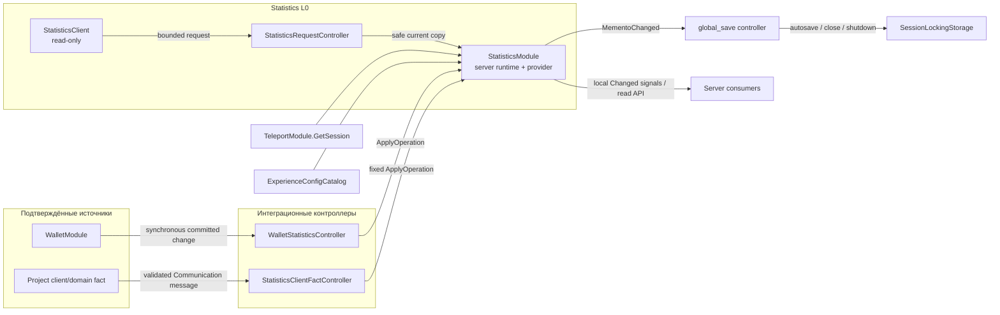

# Statistics: сбор числовой статистики игрока

## 1. Goal and Concept

`Statistics` — серверно-авторитетный save provider и runtime-модуль, который хранит числовые показатели игрока одновременно в глобальном, сессионном, плейсовом и проектных снимках. Он принимает уже подтверждённые доменные факты, атомарно применяет одну операцию ко всем подходящим активным снимкам, предоставляет безопасное server-side чтение и выдаёт клиенту только явно разрешённую текущую проекцию.

Продуктовый источник — `docs/Features/template/StatisticCollection/product-requirements.md`, revision `1`, exact-byte SHA-256 `6154d9e38f8b2897aba9736429825498523a52e738f15934a0b03c1f717c121a`. Абсолютный путь утверждённого источника: `D:/MyData/Projects/Roblox/My/roblox_project_template/docs/Features/template/StatisticCollection/product-requirements.md`. Эта спецификация не расширяет продуктовый scope за пределы `PRD-REQ-001..052`, `PRD-NFR-001..022` и `PRD-AC-001..039`.

Главные инварианты:

- все авторитетные значения, история, lifecycle и mutation API существуют только на сервере;
- одна принятая операция либо изменяет все подходящие снимки и dedup-state, либо не изменяет ничего;
- предметный модуль публикует подтверждённый факт, но не знает, какие `StatisticId` из него выводятся;
- `TeleportModule` остаётся единственным владельцем межплейсового session ID, а `Statistics` не передаёт значения через `TeleportData`;
- runtime меняется немедленно, а DataStore-запись остаётся обязанностью общего autosave/close/shutdown контура;
- `Statistics` не проверяет достижения и не выдаёт награды.

## 2. Context and Scope Boundaries

Репозиторий является reusable Roblox template. Реализация обязана расширить существующие границы, а не создавать параллельные:

- `ServerManifest` и `ClientManifest` остаются единственными composition roots; новый standalone `Script`/`LocalScript` не создаётся;
- `StatisticsModule` владеет per-player runtime-моделью и является server-authority provider существующего `global_save` controller;
- `GlobalSaveInitializationCommand` остаётся владельцем состава provider-ов, player load/close и вызова финального save;
- `PlayersModule` остаётся единственным wrapper прямых `Players.PlayerAdded`/`PlayerRemoving` подписок;
- `TeleportModule:GetSession(player)` предоставляет только подтверждённую `SessionSnapshot`; `Statistics` не дублирует envelope validation;
- `CommunicationServer`/`CommunicationClient` остаются единственной сетевой границей; client reads используют существующий bounded request API, а client facts — объявленные проектом batched message types;
- `ExperienceConfigCatalog` остаётся единственным источником tunable configuration; `statistics_config` server-only и startup-only для текущей server generation;
- `Shared/Util/Signal` используется только для восстанавливаемых локальных уведомлений. Авторитетный intake факта не может зависеть от асинхронного listener scheduling.

Текущие project contracts требуют двух целевых расширений общего save-контура:

1. `ServerSaveController:BuildSnapshot()` сейчас включает каждый server provider. Для `Statistics` нужен проверяемый provider contract `ClientSnapshotPolicy = "Omit"`, чтобы глобальная save snapshot не раскрывала и не переносила полный Statistics memento.
2. Dirty notification идёт через неблокирующий `Signal`; callback может выполниться после начала close. Поэтому `ServerSaveController:Close()` обязан синхронно захватить все provider-ы после Statistics close preparation и до `ForceSave`, независимо от уже доставленного dirty signal. Это реализует Accepted ADR-0003 буквально: close captures and saves before Stop.

Внутри L0 находятся Statistics domain/provider, snapshot lifecycle, config codec, server/client read boundary и отдельные fact adapters. Вне L0 остаются предметные правила Wallet и других модулей, player lifecycle wrapper, Teleport trust decision, DataStore/session locks, communication transport, аналитическая отправка, достижения, награды и UI.

## 3. Terminology and Glossary

| Термин | Определение |
|---|---|
| `StatisticId` | Стабильный ограниченный UTF-8 идентификатор одного числового показателя. Не является клиентским вводом для generic mutation. |
| Снимок | Изолированная запись значений одного `SnapshotType` с собственным ID, lifecycle, metadata и зафиксированным filter rule. |
| Активный снимок | Единственный допускающий mutation снимок данного типа для игрока. |
| Закрытая история | Retention-bounded записи закрытых снимков одного типа в порядке создания. |
| Pending session | Закрытый сессионный снимок, временно сохранённый вне пользовательской истории для возможного точного продолжения на teleport target. |
| Внешний вход | `TeleportModule` вернул `EntryKind = "External"`; создаётся новый Session snapshot. |
| Подтверждённое продолжение | `TeleportModule` вернул `EntryKind = "Teleported"`, а pending Session snapshot содержит точно тот же server-owned session ID. |
| Filter rule | Зафиксированный при создании снимка `AllowOnly` или `AllowAllExcept` набор `StatisticId`. |
| Подтверждённый доменный факт | Серверный факт, который предметный владелец уже успешно применил и передал синхронному интеграционному адаптеру. |
| Fact identity | Необязательная server-owned дедупликационная идентичность: ordered source sequence либо bounded stable event ID. |
| Client projection | Доступный только для чтения DTO текущего встроенного снимка текущего игрока, отфильтрованный проверяемым в коде списком разрешённых полей. |

## 4. System Decomposition

### 4.1. Level 0 — Statistics feature boundary

```text
Statistics (L0)
├── Server Statistics domain and persistence (L1)
│   ├── StatisticsModule
│   ├── StatisticsConfigCodec + ServerConfigManifest entry
│   ├── StatisticsInitializationCommand
│   └── GlobalSave/ServerSaveController integration
├── Confirmed fact adapters (L1)
│   ├── Wallet committed-change contract
│   ├── WalletStatisticsController
│   └── project StatisticsClientFactController definitions
└── Client read projection (L1)
    ├── StatisticsProtocol / StatisticsTypes
    ├── StatisticsRequestController
    ├── StatisticsClient
    └── client StatisticsInitializationCommand

Вне L0: PlayersModule, TeleportModule, CommunicationServer/Client,
ExperienceConfigCatalog, AutoSaveModule, DataStore-хранилище с session lock,
предметные правила Wallet, проектные потребители наград/достижений/аналитики и UI.
```

### 4.2. Level 1 — Server Statistics domain and persistence

#### `ServerScriptService/Modules/Statistics/StatisticsModule.luau`

Тип: серверно-авторитетный предметный модуль и stateless-контракт save provider над принадлежащим модулю per-player runtime.

Поля provider-а:

- `Id = "Statistics"`;
- `Version = 1`;
- `Authority = "Server"`;
- `ClientSnapshotPolicy = "Omit"`;
- `MementoChanged`, `Changed` and `ActiveSnapshotsChanged` are side-local `Signal` objects.

Размещение и композиция: `ServerManifest` создаёт модуль один раз с явными зависимостями `ExperienceConfigCatalog`, `TeleportModule`, `AutoSaveModule`, часов, измерителя размера и логгера. Модуль публикуется как `context.Services.Statistics`. `StatisticsInitializationCommand` инициализирует его после `Config`, `Teleport` и `Communication`; `GlobalSaveInitializationCommand` регистрирует его между Wallet и Version.

Контракт save provider-а:

```luau
Initialize()
CreateDefault(player)
ReconcileMemento(player, value, fromVersion)
ValidateMemento(player, value)
SetMemento(player, value)
GetMemento(player)
BeforeMementoGet(player)
Run(player)
Stop(player)
```

`Run(player)` resolves built-in lifecycle before the save controller publishes `PlayerLoaded`:

- continues or creates Global;
- resolves pending Session against `TeleportModule:GetSession(player)`;
- creates a fresh Place snapshot for every visit;
- fails the provider transaction when Teleport session state is unavailable or the prepared Statistics memento is invalid/oversized.

Public server API:

```luau
ApplyOperation(player, operation)
StartNewSnapshot(player, snapshotType, metadata?)
ContinueSnapshot(player, snapshotType, snapshotId)
CloseSnapshot(player, snapshotType)
SaveSnapshot(player, snapshotType, snapshotId?)

GetActiveSnapshot(player, snapshotType)
GetSnapshot(player, snapshotType, snapshotId)
GetLastSnapshot(player, snapshotType)
GetLastSnapshots(player, snapshotType, count)
GetSnapshots(player, snapshotType)
GetValue(player, snapshotType, statisticId, snapshotId?)
```

Каждый метод возвращает новую таблицу либо скаляр. Lifecycle/mutation-методы возвращают структурированный tagged result; некорректный ввод не выражается частичной мутацией или выброшенным assertion на публичной границе. `Global`, `Session` и `Place` являются управляемыми типами: публичные custom-lifecycle вызовы для них возвращают `ManagedSnapshotType`, а принадлежащие модулю `Run`/`PrepareForProfileClose` используют приватные lifecycle-операции. Обычный lifecycle никогда не закрывает `Global`.

`ApplyOperation` is synchronous and non-yielding from validation through commit. It normalizes a negative operand to `0`, calculates all candidate results, validates every affected snapshot plus fact identity and total provider size, then swaps the complete candidate memento. Only after commit does it fire one dirty notification and immutable change DTO. `NoChange` and `Duplicate` do not fire signals or create dirty state.

`PrepareForProfileClose(player)` atomically closes Place into history and closes Session into `PendingSession`; it marks the player closing so later fact intake receives `Closing`. It does not close Global or custom types. Repeated calls return the first result and do not duplicate history.

Не владеет: прямыми player-подписками, Teleport-валидацией/созданием сессии, DataStore-вызовами, расписанием autosave, клиентским транспортом, интерпретацией предметных фактов, наградами или аналитикой.

#### `ServerScriptService/Modules/Config/Codecs/StatisticsConfigCodec.luau`

Тип: чистый декодер Experience Config и межполевой валидатор.

Он принимает JSON-объект точной формы, отвергает неизвестные поля, проверяет идентификаторы встроенных/проектных типов, фильтры, retention, публичные списки разрешений и все числовые границы, после чего возвращает одну глубоко замороженную серверную модель. `ServerConfigManifest.Definitions` добавляет `{ Id = "Statistics", Key = "statistics_config", Decode = StatisticsConfigCodec.decode }` без `ToClient`; клиентское config-определение или bundle-entry не добавляется.

Codec применяет hard caps из §5.1 и агрегатное storage-неравенство для каждого объявленного типа. Конфигурация, у которой теоретический бюджет сохранённых снимков вместе с накладными расходами metadata/dedup превышает `maxProviderEncodedBytes`, останавливает bootstrap до обработки игроков. Refresh не меняет поведение активного сервера; следующий bootstrap захватывает следующую корректную generation. Каждый снимок сохраняет нормализованный фильтр, поэтому последующие поколения конфигурации не могут переинтерпретировать его.

#### `ServerScriptService/Initialization/Commands/StatisticsInitializationCommand.luau`

Тип: команда серверного manifest-а.

- `Id = "Statistics"`;
- `DependsOn = { "Config", "Teleport", "Communication" }`;
- initializes `StatisticsModule`, `WalletStatisticsController`, `StatisticsRequestController` and any code-owned project fact definitions;
- returns only after all definitions and handlers are validated and registered;
- does not observe `Players` and does not start a background worker.

`GlobalSaveInitializationCommand.DependsOn` gains `"Statistics"`. `PersistenceSchedule` remains after `GlobalSave`.

#### `ServerScriptService/Initialization/Commands/GlobalSaveInitializationCommand.luau`

Тип: существующий проектный владелец композиции глобального профиля.

Обязательные изменения:

- `GetOrderedProviders(walletModule, statisticsModule, versionModule)` returns Wallet, Statistics, Version; Version stays the final commit-provider;
- after construction it binds the `global_save` controller to `StatisticsModule`/`AutoSaveModule` for bounded `SaveSnapshot` requests;
- the existing `PlayersModule:ObservePlayers` removal callback calls `StatisticsModule:PrepareForProfileClose(player)` before `controller:Close(player, true)`;
- Statistics close failure prevents a false successful close, emits bounded diagnostics and preserves the loaded runtime for the existing close/error policy;
- no additional `Players` subscription is introduced.

#### `ServerScriptService/Modules/Save/ServerSaveController.luau`

Тип: существующий общий save controller, расширенный без знания имени `Statistics`.

Обязательные общие контракты:

- construction validates optional `provider.ClientSnapshotPolicy`; allowed values are `"Include"` (default) and `"Omit"`;
- `BuildSnapshot` skips `"Omit"` providers before any `ToClientMemento` call;
- `Close` performs a synchronous full-provider capture after caller close preparation and before `ForceSave`, validating every memento and preserving the complete retryable dirty set on failure;
- the full capture compares/copies provider data into the document and advances revision only for real changes;
- `ForceSave` keeps its existing single-flight/coalescing, size validation, retry, session-lock and last-valid-document behavior.

Этот controller не получает lifecycle или предметные правила Statistics.

#### `ServerScriptService/Modules/AutoSave/AutoSaveModule.luau`

Тип: существующий владелец расписания persistence.

Он получает ограниченный контракт `RequestSave(controller, player, reason, minimumIntervalSeconds)`, используемый `SaveSnapshot`. Для каждой пары controller/player хранится не более одного ожидающего запроса и одного активного вызова; запросы внутри cooldown объединяются. Результат сообщает `Queued`, `Joined` либо завершённый результат `ForceSave`. Ожидающее состояние очищается при close/удалении controller-а, а обычный close/shutdown `ForceSave` остаётся авторитетным. Ни одна Statistics-мутация не вызывает DataStore напрямую.

#### Interaction at level 1 — provider lifecycle

1. Config and Statistics initialize before GlobalSave.
2. GlobalSave installs Wallet → Statistics → Version.
3. Statistics `Run` uses the already validated Teleport arrival to resolve built-in snapshots before `PlayerLoaded` publication.
4. Runtime operations mutate only Statistics-owned state and signal dirty asynchronously for normal Heartbeat capture.
5. Player close first linearizes Statistics intake and snapshot closure; generic full-provider capture then removes the dirty-signal scheduling race; the existing save/release path persists and releases the profile.

### 4.3. Level 1 — Confirmed fact adapters

#### `ServerScriptService/Modules/Wallet/WalletModule.luau` committed-change contract

Тип: существующий предметный владелец Wallet с новой общей синхронной границей наблюдения.

`WalletModule` must not import Statistics or contain statistic IDs. It exposes a registration API for committed server changes, for example `RegisterCommittedChangeHandler(handler)`, before player runtime starts. On a real successful `_set`, Wallet assigns `TransactionId` and monotonically increasing persisted `TransactionSequence`, mutates its authoritative balance, then calls registered committed handlers synchronously before returning and before best-effort `Changed` signal/network publication.

Версия Wallet provider повышается с `2` до `3`. Reconciliation из версии `2` сохраняет balances/`IsInitialized` и инициализирует `LastTransactionSequence = 0`; `ToClientMemento` исключает это server-only поле. Начальные балансы, применённые `Run`, no-op изменения и отклонённые операции не продвигают sequence и не публикуют committed fact.

Ошибки handler-а не откатывают Wallet после commit; они возвращают ограниченную структурированную диагностику владельцу интеграции. Эта граница обеспечивает упорядоченное принятие и не заменяет локальный для стороны сигнал `Changed`.

#### `ServerScriptService/Modules/Statistics/WalletStatisticsController.luau`

Тип: серверный интеграционный адаптер между двумя существующими предметными владельцами.

Он регистрирует один Wallet committed-change handler и отображает только положительный `Delta` в:

```luau
{
    Operation = "Inc",
    StatisticId = "Wallet.<CurrencyId>.Earned",
    Operand = change.Delta,
    FactIdentity = {
        Mode = "Ordered",
        SourceId = "Wallet",
        Sequence = change.TransactionSequence,
        EventId = change.TransactionId,
    },
}
```

Он игнорирует применение стартового баланса, отрицательные расходы, no-op и отклонённые Wallet-операции. Он не принимает решений о наградах. Его connection/registration идемпотентно уничтожается при shutdown модуля.

#### `ServerScriptService/Modules/Statistics/StatisticsClientFactController.luau`

Тип: переиспользуемый серверный адаптер над принадлежащими коду проектными определениями.

Каждое определение владеет одним типом предметного сообщения, валидатором точной формы payload, серверными eligibility/rate-проверками и mapper-ом, возвращающим фиксированный запрос `ApplyOperation`. Ни вид операции, ни `StatisticId` не принимаются из клиентского payload. Определения регистрируются через `CommunicationServer:RegisterHandler`; пустой template-список определений не создаёт клиентской mutation-поверхности. Производные проекты расширяют принадлежащий коду список и тесты, а не `StatisticsModule`.

Не владеет: авторитетностью исходного факта, общей клиентской мутацией, наградами или communication-лимитами.

#### Interaction at level 1 — fact acceptance

Подтверждённая мутация источника → синхронная committed-change граница либо проверенный проектный handler → интеграционный адаптер → `StatisticsModule:ApplyOperation`. Сигналы `Changed` испускаются только после commit и никогда не являются авторитетным путём intake. Statistics линеаризует каждую принятую операцию игрока с close; не существует ни неограниченной runtime-очереди, ни зависящего от `task.spawn` drain.

### 4.4. Level 1 — Client read projection

#### `ReplicatedStorage/Shared/Statistics/StatisticsTypes.luau`

Тип: нейтральные к стороне объявления типов операций, результатов, снимков и клиентских DTO. Модуль не содержит изменяемого runtime-состояния или server-only service lookup.

#### `ReplicatedStorage/Shared/Statistics/StatisticsProtocol.luau`

Тип: замороженные идентификаторы запросов и точные ограниченные валидаторы.

Типы запросов:

- `Statistics.GetCurrentSnapshot` with `{ SnapshotType }`;
- `Statistics.GetCurrentValue` with `{ SnapshotType, StatisticId }`.

Принимаются только `Global`, `Session` и `Place`. Payload-ы являются обычными словарями точной формы. Не существует типа mutation-запроса или запроса истории, проектных типов, других игроков либо произвольных metadata-полей.

#### `ServerScriptService/Modules/Statistics/StatisticsRequestController.luau`

Тип: серверный read-адаптер, зарегистрированный через `CommunicationServer:RegisterRequestHandler`.

Он использует вызывающего `Player`, переданного Communication, читает из Statistics один текущий встроенный снимок/значение, проецирует только разрешённые `StatisticId` и metadata-ключи, удаляет внутренние session/filter/dedup поля, проверяет DTO и применяет `maxClientResponseEstimatedBytes`. Превышение размера возвращает `ResponseTooLarge` до формирования любого частичного payload. Общие token bucket-ы Communication остаются авторитетной per-player политикой количества запросов, частоты и байтов.

#### `ReplicatedStorage/Client/Statistics/StatisticsClient.luau`

Тип: доступный только для чтения клиентский facade.

Публичный API:

```luau
GetCurrentSnapshot(snapshotType)
GetCurrentValue(snapshotType, statisticId)
```

Каждый метод вызывает `CommunicationClient:Request`, проверяет полный ответ и возвращает изолированную копию либо структурированный отказ. У facade нет cache, mutation API, history API или сигнала, претендующего на авторитетную доставку.

#### `ReplicatedStorage/Client/Initialization/Commands/StatisticsInitializationCommand.luau`

Тип: команда клиентского manifest-а.

- `Id = "Statistics"`;
- `DependsOn = { "Communication" }`;
- initializes the read facade and exposes it as `context.Services.Statistics`;
- does not register a save provider and does not extend `GameDataClient`.

#### Interaction at level 1 — read projection

Клиентский caller → `StatisticsClient` → ограниченный Communication-запрос → `StatisticsRequestController` → безопасная Statistics-копия → явная проверка проекции/размера → клиентский DTO. Полная таблица provider-а не попадает ни в global snapshot, ни в обычные runtime-сообщения.

### 4.5. Interaction at level 0

- Teleport supplies correlation only; Statistics owns persisted snapshot values.
- GlobalSave owns provider orchestration/persistence; Statistics owns domain mutations and snapshot meaning.
- Wallet/client fact adapters own mapping; source modules and Statistics remain mutually independent.
- Communication owns transport/rate/byte bounds; Statistics owns disclosure allowlists and response semantics.
- Reward/achievement/analytics consumers can only read or observe Statistics from outside L0.

## 5. Data Models

### 5.1. `statistics_config` initial production contract

Нативный тип Experience Config: `JSON`.

```json
{
  "snapshotTypes": {
    "Global": {
      "retention": 0,
      "filter": { "mode": "AllowAllExcept", "statisticIds": [] }
    },
    "Session": {
      "retention": 4,
      "filter": { "mode": "AllowAllExcept", "statisticIds": [] }
    },
    "Place": {
      "retention": 8,
      "filter": { "mode": "AllowAllExcept", "statisticIds": [] }
    }
  },
  "publicProjection": {
    "Global": { "statisticIds": [], "metadataKeys": [] },
    "Session": { "statisticIds": [], "metadataKeys": [] },
    "Place": { "statisticIds": [], "metadataKeys": [] }
  },
  "limits": {
    "maxSnapshotTypes": 16,
    "maxRetentionPerType": 32,
    "maxStatisticIdsPerSnapshot": 256,
    "maxStatisticIdLength": 64,
    "maxSnapshotTypeLength": 48,
    "maxSnapshotEncodedBytes": 24576,
    "maxMetadataDepth": 6,
    "maxMetadataNodes": 128,
    "maxMetadataEncodedBytes": 4096,
    "maxMetadataKeyLength": 64,
    "maxMetadataStringLength": 256,
    "maxDedupSources": 16,
    "maxEventIdsPerSource": 64,
    "maxProviderEncodedBytes": 524288,
    "maxClientResponseEstimatedBytes": 49152,
    "maxHistoryReadCount": 32
  },
  "saveRequestCooldownSeconds": 30
}
```

Принадлежащие коду hard caps запрещают конфигурацию выше следующих значений: 16 типов, retention 32, длина идентификатора 64, 32 dedup-источника, 512 EventId на источник, глубина metadata 8, число metadata-узлов 256 и размер одного provider-а 1 MiB; лимит клиентского ответа обязан оставаться ниже `CommunicationConfig.MaxSingleMessageEstimatedBytes` (60 KiB). `maxStatisticIdLength` не может быть меньше 36, потому что канонический Wallet `TransactionId` является GUID и используется как EventId. Начальная конфигурация `16 × 64` для dedup-источников и EventId вместе с лимитом provider-а 512 KiB оставляет место для полного EventId-ledger и остаётся ниже существующего soft limit глобального профиля 3,5 MB. Значения вплоть до hard caps `32 × 512` принимаются только тогда, когда вся теоретическая ёмкость настроенной конфигурации укладывается в `maxProviderEncodedBytes`. Config decode отвергает любое сочетание snapshot types, retention, dedup-лимитов и длины идентификатора, при котором теоретическое размещение снимков, metadata, индексов, pending session, ordered-source cursors и полного EventId-ledger превышает provider-бюджет.

По умолчанию ни один показатель или metadata-поле не является публичным. Проектные типы не могут появляться в `publicProjection`. Сохранённый ID проектного типа нельзя удалить или переименовать без явного решения о provider/raw migration.

### 5.2. Persisted `StatisticsMemento`

```luau
type StatisticsMemento = {
    ActiveByType: { [string]: SnapshotRecord },
    PendingSession: SnapshotRecord?,
    HistoryByType: { [string]: { SnapshotRecord } },
    NextSnapshotIdByType: { [string]: number },
    Dedup: {
        OrderedSources: { [string]: OrderedSourceCursor },
        EventIdsBySource: { [string]: { string } },
    },
}
```

Provider envelope имеет `Version = 1`. Отсутствующий provider создаёт пустой memento и не восстанавливает факты до установки. `ReconcileMemento` трактует отсутствующую в снимке `Metadata` как `{}`, в остальном сохраняя значения. Некорректный, повреждённый или чрезмерно большой сохранённый Statistics завершает ошибкой загрузку всего профиля до публикации runtime и не перезаписывает storage значениями по умолчанию.

`ActiveByType` has at most one entry per configured type. `PendingSession` is not client-visible and not counted as closed history; it exists solely across a normal source close/target load. `HistoryByType[type]` is creation-ordered oldest→newest and bounded by the frozen type retention. `NextSnapshotIdByType` is a positive safe integer and never decreases after retention.

### 5.3. Persisted `SnapshotRecord`

```luau
type SnapshotRecord = {
    SnapshotId: number,
    SnapshotType: string,
    State: "Active" | "Closed",
    StartedAt: number,
    ClosedAt: number?,
    PlaceId: number?,
    SessionId: string?,
    Metadata: { [string]: any },
    Filter: {
        Mode: "AllowOnly" | "AllowAllExcept",
        StatisticIds: { string },
    },
    Values: { [string]: number },
}
```

- `SnapshotId` is monotonically increasing inside `SnapshotType`, starts at 1 and is never reused; exhaustion above `2^53 - 1` rejects creation.
- `StartedAt`/`ClosedAt` are injected Unix-second timestamps.
- `PlaceId` exists only for Place; `SessionId` exists only for Session and is server-only.
- `Metadata` is validated and deep-copied before creation, then immutable. Top-level keys matching system fields are rejected.
- `Filter` is the normalized sorted copy captured at creation; config refresh cannot alter it.
- `Values` contains only explicitly written IDs. Missing reads return `0` without insertion.

### 5.4. Operation and result

```luau
type StatisticOperation = {
    Operation: "Set" | "Inc" | "Dec" | "Min" | "Max",
    StatisticId: string,
    Operand: number,
    FactIdentity: FactIdentity?,
}

type OperationSuccess = {
    Ok: true,
    Code: "Applied" | "NoChange" | "Duplicate",
    ChangedSnapshotIds: { number },
}

type OperationFailure = {
    Ok: false,
    Code: string,
    Error: string,
}
```

Эталонные формулы для текущего значения `x` и нормализованного операнда `v = max(operand, 0)`:

| Operation | Result |
|---|---|
| `Set` | `v` |
| `Inc` | `x + v` |
| `Dec` | `max(0, x - v)` |
| `Min` | `min(x, v)` |
| `Max` | `max(x, v)` |

`x` is `0` when absent. Input and result must be finite Luau numbers; overflow to infinity rejects the entire operation. The module does not round or convert into a separate integer/float representation.

До commit модуль проверяет: операцию/type/ID, dedup identity, каждый затронутый фильтр/результат, число новых ID, закодированный размер каждого candidate snapshot и всего provider-а. Ошибка одного candidate оставляет все снимки и dedup-state неизменными.

### 5.5. Fact identity and deduplication

```luau
type FactIdentity =
    { Mode: "Ordered", SourceId: string, Sequence: number, EventId: string? }
    | { Mode: "EventId", SourceId: string, EventId: string }

type OrderedSourceCursor = {
    LastSequence: number,
    LastEventId: string?,
}
```

- Ordered mode accepts a safe positive sequence only when it is greater than the stored cursor. A sequence at or below the cursor is `Duplicate`; trusted adapters must deliver original order. Sparse increases are valid so ignored Wallet spends do not create false gaps.
- EventId mode stores exact IDs without eviction. An existing ID is `Duplicate`; when its finite ledger is full, a new unique ID returns `DedupeLimitExceeded` rather than weakening exactly-once behavior.
- A source cannot switch dedup modes without a migration.
- Dedup state advances atomically only with an actual snapshot change. `NoChange` creates neither dedup nor dirty state.

### 5.6. Client projection DTO

```luau
type ClientSnapshot = {
    SnapshotId: number,
    SnapshotType: "Global" | "Session" | "Place",
    State: "Active",
    StartedAt: number,
    PlaceId: number?,
    Metadata: { [string]: any },
    Values: { [string]: number },
}
```

DTO исключает `SessionId`, `ClosedAt`, замороженные фильтры, dedup-поля, историю, проектные типы и не разрешённые списком значения/metadata. После той же проверки списка разрешений ответ значения имеет форму `{ StatisticId, Value, SnapshotId, SnapshotType }`. Непубличный ID возвращает `Unavailable`, а не `0`, чтобы политику раскрытия нельзя было исследовать сравнением отсутствующих значений.

## 6. System Diagram



## 7. User / Core / Behaviour Flows

### 7.1. Bootstrap and configuration

1. `ExperienceConfigCatalog` decodes the exact `statistics_config` candidate with all cross-limits.
2. `StatisticsInitializationCommand` captures that immutable generation, registers request/fact adapters and publishes `Services.Statistics`.
3. `GlobalSaveInitializationCommand` builds Wallet → Statistics → Version and binds bounded save requests.
4. Any config/handler/provider-order failure stops server bootstrap; no player runtime starts with a partial contract.

### 7.2. First or external profile load

1. GlobalSave acquires the session lock, migrates raw document when applicable and prepares every provider.
2. Missing Statistics creates provider version 1 with no invented history.
3. `StatisticsModule:Run` reads `TeleportModule:GetSession(player)`.
4. Existing Global remains active; otherwise Global ID 1 is created.
5. Any `PendingSession` is finalized into Session history under its frozen retention because this is not a matching continuation.
6. A new Session with the current server-owned session ID and a new Place with `game.PlaceId` are created atomically.
7. Only after complete provider application does GlobalSave publish load success.

### 7.3. Confirmed teleport continuation

1. Source removal calls `PrepareForProfileClose`: Place moves to history; Session becomes `PendingSession`; Global stays active.
2. Generic close captures all providers, saves the profile and releases the session lock.
3. Target load uses the existing bounded lock-handoff retry.
4. If `TeleportModule` reports `Teleported` and pending `SessionId` matches exactly, that same record returns to Active with the same `SnapshotId` and values; a new Place is created.
5. Missing/mismatched pending session is finalized by retention and a new Session starts. No values are merged and no Statistics data is read from `TeleportData`.
6. `TeleportAsync` acceptance or late `TeleportInitFailed` while the player remains on source never calls Statistics close; current snapshots remain unchanged until actual `PlayersModule` removal.

### 7.4. Atomic Statistics operation

1. Adapter calls `ApplyOperation` synchronously.
2. Statistics rejects closing/unloaded player, malformed fields, non-finite input and invalid fact identity.
3. It selects every active snapshot whose frozen filter permits `StatisticId`.
4. It computes every result from the same pre-operation state and validates count/size limits on an isolated candidate.
5. Any failure discards the candidate and emits no success event.
6. If no value changes, result is `NoChange` with no dirty/event.
7. Otherwise one candidate swap commits all snapshot values and dedup cursor/ledger, then one dirty notification and one immutable `Changed` DTO are fired.

### 7.5. Custom snapshot lifecycle and history

1. A project controller declares a stable custom type in `statistics_config`.
2. `StartNewSnapshot` validates type/metadata/filter and rejects a second active snapshot.
3. `CloseSnapshot` atomically removes active, appends it to history, trims only oldest closed records beyond retention and keeps `NextSnapshotIdByType` unchanged.
4. Repeated close returns `NotActive`; no history/retention/event duplication occurs.
5. `ContinueSnapshot` rejects when the type is active, locates the retained ID, restores the exact values/metadata/filter and removes that record from history.
6. Base Statistics never guesses when a custom type starts/closes.

### 7.6. Wallet integration

1. Wallet `Run` applies starting balances directly; no committed-change handler runs.
2. A real successful runtime `_set` creates GUID plus persisted sequence and invokes committed handlers synchronously.
3. `WalletStatisticsController` ignores non-positive delta; positive delta maps to `Wallet.<CurrencyId>.Earned` `Inc` with ordered identity.
4. Statistics applies the fact before Wallet API returns. Redelivery of the same/older sequence returns `Duplicate`.
5. The later Wallet/Statistics signals and client Wallet message are notifications, not the correctness path.

### 7.7. Project client fact

1. Client queues a project-owned domain message, never a Statistics operation.
2. Communication charges common rate/byte budgets before deep validation.
3. Code-owned server definition validates payload and domain eligibility, then maps it to one fixed operation/ID.
4. Invalid/unknown/rate-limited input returns or logs bounded failure and never calls Statistics.
5. The project decides whether this untrusted fact is suitable for analytics or rewards; Statistics only accumulates it.

### 7.8. Client read

1. Client requests one current built-in snapshot/value through `StatisticsClient`.
2. Shared validator rejects custom/history/other-player/arbitrary operations.
3. Server reads an isolated current copy, filters allowlists, strips internal fields and prevalidates response size.
4. Oversize returns explicit `ResponseTooLarge`; no partial/truncated payload is sent.

### 7.9. Explicit save, normal close and shutdown

1. `SaveSnapshot` confirms that the named current/retained snapshot exists, marks no new domain change and sends one request to `AutoSaveModule:RequestSave`.
2. Concurrent/cooldown requests coalesce into bounded per-player state; they never create one write per Statistics operation.
3. On removal, Statistics first prevents new fact acceptance and atomically closes built-in Place/Session.
4. `ServerSaveController:Close` synchronously captures every provider, then uses existing single-flight `ForceSave`, provider Stop in reverse order and lock release.
5. Shutdown uses the existing shared deadline/concurrency coordinator. Hard server termination may lose post-autosave changes; this remains an observed platform boundary.

### 7.10. Invalid or oversized state

Валидация ввода и проверка размера candidate происходят до мутации. Повреждённый/чрезмерно большой сохранённый provider заставляет загрузку профиля завершиться закрытой ошибкой и сохраняет значение DataStore. Runtime-candidate за пределами любого snapshot/provider/dedup лимита возвращает конкретный отказ, оставляет предыдущее состояние и последнюю корректную storage-версию неизменными и испускает ограниченную по частоте диагностику без полных снимков, metadata или session ID.

## 8. Implementation Constraints

### 8.1. Normative constraints

- Все production Luau modules сохраняют `--!strict`.
- Табличные входы/выходы глубоко копируются; внутренние таблицы, metadata, фильтры и dedup-реестры никогда не выходят наружу.
- До persistence или сетевого ответа проверяются точная форма словаря/массива, корректный UTF-8, конечные числа и отсутствие metatable, циклов, mixed/sparse/неподдерживаемых значений.
- Config models and shared constants are frozen; runtime mementos are module-owned mutable state only.
- `StatisticsModule` methods use explicit dependencies and never call `game:GetService("Players")`, `ConfigService`, DataStore or remotes directly.
- Normal operation is non-yielding and per-player linearizable. No unbounded operation queue is introduced.
- Side-local success events are recovery hints; consumers must be able to re-read current snapshots.
- Event listener failure cannot roll back committed state or suppress later listeners.
- Provider absence is additive compatibility; provider corruption is not converted into an empty profile.
- Provider-local version reconciliation handles Statistics/Wallet local schema evolution. Cross-provider changes require the existing raw migration pipeline.
- `SaveSnapshot` is a coalesced persistence request, not an immediate per-snapshot DataStore owner and not a durability promise beyond its returned result.
- The implementation must add/update current runtime docs, `docs/TestCoverage.md`, feature artifacts and enforcement tests. A new durable cross-module decision requires the next free template ADR; Accepted ADR bodies are not rewritten.

### 8.2. PRD traceability

| Техническая область | PRD IDs |
|---|---|
| types, one-active invariant, IDs, lifecycle and history | `PRD-REQ-001..005`, `PRD-REQ-009..010`, `PRD-REQ-014..016`, `PRD-REQ-020`, `PRD-REQ-023..025`, `PRD-REQ-036..040` |
| operation semantics, atomicity, values, copy safety | `PRD-REQ-006..008`, `PRD-REQ-011..012`, `PRD-REQ-017..019`, `PRD-REQ-021..022`, `PRD-REQ-048`, `PRD-NFR-001`, `PRD-NFR-003`, `PRD-NFR-006..008` |
| source/controller separation, client facts and no rewards | `PRD-REQ-013`, `PRD-REQ-026..027`, `PRD-REQ-034..035`, `PRD-NFR-002`, `PRD-NFR-005`, `PRD-NFR-013` |
| Players/Teleport continuation and session-lock handoff | `PRD-REQ-028..029`, `PRD-REQ-041..044`, `PRD-NFR-010`, `PRD-NFR-015..016` |
| Wallet ordered integration and deduplication | `PRD-REQ-030..031`, `PRD-REQ-045..047`, `PRD-NFR-004` |
| dirty capture, coalesced save and last-valid persistence | `PRD-REQ-032..033`, `PRD-REQ-052`, `PRD-NFR-012`, `PRD-NFR-021` |
| client read projection and communication limits | `PRD-REQ-049..050`, `PRD-NFR-018` |
| finite config/storage/metadata/diagnostic bounds | `PRD-REQ-037..040`, `PRD-REQ-051`, `PRD-NFR-009`, `PRD-NFR-011`, `PRD-NFR-014`, `PRD-NFR-017`, `PRD-NFR-019..020` |
| deterministic and published evidence | `PRD-NFR-022` |

### 8.3. Acceptance and verification matrix

| PRD AC | Обязательное доказательство |
|---|---|
| `PRD-AC-001` | Сфокусированный load-тест: активны ровно Global/Session/Place; повторный start отклонён. |
| `PRD-AC-002` | Два цикла external load над одним memento: тот же Global ID, новые Session/Place ID. |
| `PRD-AC-003` | Тест проектного типа: start/read/close/continue без правки базового модуля. |
| `PRD-AC-004` | Табличные эталонные тесты всех пяти операций и отрицательных операндов. |
| `PRD-AC-005` | Смешанные замороженные фильтры: одна атомарная операция меняет только разрешённые активные снимки. |
| `PRD-AC-006` | Табличные config-тесты default/allow-only/allow-all-except. |
| `PRD-AC-007` | Retention 0/N, удаление только старейших, сохранение active и отсутствие повторного использования ID. |
| `PRD-AC-008` | Мутация каждой возвращённой вложенной таблицы не меняет runtime/memento. |
| `PRD-AC-009` | Protocol/static-тест доказывает отсутствие общего Statistics mutation-запроса. |
| `PRD-AC-010` | Положительные и отрицательные случаи validator/rate/fixed-mapping проектного fact controller-а. |
| `PRD-AC-011` | Event испускается после commit; повторное чтение в callback видит полное текущее состояние. |
| `PRD-AC-012` | Повторный close возвращает `NotActive`; существует одна запись истории и один retention-проход. |
| `PRD-AC-013` | Round trip close/continue сохраняет ID, values, metadata и filter. |
| `PRD-AC-014` | NaN/±inf/overflow/неизвестная операция/некорректный переход оставляют полный memento равным исходному. |
| `PRD-AC-015` | Чтение отсутствующего значения возвращает 0, а сериализованный `Values` остаётся пустым. |
| `PRD-AC-016` | Детерминированная Teleported-загрузка с совпадающей сессией сохраняет Session `SnapshotId`. |
| `PRD-AC-017` | Тот же flow закрывает исходный Place и создаёт целевой Place с новыми ID/PlaceId. |
| `PRD-AC-018` | Принятый Teleport и ранний/поздний отказ без удаления оставляют снимки активными. |
| `PRD-AC-019` | External/missing/mismatched continuation завершает старую и создаёт новую Session. |
| `PRD-AC-020` | Стартовые балансы Wallet `Run` не испускают committed fact и не меняют статистику. |
| `PRD-AC-021` | Положительные изменения Coins/Gems увеличивают статистику; spend/no-op/rejection — нет. |
| `PRD-AC-022` | Серия операций меняет runtime/dirty-state, но storage fake не видит записи на каждую операцию. |
| `PRD-AC-023` | Быстрые закрытия проектных снимков объединяют save request; финальный close сохраняет всё до release. |
| `PRD-AC-024` | Публичный API/static scan не содержит операции проверки достижения или выдачи награды. |
| `PRD-AC-025` | Schema validation требует системные поля и корректный `PlaceId` только для Place. |
| `PRD-AC-026` | Metadata принимает `RunId`, `EventId`, `Difficulty`, `MapId` в установленных пределах. |
| `PRD-AC-027` | Изоляция мутации исходной/возвращённой metadata и отклонение небезопасных depth/node/byte значений. |
| `PRD-AC-028` | Reconciliation fixture без Metadata даёт пустую таблицу и сохраняет values. |
| `PRD-AC-029` | Три target-load fixture: один Session ID/SnapshotId, три Place ID, нет Statistics-полей в envelope. |
| `PRD-AC-030` | ProductionIntegration проверяет успех/исчерпание lock handoff без fallback на пустой профиль. |
| `PRD-AC-031` | Wallet-изменение непосредственно перед removal синхронно принимается и присутствует после reload. |
| `PRD-AC-032` | Повтор одной ordered Wallet identity меняет каждый подходящий снимок ровно один раз. |
| `PRD-AC-033` | Ошибка размера/результата одного снимка откатывает все values/dedup/events. |
| `PRD-AC-034` | Тест allowlist/privacy клиентской проекции для всех трёх встроенных типов. |
| `PRD-AC-035` | Запросы history/custom/other-player/oversize/frequent завершаются явным полным отказом. |
| `PRD-AC-036` | Лимит новых ID отклоняет вставку; обновление существующего ID разрешено, пока aggregate укладывается в лимит. |
| `PRD-AC-037` | Oversized/corrupt provider load/save сохраняет последний корректный документ storage. |
| `PRD-AC-038` | Профиль до появления provider-а создаёт пустой Statistics и начинает считать только после установки. |
| `PRD-AC-039` | Diagnostic sink подтверждает cooldown и отсутствие payload со snapshot/session/metadata. |

### 8.4. Required checks

1. Before first source edit: `powershell -NoProfile -ExecutionPolicy Bypass -File scripts/ensure-rojo-server.ps1`.
2. Rojo build to a temporary output path.
3. `powershell -NoProfile -ExecutionPolicy Bypass -File scripts/validate-repository-layout.ps1`.
4. `ConfigCatalogTestRunner`, new `StatisticsTestRunner`, `TeleportModuleTestRunner`, `SystemTestRunner`, `ProductionIntegrationTestRunner`, `ProductionReadinessTestRunner`, then `AllTestsRunner`; every aggregate has `failed = 0`.
5. Focused deterministic suites use fresh modules, injected clocks/size/storage/transport fakes, finite timeouts and failure-safe cleanup.
6. Clean server/client Play in the explicitly selected canonical Studio instance; inspect both outputs for unexpected warnings/errors and exercise join, Wallet gain, client read and leave.
7. Published multi-place evidence reuses the existing Teleport/session-lock handoff operator flow; Statistics-specific continuation/atomicity remains deterministic and no Statistics value is added to the teleport envelope. If compatible published handoff evidence is unavailable for the reviewed revision, production readiness remains blocked rather than inferred.
8. Opt-in `RealDataStoreSmokeTest` runs only in the dedicated published test Experience with safe key cleanup; omission must be reported, not replaced by a production-store run.
9. `scripts/validate-feature-workflow.ps1`, `scripts/sync-feature-index.ps1 -Check -Scope All`, and `git diff --check` before feature finish.

## 9. Mandatory Implementation Approach

1. Add shared types/protocol and pure validation/reference-operation tests first.
2. Add `statistics_config` codec/manifest definition with exact and cross-budget validation.
3. Implement `StatisticsModule` provider/runtime, immutable copies, lifecycle, atomic candidate commit, retention and deduplication.
4. Extend generic save snapshot omission and close-time full capture with regressions before registering Statistics.
5. Register provider order Wallet → Statistics → Version and integrate built-in close through existing GlobalSave/Players boundary.
6. Extend Wallet with generic synchronous committed-change delivery and provider version 3 sequence; implement the separate Wallet adapter.
7. Add bounded/coalesced save requests in AutoSave and wire `SaveSnapshot` to it.
8. Add server request controller and read-only client facade; do not add a client Statistics save provider.
9. Add the code-owned project fact extension point with an empty reusable-template mutation manifest.
10. Add focused, aggregate and clean-Play regressions, then update current docs, TestCoverage, feature evidence and the next template ADR.
11. Run two clean architectural sweeps: no duplicate capability owner, no async authoritative fact intake, no leakage/full-table sync, and no persistence bypass.

## 10. Forbidden Formal Solutions

- хранить Statistics runtime в save controller или мутировать save document напрямую;
- добавлять второй save layer, ProfileModule, standalone bootstrap, service locator или direct `Players` subscription;
- использовать `Signal`, `task.spawn` или unordered listener completion как путь принятия доменного факта либо close drain;
- импортировать Statistics из Wallet/другого предметного модуля или помещать mapping `StatisticId` в source module;
- принимать от клиента operation, итоговое значение, произвольный `StatisticId`, target player, snapshot ID/type history или metadata projection;
- добавлять domain RemoteEvent/RemoteFunction вместо Communication APIs;
- включать полный Statistics provider в global client snapshot, обычное runtime-сообщение или resync;
- передавать values, history, dedup или metadata через `TeleportData`/MemoryStore либо считать `TeleportAsync` доказательством продолжения;
- применять operation снимок-за-снимком без полной предварительной проверки и rollback-equivalent candidate commit;
- преобразовывать NaN/inf/overflow в `0`, округлять значения или создавать отсутствующий ID при чтении;
- выдавать mutable internal tables или позволять входной Metadata менять снимок после создания;
- удалять active/pending snapshot retention-очисткой, переиспользовать ID или молча evict-ить dedup IDs;
- выполнять DataStore save на каждую operation/close либо создавать отдельный Statistics storage path;
- заменять corrupt/oversized provider пустым, усекать client response или перезаписывать последнюю корректную storage version;
- проверять достижения, выбирать/выдавать награды или утверждать, что client fact стал доверенным только после rate limiting;
- ослаблять существующие save, Teleport, communication или provider tests, чтобы формально провести новую интеграцию.

## 11. Open Questions

Нет открытых продуктовых или реализационно-блокирующих вопросов. Числовые production defaults, provider/network budgets, ordered Wallet deduplication, pending Session handoff и synchronous fact-acceptance boundary зафиксированы этой спецификацией. Отсутствие подходящей опубликованной среды является evidence gate для production-ready verdict, а не основанием менять контракт.
