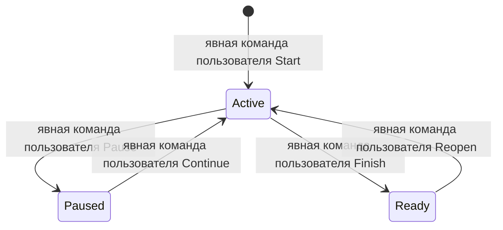

# Agent-Agnostic Feature Workflow — Technical Specification

- Status: Approved
- Date: 2026-08-06
- Feature: TF-0007
- Source: подтверждённые требования пользователя в текущей работе над feature

## 1. Цель и концепция

Feature workflow должен работать одинаково для Codex и других программных
агентов. Канонический контекст работы хранится в репозитории, а не в ссылках на
чат, идентификаторах сессий или переменных окружения конкретного продукта.

Только пользователь владеет решением об изменении lifecycle state feature.
Агент выполняет `Start`, `Continue`, `Pause`, `Reopen` или `Finish` только
после явной текущей команды пользователя на этот конкретный переход. Успешные
проверки, завершение реализации или аудита, окончание хода агента и результат
субагента не являются разрешением на переход состояния.

На `Pause` и `Finish` агент обязан добавить в `worklog.md` самостоятельное
резюме, достаточное для продолжения работы в новом чате без доступа к исходной
переписке. `Finish` не запускает тесты и проверки: он фиксирует уже завершённую
работу, обновляет документационный каскад и переводит feature в `ready` только
при отсутствии блокеров.

## 2. Контекст и границы

В область входят `.agents/skills/feature-*`, `scripts/feature-workflow.ps1`,
`scripts/FeatureWorkflow.psm1`, schema/validators/tests, feature dashboards,
правила, документация и новый template ADR. Roblox runtime, Rojo mappings и
`place.rbxl` не меняются.

Template и derived-проекты продолжают иметь раздельные владельческие
namespace. Template использует ID `TF-####` и ветки
`template-feature/tf-####-<slug>`. Derived-проект использует ID `F-####` и
ветки `feature/t-####-<slug>`. Четырёхзначный номер сохраняет детерминированную
сортировку и соответствует уже существующей template-нумерации.

Исторические ветки готовых feature не переименовываются. Новый формат обязателен
для веток, создаваемых новым `Start`.

## 3. Терминология

- **Worklog** — append-only журнал полноценных checkpoint summary; основной
  межчатовый источник истории feature.
- **Checkpoint** — одна структурированная запись `paused` или `finished` с
  результатом работы, важными решениями и обсуждениями, состоянием проверок,
  блокерами и следующим шагом.
- **Handoff** — перезаписываемая проекция последнего checkpoint для быстрого
  входа; не заменяет полный worklog.
- **Feature-scoped lease** — локальный atomic lease ветки, содержащий только
  ветку и feature ID; он не идентифицирует агента или чат.
- **Явная пользовательская команда** — текущая команда пользователя, прямо
  называющая требуемый lifecycle transition или однозначный естественно-языковой
  эквивалент. План агента, его собственный вывод о готовности и команда
  субагента не являются пользовательской командой.

## 4. Декомпозиция

### 4.1. Level 0 — Repository Feature Workflow

Feature workflow владеет состояниями `planned`, `in_progress` и `ready`,
резервированием ветки, переносимым контекстом и namespace isolation.

```text
Repository Feature Workflow (L0)
├── Lifecycle command (L1)
├── Feature workflow module (L1)
├── Durable feature artifacts (L1)
├── Agent skills (L1)
└── Validators and contract tests (L1)
```

За границей L0 находятся Git, конкретный агент/чат, уже выполненные subsystem
test suites и Roblox Studio. Workflow читает Git, но не хранит identity агента
и не выполняет runtime verification внутри `Finish`.

### 4.2. Level 1 — Lifecycle command

#### `scripts/feature-workflow.ps1`

Тип: публичный deterministic command boundary.

Ответственность:

- реализовывать `Start`, `Continue`, `Pause`, `Finish`, `Context`;
- изменять lifecycle state только как исполнитель конкретного transition,
  явно запрошенного пользователем в текущем диалоге;
- создавать каноническую ветку новой feature;
- принимать содержимое checkpoint через явные параметры;
- проверять допустимый state transition и отсутствие blockers перед `Finish`;
- не читать `CODEX_THREAD_ID` и другие product-specific identity variables;
- не запускать тесты, validators, Rojo build или Studio в `Finish`.

Не владеет: анализом чата, формулировкой решений, выполнением subsystem checks
или редактированием system documentation вместо агента. Ни command, ни агент
не владеют решением о том, когда feature должна перейти в другое состояние.

### 4.3. Level 1 — Feature workflow module

#### `scripts/FeatureWorkflow.psm1`

Тип: repository-owned lifecycle library.

Ответственность:

- выделять `TF-####` или `F-####` в writable namespace;
- вычислять каноническое имя ветки из namespace, ID и slug;
- атомарно создавать feature-scoped lease без session/task fields;
- валидировать manifest schema, namespace, состояния и branch reservation;
- рендерить `handoff.md`, append-only `worklog.md` и dashboards;
- ссылать dashboard на worklog без подсчёта или показа сессий.

Lease размещается под Git common directory в product-neutral каталоге
`feature-workflow/locks`. Повторное приобретение lease той же feature
идемпотентно; другая feature на той же ветке отклоняется.

### 4.4. Level 1 — Durable feature artifacts

#### `feature.json`

Manifest schema version 2 не содержит `activeSessionId`, `sessions`,
`threadId`, `hostId` или иных chat/task identifiers. Состояние работы выражено
только через `status`, `activity`, branch/base commit, blockers, artifacts,
verification evidence и recovery reasons.

#### `worklog.md`

Каждый checkpoint содержит обязательные стабильные разделы:

1. `Result and current state`;
2. `Important decisions and discussions`;
3. `Verification state`;
4. `Blockers`;
5. `Next step`.

Названия разделов остаются одинаковыми для всех агентов, а содержимое пишется
на языке текущей работы.

Текст должен быть самодостаточным и не может ссылаться на transcript, task ID
или session ID как на обязательный контекст. При отсутствии решений или
блокеров агент пишет это явно.

#### `handoff.md`

Handoff повторяет последний checkpoint и текущий manifest state без полей
агента/сессии. `Continue` читает manifest, handoff, approved PRD/spec, worklog,
Git range, правила, документацию и ADR; историю чатов он не запрашивает.

### 4.5. Level 1 — Agent skills

#### `.agents/skills/feature-start`

Запускает или явно переоткрывает feature, делегирует создание канонической
ветки lifecycle command и сообщает namespace, ID, branch, base commit,
blockers и следующий шаг. Не вызывается автоматически из запроса на
реализацию, доработку или аудит: пользователь должен явно запросить `Start`
или `Reopen`.

#### `.agents/skills/feature-continue`

Восстанавливает контекст только из repository-owned artifacts и Git. Skill не
предполагает наличие Codex API или доступа к linked chat history и не
продолжает paused feature без явной команды пользователя.

#### `.agents/skills/feature-pause`

Передаёт lifecycle command полный checkpoint. Особое внимание уделяется
важным решениям и обсуждениям, которые иначе останутся только в чате. Окончание
хода агента или незавершённая работа сами по себе не разрешают `Pause`.

#### `.agents/skills/feature-finish`

Не выполняет проверки. Он убеждается по уже существующим evidence и blockers,
что implementation work завершён, актуализирует PRD/spec, затронутые system
docs, rules и ADR/indexes, затем записывает final checkpoint и переводит
feature в `ready`. Даже полностью готовая feature остаётся в текущем состоянии,
пока пользователь явно не запросит `Finish`.

### 4.6. Level 1 — Validators and contract tests

#### `scripts/tests/feature-workflow.tests.ps1`

Проверяет отсутствие зависимости от `CODEX_THREAD_ID`, exact ID/branch
форматы, branch collision, namespace isolation, agent-neutral worklog/handoff,
blocker gate и то, что lifecycle `Finish` не запускает внешние проверки.

#### Repository validators

Проверяют manifest schema version 2, dashboard equality, ID namespace,
уникальность branch reservation и отсутствие session/task fields в текущих
feature artifacts.

### 4.7. Взаимодействие на Level 0

1. Skill собирает контекст и формулирует checkpoint.
2. Lifecycle command валидирует state transition.
3. Module обновляет manifest, handoff, worklog, lease и owning dashboard.
4. Validators отдельно проверяют контракт; `Finish` их не вызывает.

## 5. Модели данных

### 5.1. Manifest schema version 2

Обязательные поля: `schemaVersion`, `id`, `slug`, `title`, `status`, `activity`,
`branch`, `baseCommit`, timestamps, `blockers`, `artifacts`, `verification`,
`recoveryLog`. `recoveryLog` хранит время, причину и прежнее состояние без
identity инициатора.

### 5.2. Feature-scoped lease

```text
schemaVersion: 2
branch: string
featureId: TF-#### | F-####
createdAt: ISO-8601 timestamp
```

Lease является локальным guardrail и не коммитится.

### 5.3. Checkpoint input

- `Summary`: результат и текущее состояние;
- `Decisions`: важные решения и обсуждения;
- `VerificationSummary`: фактическое состояние уже выполненных проверок;
- `NextStep`: обязательный для `Pause`, `None` для `Finish`;
- blockers берутся из manifest и всегда отражаются в записи.

## 6. Диаграмма состояний



## 7. Основные flows

### 7.1. Start новой template feature

1. Агент получает явную текущую команду пользователя на `Start`; запрос на
   реализацию или планирование без такого перехода не является заменой.
2. Command требует чистое дерево, именованный текущий base branch и отсутствие
   другой in-progress feature на нём.
3. Module выделяет следующий `TF-####`, вычисляет
   `template-feature/tf-####-<slug>` и отклоняет collision.
4. Git создаёт и выбирает ветку от исходного `HEAD`.
5. Command создаёт schema-v2 artifacts, приобретает feature-scoped lease и
   синхронизирует template dashboard.

### 7.2. Start новой project feature

Command сначала fail-closed подтверждает, что remote `upstream` указывает на
`roblox_project_template`, а `docs/adr/project/README.md` и
`docs/Features/project/README.md` уже созданы обязательной инициализацией.
Lifecycle не создаёт эти владельческие namespace вместо initialization. После
gate flow совпадает с template flow, но выделяет `F-####`, создаёт
`feature/t-####-<slug>` и изменяет только `docs/Features/project/`.

### 7.3. Pause

Только явная текущая команда пользователя на `Pause` разрешает переход.
Command принимает четыре содержательных checkpoint inputs, добавляет
структурированную запись в worklog, обновляет handoff, устанавливает
`in_progress/paused`, освобождает lease и сохраняет branch reservation. До
первой мутации command требует совпадение current/recorded branch и точную
schema-v2 lease этой feature без дополнительных identity fields.

### 7.4. Continue

Только явная текущая команда пользователя на `Continue` разрешает переход.
Command разрешён для `in_progress/paused` на recorded branch с ancestor
`baseCommit`. Он приобретает feature-scoped lease и возвращает пути ко всем
durable context artifacts. Agent восстанавливает контекст без transcript API.

### 7.5. Finish

1. Пользователь явно запрашивает `Finish` в текущем сообщении. Готовность
   реализации, успешные проверки или завершение аудита не дают агенту права
   инициировать этот transition.
2. Agent подтверждает, что реализация и требуемые проверки уже закончены.
3. Agent обновляет worklog context, PRD/spec, system docs, rules и новый ADR,
   если feature изменила durable decision.
4. Command требует непустые `Summary`, `Decisions` и
   `VerificationSummary`, а также пустой список blockers.
5. Command не исполняет verification commands; он записывает evidence,
   обновляет handoff/worklog/manifest/dashboard, освобождает lease и выставляет
   `ready/none`. Как и Pause, Finish до мутации требует recorded current branch
   и действующую schema-v2 lease.

### 7.6. Reopen ready feature

Только явная текущая команда пользователя на `Reopen` разрешает переход.
`Start -ReopenReason` переключается на существующую recorded branch, проверяет
ancestor `baseCommit` и сохраняет historical branch name. Отсутствующие
branch/base metadata или отсутствующая локальная recorded branch завершают
операцию до manifest/worklog mutation и требуют явной metadata migration.
Успешный reopen обновляет handoff до `in_progress/active` и добавляет worklog
checkpoint с причиной reopen, историческим статусом прежней verification и
следующим шагом.

## 8. Ограничения реализации

- Ни один текущий feature skill, lifecycle script, schema, manifest, handoff,
  worklog или lease не должен зависеть от Codex session/task identity.
- Ни один агент, сабагент, automation или lifecycle skill не инициирует
  изменение feature state по собственной оценке. Каждый `Start`, `Continue`,
  `Pause`, `Reopen` и `Finish` требует отдельной явной текущей команды
  пользователя на соответствующий transition.
- Raw transcripts, process IDs, agent IDs и secrets не коммитятся.
- Dashboard column называется `Worklog` и всегда ведёт на `worklog.md`.
- Existing ready feature branch names остаются историческими значениями.
- Наличие произвольного remote с именем `upstream` не определяет repository
  role; URL обязан разрешаться в reusable `roblox_project_template`.
- Template command не мутирует project namespace; derived command не мутирует
  template namespace.
- Agent-neutral workflow из template/ADR-0036 сохраняется, а исключительное
  право пользователя на state transitions фиксируется superseding
  template/ADR-0037; Accepted history не переписывается.
- Existing template manifests и handoff/worklog metadata мигрируются без
  потери содержательных summary.

## 9. Обязательный подход

1. Сначала обновить schema/module/command и contract tests.
2. Затем мигрировать repository-owned feature artifacts и regenerated
   dashboard.
3. После этого обновить четыре skills и их `agents/openai.yaml` metadata.
4. Обновить rules, initialization/update docs, root README и superseding ADR.
5. Проверки выполняются до вызова нового `$feature-finish`; сам finish только
   фиксирует evidence и completion state.

## 10. Запрещённые решения

- Подменять session ID другим agent ID, username, hostname или произвольным
  owner token.
- Хранить ссылки на чаты вместо содержательного summary.
- Оставлять `CODEX_THREAD_ID` как необязательный fast path.
- Запускать validators/tests/Rojo/Studio из `feature-finish` skill или
  lifecycle `Finish` action.
- Создавать branch name вручную в skill в обход единого lifecycle command.
- Перегенерировать foreign namespace dashboard.
- Вызывать lifecycle transition потому, что реализация или аудит завершены,
  проверки прошли, агент заканчивает ход либо сабагент сообщил о готовности.

## 11. Открытые вопросы

Открытых вопросов нет. Exact branch patterns, ID namespaces, worklog contract
и граница `Finish` подтверждены пользовательским запросом; сохранение
четырёхзначного номера следует из указанного имени `tf-0007` и существующей
детерминированной нумерации workflow.
