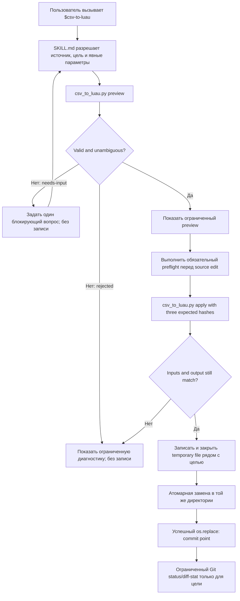

# Техническая спецификация skill `$csv-to-luau`

## 1. Цель и концепция

`$csv-to-luau` — явно вызываемый проектный Codex skill, который преобразует доступный CSV в детерминированный Luau ModuleScript с данными внутри текущего Git/Rojo-репозитория. Skill сначала выполняет полный разбор, вывод типов, проверку существующей цели и ограниченный предпросмотр, а затем отдельным шагом атомарно записывает только проверенный результат. Неоднозначность, повреждённые данные, неподдерживаемый Luau или обнаруженное до commit point изменение входов приводят к отказу без изменения цели.

Спецификация нормативно преобразует approved PRD revision 5 с exact-byte SHA-256 `2bba4fdca93020d79eea7691483c02ae0034781b319bf3d7c45d0c787ef2b083`. Revision 5 добавляет bounded-анализ вероятных массивов с нестандартными разделителями и обязательное решение пользователя до их преобразования; автоматическое распознавание comma-separated массивов сохраняется. Исключение одновременных запусков для одной цели, координации таких запусков и защиты от внешних writers не меняется; новых внешних зависимостей не требуется.

## 2. Контекст и границы области

Репозиторий является переиспользуемым template-репозиторием. Пакет skill хранится в template-owned `.agents/skills/csv-to-luau/` и наследуется производными проектами обычным template update. Сам конвертер работает с файловой системой; Roblox Studio, DataModel, публикация и отдельный Studio plugin не участвуют.

Внешние соседи границы feature:

- Codex предоставляет вызов skill, доступ к attachment/path, диалог с пользователем и shell execution;
- Git определяет корень текущего репозитория и формирует ограниченную итоговую сводку;
- `default.project.json` определяет файловые `$path`-границы Rojo, в которые допустимо поместить ModuleScript;
- действующие `AGENTS.md` и matched repository rules определяют обязательный preflight перед source edit;
- Python 3.10+ standard library исполняет bundled deterministic helper и его tests;
- Rojo синхронизирует уже записанный `.luau` обычным существующим контуром.

### 2.1. Точный контракт артефактов реализации

| Путь | Назначение | Обязательность |
|---|---|---|
| `.agents/skills/csv-to-luau/SKILL.md` | Краткая orchestration-инструкция Codex; YAML frontmatter содержит только `name` и `description` | Обязательно |
| `.agents/skills/csv-to-luau/agents/openai.yaml` | Детерминированные UI metadata и запрет implicit invocation | Обязательно |
| `.agents/skills/csv-to-luau/scripts/csv_to_luau.py` | Единственный production helper для `preview` и `apply`; только Python standard library | Обязательно |
| `.agents/skills/csv-to-luau/scripts/test_csv_to_luau.py` | Исполняемые unit/integration tests helper с временными fixture-репозиториями | Обязательно |

Внутри skill запрещены `README.md`, `CHANGELOG.md`, installation guide, quick reference, необязательные `references/`, `assets/`, fixture dumps и иные вспомогательные документы. Изменения `default.project.json`, `.codex/config.toml`, Roblox source, `place.rbxl` или Studio assets не входят в реализацию feature. Служебные документы TF-0006 обновляются только командами feature workflow и не являются частью runtime-пакета skill.

### 2.2. Проверка доступных возможностей и ожидания от оператора

Перед реализацией и перед каждым реальным `apply` должны быть подтверждены:

1. доступный Python 3.10+ и Git CLI;
2. читаемый CSV attachment/path;
3. текущий Git root и читаемый `default.project.json`;
4. существующий, записываемый parent целевого файла;
5. фактический целевой путь внутри Git root и внутри одного filesystem-backed Rojo `$path`;
6. доступный PowerShell host для обязательного repository preflight (`powershell` на Windows или `pwsh` на поддерживаемой платформе), когда текущие repository rules требуют `scripts/ensure-rojo-server.ps1`;
7. отсутствие потребности в Studio, Computer Use, browser UI, MCP, network или package installation.

Пользователь вручную принимает только отсутствующие решения: точную цель, формат нового файла, ключевую колонку, неоднозначный разделитель, type override или дальнейшее действие для небезопасного существующего модуля. Skill задаёт не более одного минимального блокирующего вопроса за раз. Валидный однозначный preview не требует дополнительного подтверждения записи.

## 3. Термины и глоссарий

| Термин | Определение |
|---|---|
| Логическая запись | Одна CSV-запись; может занимать несколько физических строк из-за quoted field |
| Чистый модуль данных | UTF-8 `.luau`, чьё единственное исполняемое содержимое — literal `return { ... }`; до `return` допустимы whitespace, `--!strict`, Luau line comments и Luau long comments |
| Режим массива | Верхняя таблица содержит row tables в порядке логических записей CSV |
| Режим словаря | Верхняя таблица индексируется типизированным значением выбранной key column |
| Target preimage | Отсутствие цели либо точные bytes цели на момент `preview` |
| Typed key | Значение key column после подтверждённой type conversion к `string`, `number` или `boolean` |
| Массив ячейки | Непустое значение колонки с effective type `array<string>`; оно разбирается по автоматически выбранной запятой либо по явно подтверждённому разделителю колонки, trim-ит каждый элемент и генерируется как Luau array table строк |
| Предпросмотр | Ограниченный JSON-derived отчёт до записи, содержащий schema, samples, diagnostics, diff counts и hashes |
| Полная синхронизация | Новый результат полностью определяется CSV и параметрами; старые rows/keys, отсутствующие в CSV, не сохраняются |
| Commit point | Успешный возврат `os.replace`; после этой точки новый target считается атомарно установленным и не откатывается из-за последующего сбоя отчётности |
| Последовательный запуск | Один invocation обрабатывает одну цель без одновременного competing invocation или внешнего writer для этой цели |

## 4. Декомпозиция

### 4.1. Уровень 0 — пакет `$csv-to-luau`

```text
$csv-to-luau (L0)
├── Codex orchestration (L1)
│   ├── SKILL.md
│   └── agents/openai.yaml
├── Deterministic conversion (L1)
│   └── scripts/csv_to_luau.py
└── Contract verification (L1)
    └── scripts/test_csv_to_luau.py

Вне границы L0: пользователь, Git, default.project.json, repository AGENTS/rules, Python runtime, Rojo
```

L0 владеет только conversion workflow. Он не владеет Roblox runtime state, Studio lifecycle, Rojo server implementation, Git staging/commit или feature lifecycle.

### 4.2. Уровень 1 — оркестрация Codex

#### `.agents/skills/csv-to-luau/SKILL.md`

Тип: project-local Codex skill instruction.

Ответственность: разрешить source/target и пользовательские параметры, прочитать repository instructions, вызвать helper сначала в `preview`, показать bounded preview, задать один вопрос при необходимости, выполнить обязательный repository preflight непосредственно перед source edit, вызвать `apply` с expected hashes и показать bounded result/Git summary.

Не владеет: CSV grammar, type inference, Luau parsing/rendering, path safety или atomic write. Эти fragile contracts принадлежат helper и не дублируются ad hoc shell/Python snippets в `SKILL.md`.

Frontmatter:

- `name: csv-to-luau`;
- `description` одновременно описывает conversion behavior и явные trigger contexts;
- иных frontmatter keys нет;
- body использует imperative/infinitive form и остаётся менее 500 строк.

#### `.agents/skills/csv-to-luau/agents/openai.yaml`

Тип: UI metadata.

Канонические значения:

```yaml
interface:
  display_name: "CSV to Luau"
  short_description: "Convert CSV into safe Luau data modules"
  default_prompt: "Use $csv-to-luau to convert an attached or local CSV into a repository-owned Luau data module."

policy:
  allow_implicit_invocation: false
```

Metadata генерируются `skill-creator/scripts/init_skill.py` или `generate_openai_yaml.py` через явные `--interface key=value`; optional icons, colors и tool dependencies не добавляются.

#### Взаимодействие на уровне 1 — оркестрация

1. `SKILL.md` разрешает только conversational ambiguity и передаёт точные параметры helper.
2. Helper возвращает machine-readable bounded JSON.
3. `SKILL.md` не интерпретирует CSV или Luau самостоятельно и не записывает target через shell redirection.
4. `openai.yaml` обеспечивает UI discovery только для explicit invocation.

### 4.3. Уровень 1 — детерминированная конверсия

#### `.agents/skills/csv-to-luau/scripts/csv_to_luau.py`

Тип: Python 3.10+ standard-library CLI.

Ответственность: byte decoding, strict CSV state machine, delimiter selection, normalization, schema inference, safe parsing of existing pure data module, deterministic rendering, bounded preview/diff, hash guard, repository/Rojo boundary validation и atomic replace.

Не владеет: диалогом, approval, repository rule selection, запуском Rojo preflight, Git commit/stage или Studio operations. Boundary writer владеет подготовкой и commit point для одного последовательного invocation. Одновременные helper invocations одной цели и внешние writers не поддерживаются и не координируются.

Публичные операции:

```text
preview --repo-root <path> --source <path> --target <path>
        [--mode array|dictionary] [--key-column <header>]
        [--delimiter comma|semicolon|tab|pipe]
        [--type <header>=string|number|boolean]...
        [--array-delimiter <header>=comma|semicolon|pipe|tab|newline]...

apply   <те же conversion args>
        --expect-source-sha256 <hex>
        --expect-target-sha256 <hex|absent>
        --expect-output-sha256 <hex>
```

CLI получает argv напрямую без shell interpolation. `preview` никогда не пишет repository files. `apply` полностью повторяет resolution/parsing/validation/rendering и записывает только если все три expected hash совпали.

Внутренние grounded roles одного script:

- CSV reader сохраняет `quoted` provenance каждого field и считает logical/physical positions;
- schema inference владеет nil/scalar/`array<string>`/override rules;
- pure-module recognizer статически разбирает только разрешённую literal grammar и никогда не выполняет Luau;
- renderer владеет canonical bytes;
- boundary writer владеет real-path/Rojo checks, same-directory temporary file, hash recheck, best-effort cleanup и `os.replace` commit point.

### 4.4. Уровень 1 — проверка контрактов

#### `.agents/skills/csv-to-luau/scripts/test_csv_to_luau.py`

Тип: Python standard-library executable test suite.

Ответственность: создавать изолированные temporary Git/Rojo fixture repos, вызывать CLI как subprocess, проверять exit code, bounded JSON, exact bytes, target non-mutation, idempotency, path redirects, simple pre-commit/commit failure seams и PRD/TS acceptance matrix. Tests не зависят от network, Studio, текущего repository working tree или постоянных fixture files.

## 5. Модели данных

### 5.1. `ParsedField` и `LogicalRecord`

```text
ParsedField = { text: Unicode string, quoted: boolean, physical_start_line: positive integer }
LogicalRecord = { logical_number: positive integer, fields: ParsedField[] }
```

`text` после decoding сохраняет quoted content буквально; unquoted content получает trim по краям. Empty value представляется внутренним `None` только после normalization.

### 5.2. `ColumnSchema`

```text
ColumnSchema = {
  index: non-negative integer,
  name: non-empty unique string,
  inferred_type: "string" | "number" | "boolean" | "array<string>" | "empty",
  effective_type: "string" | "number" | "boolean" | "array<string>" | "empty",
  override: null | "string" | "number" | "boolean",
  array_delimiter: null | "comma" | "semicolon" | "pipe" | "tab" | "newline",
  non_empty_count: non-negative integer,
  empty_count: non-negative integer
}
```

### 5.3. Результат `preview`

`preview` пишет в stdout ровно один UTF-8 JSON object:

```text
{
  status: "ok" | "needs-input" | "rejected",
  operation: "preview",
  source: { display_path, bytes, sha256 },
  target: { repo_relative_path, exists, bytes, sha256|null, detected_mode|null },
  delimiter: { selected|null, candidates[] },
  shape: { records, columns, empty_cells },
  schema: ColumnSchema[],
  array_candidates: { total, shown[], truncated },
  mode: "array" | "dictionary" | null,
  key_column: string|null,
  diff: { added, changed, removed },
  samples: { first[], last[], truncated },
  diagnostics: { total, shown[] },
  required_decisions: string[],
  output: { bytes, sha256 } | null,
  limits: { ...effective budgets... }
}
```

`needs-input` используется только для resolvable ambiguity; `rejected` — для invalid/capability/safety error. JSON не содержит полный CSV или полный generated module.

### 5.4. Результат `apply`

```text
{
  status: "written" | "unchanged" | "rejected",
  operation: "apply",
  target: { repo_relative_path, bytes, sha256 },
  records: non-negative integer,
  diff: { added, changed, removed },
  diagnostics: { total, shown[] }
}
```

Exit codes: `0` для `ok`, `written`, `unchanged`; `2` для `needs-input`; `3` для input/validation/safety rejection; `4` для unavailable capability или internal failure. Ошибка до commit point, включая неуспешный `os.replace`, оставляет target preimage неизменным со стороны helper. Успешный возврат `os.replace` является commit point; после него helper и orchestration MUST NOT откатывать target даже при последующей ошибке формирования или доставки итогового JSON.

Отдельной операции reconciliation нет. Если процесс завершился без подтверждённого result после возможного commit point, skill сообщает bounded error и не повторяет write автоматически. Защита от внешнего writer или второго invocation для той же цели не входит в контракт.

## 6. Диаграмма



## 7. Пользовательские и технические потоки

### 7.1. Новый модуль

1. Orchestration разрешает readable source и exact target.
2. Если mode отсутствует, helper возвращает `needs-input`; skill спрашивает `array` или `dictionary` и не пишет файл.
3. Для dictionary без key column задаётся следующий единственный вопрос.
4. `preview` выводит schema, bounded samples и expected hashes.
   Если хотя бы одна непустая ячейка колонки содержит запятую и для колонки не задан type override, schema inference выбирает `array<string>` для всей колонки; одиночные значения становятся одноэлементными массивами.
   Для оставшихся scalar columns helper анализирует `semicolon`, `pipe`, `tab` и `newline`. При валидном кандидате preview возвращает `needs-input`, bounded evidence и не разрешает apply; skill спрашивает только о первом кандидате. Выбор передаётся как `--array-delimiter <header>=<name>`, отказ — как `--type <header>=string`, затем preview повторяется.
5. Когда unresolved array candidates отсутствуют, skill показывает preview, выполняет repository source-edit preflight и вызывает `apply` без confirmation prompt.
6. `apply` повторяет полный анализ, сверяет hashes, пишет atomically и возвращает result.

### 7.2. Существующий чистый модуль

1. Recognizer определяет `array` либо `dictionary` из literal table.
2. Для dictionary key column определяется только если ровно одна nested column во всех rows типизированно равна outer key; иначе требуется вопрос.
3. Prefix до `return`, включая `--!strict`, header line comments и header long comments, сохраняется семантически с canonical LF.
4. Preview сообщает position-based counts для array либо typed-key counts для dictionary.
5. Full synchronization удаляет отсутствующие CSV rows/keys.

### 7.3. Неоднозначность или недопустимые входные данные

Helper собирает bounded diagnostics до лимита, возвращает `needs-input` или `rejected`, не создаёт target/temp repository file и не запускает Git mutation. Skill задаёт максимум один вопрос только если пользовательский ответ способен продолжить операцию.

### 7.4. Изменение после preview и граница отказа

Если source bytes, target preimage или recomputed output отличаются от expected hashes, `apply` отказывает до mutation. Для одного последовательного invocation boundary writer повторно разрешает и валидирует target/parent, создаёт unique temporary `.luau` в том же разрешённом parent, записывает полный canonical output, выполняет flush и закрывает файл, затем вызывает `os.replace`. Успешный возврат `os.replace` является commit point.

| Точка отказа | Наблюдаемый state | Обязательное действие |
|---|---|---|
| До `os.replace`, включая validation, limits, temp write, flush и close | Helper не изменял target | Best-effort удалить только temporary file текущего invocation; вернуть rejection |
| `os.replace` завершился ошибкой | Helper не подтвердил commit | Best-effort удалить только temporary file текущего invocation; не менять target дополнительно |
| После успешного возврата `os.replace` | Target содержит output на commit point | Не выполнять rollback; вернуть success либо bounded reporting error, если итоговый JSON сформировать невозможно |

Lock marker, hard-link publication, polling, waiting, serialization, retry protocol и cleanup чужих sibling files запрещены как ненужная coordination logic. Helper не обещает защиту от одновременного второго invocation или external writer; такие запуски находятся вне поддерживаемого контракта.

### 7.5. Повторный запуск

При одинаковых source bytes, parameters и target helper создаёт те же output bytes; `apply` возвращает `unchanged`, не заменяет файл и итоговый meaningful Git diff пуст.

## 8. Нормативные требования и ограничения

- `TS-REQ-001`: Реализация MUST создать ровно четыре артефакта из §2.1; skill MUST быть инициализирован через `skill-creator/scripts/init_skill.py csv-to-luau --path .agents/skills --resources scripts` с deterministic `--interface` values. Источник: Release Target, `PRD-NFR-009`.
- `TS-REQ-002`: `SKILL.md` MUST иметь имя `csv-to-luau`, frontmatter только `name`/`description`, explicit-invocation trigger и concise imperative body; `openai.yaml` MUST совпадать с §4.2 и запрещать implicit invocation. Источник: Product Outcome, Core Loop step 1.
- `TS-REQ-003`: Перед preview orchestration MUST подтвердить Python 3.10+, Git root и `default.project.json`; перед apply MUST прочитать действующие repository instructions и выполнить их source-edit preflight. Failure MUST блокировать write. Источник: Assumptions, `PRD-NFR-008`, repository rules.
- `TS-REQ-004`: Source MUST быть readable attachment-backed path либо явно указанный accessible path; helper MUST читать bytes без изменения source и декодировать только UTF-8 с optional BOM. Источник: `PRD-REQ-001`, `PRD-REQ-008`, `PRD-NFR-006`.
- `TS-REQ-005`: Target MUST быть exact `.luau` path с существующим parent; lexical и real path MUST находиться внутри resolved Git root. Redirect через `..`, symlink, junction/reparse или иной real-path mismatch MUST быть rejected. Источник: `PRD-REQ-002`, `PRD-REQ-003`, `PRD-NFR-010`.
- `TS-REQ-006`: Target MUST находиться внутри хотя бы одного filesystem-backed `$path` из `default.project.json`; `.server.luau` и `.client.luau` MUST быть rejected, а project mapping MUST NOT изменяться. Источник: Product Outcome, Release Target, `PRD-REQ-002`.
- `TS-REQ-007`: Новый target MUST требовать explicit mode `array` или `dictionary`; dictionary MUST требовать exact key column. Existing safe target MUST использовать reliably detected mode; conflicting supplied mode MUST fail closed. Источник: `PRD-REQ-004`, `PRD-REQ-005`, `PRD-REQ-023`.
- `TS-REQ-008`: Conversion MUST использовать отдельные `preview` и `apply`; apply MUST recompute complete result и сравнить source, target-preimage и output SHA-256 из successful preview. При несовпадении apply MUST отказать до write. Отдельные lock/reconcile operations, автоматический retry write и rollback после commit point MUST NOT реализовываться. Источник: Core Loop steps 4–5, `PRD-REQ-006`, `PRD-REQ-007`, `PRD-REQ-028`, `PRD-NFR-002`.
- `TS-REQ-009`: CSV parser MUST быть strict finite-state parser с quoted provenance, doubled quotes, embedded delimiters/newlines и CR/LF/CRLF record endings. Auto-detection MUST оценивать `comma`, `semicolon`, `tab`, `pipe` отдельно для каждого source; structurally different plausible candidates MUST require user choice. Источник: `PRD-REQ-008`, `PRD-REQ-009`, `PRD-NFR-005`.
- `TS-REQ-010`: Parser MUST игнорировать empty physical lines вне quotes, trim unquoted fields, literal-preserve quoted fields до effective-type conversion, omit normalized empty cells, reject all-empty logical data records, reject empty/duplicate headers и reject row width mismatch with logical record diagnostics. Источник: `PRD-REQ-010`, `PRD-REQ-011`, `PRD-REQ-012`, `PRD-REQ-013`, `PRD-REQ-014`, `PRD-REQ-015`, `PRD-REQ-016`.
- `TS-REQ-011`: Type inference MUST inspect every non-empty cell. Без explicit override наличие запятой хотя бы в одной непустой ячейке MUST задавать `array<string>` для всей колонки; иначе all valid numbers -> `number`, all case-insensitive `true`/`false` -> `boolean`, remaining values -> `string`, no-data column -> `empty`. Boolean rendering MUST быть lowercase. Источник: `PRD-REQ-017`, `PRD-REQ-019`, `PRD-REQ-021`.
- `TS-REQ-012`: Valid number grammar MUST быть `[+-]?(?:0|[1-9][0-9]*)(?:\.[0-9]+)?(?:[eE][+-]?[0-9]+)?`. Helper MUST reject numeric conversion if IEEE-754 binary64 is non-finite or canonical shortest round-trip changes the exact decimal value; leading-zero tokens such as `00123` therefore remain strings. `-0` and `0` share one numeric key. Источник: `PRD-REQ-017`, `PRD-REQ-018`, Assumptions.
- `TS-REQ-013`: Repeated `--type <header>=...` overrides MUST determine effective type after inferred type is reported and before conversion/mode validation. Explicit `string` MUST preserve the complete cell, including commas, as one scalar string; incompatible number/boolean conversion MUST reject without write. Override MUST NOT synthesize values in empty cells or no-data columns. Источник: `PRD-REQ-020`, `PRD-REQ-021`.
- `TS-REQ-014`: Array rendering MUST emit exactly one row table per valid logical record in CSV order; empty fields MUST be absent. Array diff MUST compare equal positions, count unequal common positions as changed, excess new positions as added и excess old positions as removed. Источник: `PRD-REQ-022`, `PRD-REQ-029`.
- `TS-REQ-015`: Dictionary rendering MUST type outer keys by key-column effective scalar type, retain the key field inside row, reject an `array<string>` key column, reject empty/duplicate typed keys и preserve CSV order textually without promising runtime iteration order. Diff MUST compare typed key sets and row values. Источник: `PRD-REQ-023`, `PRD-REQ-024`, `PRD-REQ-025`, `PRD-REQ-036`.
- `TS-REQ-016`: ASCII Luau identifiers matching `[A-Za-z_][A-Za-z0-9_]*` and not a Lua 5.1 reserved word MUST use `name =`; all other headers MUST use escaped string keys. Strings MUST preserve Unicode and escape `"`, `\`, standard control escapes and remaining C0/DEL bytes via Luau `\xNN`. `array<string>` MUST render as a nested Luau array table with one escaped string literal per line in source order. Источник: `PRD-REQ-026`, `PRD-REQ-027`, `PRD-REQ-036`, `PRD-NFR-006`, `PRD-NFR-007`.
- `TS-REQ-017`: Preview MUST include source/target, delimiter, shape, complete bounded schema, mode/key, empty count, diagnostics, diff counts, first three and last three transformed rows and hashes; it MUST NOT expose full large output. Источник: `PRD-REQ-028`, `PRD-REQ-029`, `PRD-NFR-004`.
- `TS-REQ-018`: Existing target recognizer MUST statically accept only one literal `return { ... }` with generated scalar/row/table grammar, включая одноуровневые nested string-array values, and optional whitespace, `--!strict`, Luau line comments и Luau long comments before return. It MUST NOT execute, import or evaluate target Luau. Источник: `PRD-REQ-005`, `PRD-REQ-031`, `PRD-REQ-036`, `PRD-NFR-012`.
- `TS-REQ-019`: `require`, function, computed expression, metatable, additional executable statement, table-internal comment, trailing content, unsupported literal or ambiguous shape MUST reject automatic update and request disposition. Источник: `PRD-REQ-032`, `PRD-NFR-012`.
- `TS-REQ-020`: CSV MUST be the complete source; successful update MUST remove absent rows/typed keys and MUST compute added/changed/removed against parsed target. Источник: `PRD-REQ-030`, `PRD-REQ-029`.
- `TS-REQ-021`: Renderer MUST emit UTF-8 without BOM, LF line endings, tab indentation, stable column/record order and final newline. New files MUST start with `--!strict\n\n`; existing allowed prefix comments/directive MUST be preserved with LF normalization. Источник: `PRD-NFR-001`, `PRD-NFR-006`, `PRD-REQ-031`.
- `TS-REQ-022`: All parsing, validation, rendering and limit checks MUST finish before target mutation. Для одного последовательного invocation apply MUST повторно validate exact target/parent, создать unique same-directory temporary `.luau`, записать полный output, выполнить flush и close, затем выполнить atomic `os.replace`. Успешный возврат `os.replace` MUST быть commit point. До commit point helper MUST best-effort удалить только свой temporary file и MUST NOT частично перезаписывать target; после commit point rollback запрещён. Реализация MUST NOT создавать lock marker, hard link, polling/waiting/serialization protocol или обещать защиту от второго invocation/external writer. Источник: `PRD-NFR-002`, `PRD-NFR-010`, `PRD-AC-022`, Scope revision 3.
- `TS-REQ-023`: Every data diagnostic MUST include source display path, logical record and applicable column; parser diagnostics SHOULD also include physical start line. Multiple errors MUST be bounded and summarized; stack traces MUST NOT appear in normal user output. Источник: `PRD-REQ-034`, `PRD-NFR-003`, `PRD-NFR-005`, `PRD-NFR-011`.
- `TS-REQ-024`: Helper MUST enforce all budgets in §8.1 before write and use O(input bytes + cells + output bytes) time; quadratic row/record comparison is forbidden. Источник: `PRD-NFR-004`, `PRD-NFR-011`, Risks.
- `TS-REQ-025`: After acknowledged `written`/`unchanged`, orchestration MUST show exact repo-relative target, status, records, output bytes/hash and target-only bounded `git status`, `git diff --numstat`/`--stat`; untracked targets MUST use direct-argv `git diff --no-index` with `os.devnull`. Target path MUST передаваться после Git end-of-options marker `--` там, где команда его поддерживает. Git reporting MUST NOT mutate the repository, MUST NOT roll back output on failure и MUST NOT use a helper-internal fixed wall-clock timeout. Full diff MAY appear only within §8.1 display budget. Источник: `PRD-REQ-033`, `PRD-AC-024`.
- `TS-REQ-026`: Runtime MUST use only Python standard library and Git already available to Codex; it MUST NOT install packages, start a persistent process, use platform-specific shell pipelines, network, Studio, DataModel, plugin, VS Code extension or companion app. Источник: Out of Scope, `PRD-NFR-008`, `PRD-NFR-009`.
- `TS-REQ-027`: Same source bytes, options and preimage MUST produce byte-identical canonical output without OS-specific rendering branches; identical output MUST return `unchanged` without replacement. Полный deterministic suite на доступной поддерживаемой среде MUST подтверждать этот контракт; отдельные desktop-OS сравнения MAY выполняться как дополнительный неблокирующий evidence. Источник: `PRD-REQ-035`, `PRD-NFR-001`.
- `TS-REQ-028`: Implementation MUST execute `test_csv_to_luau.py`, `skill-creator/scripts/quick_validate.py`, deterministic metadata generation/validation, repository workflow/layout checks, `git diff --check` and all matched gates. Bundled scripts MUST be actually run, not inspection-only. Источник: `PRD-NFR-007`, `PRD-NFR-009`, Skill Creator contract.
- `TS-REQ-029`: Release evidence MUST include the complete deterministic helper suite in the available supported environment plus an independent Luau parser/runtime syntax check for generated golden outputs. macOS/Linux repeats and the Windows directory-symlink scenario that requires unavailable filesystem privilege MUST remain in the suite or QA inventory as additional checks, but their environmental skip MUST NOT block readiness when path traversal, junction/redirect, real-path validation and all other executable scenarios pass. Источник: Release Target, `PRD-NFR-001`, `PRD-NFR-007`, `PRD-AC-023`.
- `TS-REQ-030`: Implementation MUST NOT add any package file beyond §2.1 or any external dependency/config; generated placeholder/example resources from `init_skill.py` MUST be removed. Источник: Scope, `PRD-NFR-009`, Skill Creator contract.
- `TS-REQ-031`: Missing/ambiguous target, mode, key, delimiter or unsafe-target disposition MUST yield no write and at most one user question per turn; successful unambiguous preview MUST continue to apply without a confirmation question. Reporting failure MUST NOT trigger automatic retry or rollback. Источник: `PRD-REQ-003`–`PRD-REQ-007`, `PRD-REQ-009`, `PRD-REQ-032`.
- `TS-REQ-032`: Existing `--!strict`, header line comments и header long comments MUST remain in original order and text content; comments inside returned table are never auto-preserved and therefore make the target unsafe. Источник: `PRD-REQ-031`, `PRD-REQ-032`.
- `TS-REQ-033`: Для автоматически inferred `array<string>` helper MUST split каждую непустую ячейку по literal comma; для explicit array delimiter действует split rule из `TS-REQ-034`. В обоих случаях helper MUST trim whitespace вокруг каждого элемента, preserve order и reject empty elements (`a,,b`, leading/trailing selected delimiter) с source/record/column diagnostic до write. Непустая ячейка без выбранного delimiter в той же колонке MUST стать одноэлементным массивом. Каждый array element MUST учитываться в существующем лимите `Total data cells`; превышение MUST reject до write. Источник: `PRD-REQ-036`, `PRD-REQ-037`.
- `TS-REQ-034`: После scalar inference и до apply helper MUST детерминированно анализировать scalar columns без explicit override по кандидатам `semicolon`, `pipe`, `tab`, `newline` в этом порядке. Кандидат существует, если разделитель встречается хотя бы в одной непустой ячейке колонки и каждое совпавшее значение split/trim-ится в два или более непустых элемента. Preview MUST вернуть exit 2/`needs-input`, `required_decisions=["array_delimiter"]` и bounded `array_candidates` (не более 32 shown, с total/truncated, column, delimiter, matching/non-empty counts, generated-element count и одним bounded sample); apply без решения MUST NOT write. Repeated `--array-delimiter <header>=<name>` MUST явно задавать effective `array<string>` и выбранный split rule; repeated `--type <header>=string` MUST сохранять scalar и suppress candidate для этой колонки. Unknown/duplicate/conflicting overrides и пустые элементы выбранного массива MUST reject до write. Источник: `PRD-REQ-037`.

### 8.1. Ресурсные бюджеты

| Ресурс | Жёсткий лимит | Поведение при превышении |
|---|---:|---|
| CSV source bytes | 32 MiB | `rejected`, no write |
| Existing target bytes | 64 MiB | `rejected`, no write |
| Generated output bytes | 64 MiB | `rejected`, no write |
| Logical data records | 100,000 | `rejected` с первым превышенным logical number |
| Columns | 256 | `rejected` после header parsing |
| Total data cells / generated scalar values | 1,000,000 | Каждая scalar cell либо каждый элемент `array<string>` считается одной value; `rejected`, no write |
| Один decoded field | 1 MiB UTF-8 | `rejected` с record/column |
| Одна logical record | 4 MiB source bytes | `rejected` с record |
| Stored diagnostics | первые 50 | показываются 50 и total count |
| Preview samples | первые 3 + последние 3 | без middle rows |
| Helper JSON stdout | 256 KiB | samples/diagnostic text сокращаются, counts/schema сохраняются |
| Chat preview/full diff | 16 KiB и 200 lines | только schema/counts/stat и bounded samples |
| Peak process memory | 512 MiB design budget | implementation MUST stream/spool in memory-bounded structures либо reject до превышения |

Helper не устанавливает wall-clock timeout, потому что host performance различается; каждый test subprocess имеет finite timeout 120 seconds. Никакая операция не остаётся background process после завершения команды.

## 9. Обязательный подход к реализации

1. Перед source edit выполнить repository Rojo preflight, затем инициализировать skill ровно через `C:\Users\teano\.codex\skills\.system\skill-creator\scripts\init_skill.py` с `--resources scripts` и §4.2 interface values.
2. Удалить placeholders и реализовать один deterministic helper вместо логики в prompt или множества platform wrappers.
3. Реализовать CSV как explicit state machine: start/unquoted/quoted/after-quote, сохраняя quoted provenance и logical positions.
4. Реализовать отдельный non-executing tokenizer/parser для разрешённого Luau literal subset; regex-only classification существующего module недостаточна.
5. Реализовать preview/apply как две полные вычислительные транзакции с three-hash guard для одного последовательного invocation; не добавлять coordination protocol для конкурирующих запусков.
6. Сформировать canonical output bytes до любой target mutation; записать, flush и закрыть unique same-directory temporary file, затем выполнить atomic replace только в validated target parent. Считать successful `os.replace` commit point; после него не выполнять rollback.
7. Сгенерировать `agents/openai.yaml` детерминированно, затем проверить соответствие `SKILL.md`.
8. Запустить bundled tests, `quick_validate.py`, repository checks и required available-environment/runtime evidence; сохранить дополнительные OS/symlink проверки, не делая отсутствие соответствующего runner/privilege release blocker.

## 10. Запрещённые формальные решения

- Нельзя разбирать CSV через `splitlines()`/`split(delimiter)` или library path, теряющий quoted/unquoted provenance.
- Нельзя выполнять/`require` existing target, использовать `loadstring`, импортировать Luau parser dependency или угадывать безопасность regex-only проверкой.
- Нельзя писать target во время preview, до завершения validation или через direct shell redirection.
- Нельзя продолжать после ambiguous delimiter/target/mode/key, incompatible override, changed hash или unsafe existing module.
- Нельзя сохранять absent CSV rows/keys, переименовывать headers, превращать leading-zero IDs в numbers или обещать dictionary iteration order.
- Нельзя оставлять comma-separated значение строкой при inferred `array<string>`, превращать строковый массив в dictionary key, молча удалять пустые элементы или рекурсивно создавать nested arrays.
- Нельзя выводить полный большой CSV/module/diff в чат.
- Нельзя обходить repository AGENTS/rules, Rojo source boundaries или target real-path validation.
- Нельзя после commit point восстанавливать preimage или автоматически повторять write.
- Нельзя добавлять lock marker, hard-link publication, polling, waiting, serialization, same-target multi-writer coordination или отдельную operation `reconcile`.
- Нельзя добавлять package manager, third-party Python module, Studio plugin, LocalScript/Script, daemon, network service, README/CHANGELOG или второй conversion implementation.

## 11. Открытые вопросы

Открытых вопросов нет. Product decisions полностью определены approved PRD revision 5; number grammar, resource budgets, package anatomy и capability gates зафиксированы здесь как технические контракты.

## 12. Критерии приёмки

- `TS-AC-001`: Valid array CSV создаёт exact canonical ModuleScript в CSV order; empty cells отсутствуют. Проверяет: `TS-REQ-010`, `TS-REQ-014`, `TS-REQ-021`. Трассировка: `PRD-AC-001`.
- `TS-AC-002`: Новый target без mode возвращает exit 2/`needs-input`, и target не существует. Проверяет: `TS-REQ-007`, `TS-REQ-031`. Трассировка: `PRD-AC-002`.
- `TS-AC-003`: Отсутствующая/неоднозначная verbal target resolution задаёт один вопрос и не меняет `.luau`. Проверяет: `TS-REQ-005`, `TS-REQ-031`. Трассировка: `PRD-AC-003`.
- `TS-AC-004`: Path traversal и symlink/junction redirect вне root/Rojo mapping, включая redirect/identity drift, введённый после preview или непосредственно перед commit, отвергаются; внешний файл byte-identical. Junction/redirect и real-path coverage обязательны; direct directory-symlink execution сохраняется в suite, но privilege-based skip неблокирующий. Проверяет: `TS-REQ-005`, `TS-REQ-006`, `TS-REQ-022`, `TS-REQ-029`. Трассировка: `PRD-AC-004`.
- `TS-AC-005`: BOM CSV с doubled quote, delimiter и CRLF внутри quoted field создаёт одну logical record и с explicit `string` override round-trips exact text. Проверяет: `TS-REQ-004`, `TS-REQ-009`, `TS-REQ-013`, `TS-REQ-016`. Трассировка: `PRD-AC-005`.
- `TS-AC-006`: Unique semicolon/tab/pipe определяется; structurally ambiguous candidates возвращают `needs-input` и no write. Проверяет: `TS-REQ-009`, `TS-REQ-031`. Трассировка: `PRD-AC-006`.
- `TS-AC-007`: `1,-2,3.5` -> number, boolean case variants -> boolean, mixed -> string, `00123` -> string. Проверяет: `TS-REQ-011`, `TS-REQ-012`. Трассировка: `PRD-AC-007`.
- `TS-AC-008`: String override принимает numeric-looking cells; incompatible boolean override возвращает rejection и unchanged target. Проверяет: `TS-REQ-013`, `TS-REQ-023`. Трассировка: `PRD-AC-008`.
- `TS-AC-009`: `name` renders bare, `display name` и `end` render escaped bracket keys. Проверяет: `TS-REQ-016`. Трассировка: `PRD-AC-009`.
- `TS-AC-010`: Empty/duplicate header rejected before target/temp creation. Проверяет: `TS-REQ-010`, `TS-REQ-022`. Трассировка: `PRD-AC-010`.
- `TS-AC-011`: Width mismatch diagnostic names logical record; a syntactically present empty cell counts toward width. Проверяет: `TS-REQ-010`, `TS-REQ-023`. Трассировка: `PRD-AC-011`.
- `TS-AC-012`: Empty physical line ignored; `,,` и quoted-empty row rejected and never render `{}`. Проверяет: `TS-REQ-010`. Трассировка: `PRD-AC-012`.
- `TS-AC-013`: `,Bob,` yields only non-empty field in array; same row with empty dictionary key rejects. Проверяет: `TS-REQ-010`, `TS-REQ-014`, `TS-REQ-015`. Трассировка: `PRD-AC-013`.
- `TS-AC-014`: Textually distinct values mapping to one binary64/string/boolean typed key are duplicate and leave target unchanged. Проверяет: `TS-REQ-012`, `TS-REQ-015`, `TS-REQ-022`. Трассировка: `PRD-AC-014`.
- `TS-AC-015`: Numeric dictionary outer key is numeric, remains nested field, and text order matches CSV. Проверяет: `TS-REQ-015`. Трассировка: `PRD-AC-015`.
- `TS-AC-016`: Quotes, backslashes, C0 controls, Unicode and CR/LF string data compile/require in independent Luau validation and equal source value. Проверяет: `TS-REQ-016`, `TS-REQ-021`, `TS-REQ-029`. Трассировка: `PRD-AC-016`.
- `TS-AC-017`: Maximum-size representative preview stays within 256 KiB helper JSON and 16 KiB/200-line chat budget, with complete counts/schema and 3+3 samples. Проверяет: `TS-REQ-017`, `TS-REQ-024`. Трассировка: `PRD-AC-017`.
- `TS-AC-018`: Existing array/dictionary preview reports defined diff counts; apply removes absent rows/keys. Проверяет: `TS-REQ-014`, `TS-REQ-015`, `TS-REQ-020`. Трассировка: `PRD-AC-018`.
- `TS-AC-019`: Safe target with strict/header comments updates automatically and preserves prefix text/order. Проверяет: `TS-REQ-018`, `TS-REQ-021`, `TS-REQ-032`. Трассировка: `PRD-AC-019`.
- `TS-AC-020`: Каждый unsafe Luau construct из PRD возвращает rejection/one question and exact unchanged bytes. Проверяет: `TS-REQ-019`, `TS-REQ-031`, `TS-REQ-032`. Трассировка: `PRD-AC-020`.
- `TS-AC-021`: Successful preview followed by unchanged inputs writes without confirmation; existing detected mode does not prompt again. Проверяет: `TS-REQ-007`, `TS-REQ-008`, `TS-REQ-031`. Трассировка: `PRD-AC-021`.
- `TS-AC-022`: В одном последовательном invocation injected failure во время temporary write, flush/close или до successful `os.replace` оставляет существующий target byte-identical и выполняет best-effort cleanup только temporary file этого invocation. Successful `os.replace` устанавливает полный output; последующая reporting failure не выполняет rollback. Suite подтверждает отсутствие lock marker, hard-link coordination, polling/waiting и `reconcile` operation. Проверяет: `TS-REQ-008`, `TS-REQ-022`, `TS-REQ-031`. Трассировка: `PRD-AC-022`.
- `TS-AC-023`: Complete suite in the available supported environment produces stable SHA-256/bytes; second apply returns `unchanged` and meaningful diff empty. Additional macOS/Linux comparisons remain optional non-blocking evidence. Проверяет: `TS-REQ-021`, `TS-REQ-027`, `TS-REQ-029`. Трассировка: `PRD-AC-023`.
- `TS-AC-024`: Acknowledged `written`/`unchanged` summary names exact target/records and bounded target-only Git stats. Rejection до commit не создаёт target diff. Git reporting failure возвращает bounded error, не мутирует repository, не откатывает target и не использует fixed helper-internal timeout. Проверяет: `TS-REQ-008`, `TS-REQ-023`, `TS-REQ-025`, `TS-REQ-031`. Трассировка: `PRD-AC-024`.
- `TS-AC-025`: `init_skill.py` output is reduced to §2.1, `openai.yaml` exact-matches §4.2, and `quick_validate.py` passes. Проверяет: `TS-REQ-001`, `TS-REQ-002`, `TS-REQ-028`, `TS-REQ-030`.
- `TS-AC-026`: Каждый hard budget boundary имеет below/at/above tests; above returns bounded rejection and no write. Проверяет: `TS-REQ-024`.
- `TS-AC-027`: Missing Python/Git/default.project/PowerShell-required preflight capability blocks before apply with bounded diagnostic and no mutation. Проверяет: `TS-REQ-003`, `TS-REQ-023`, `TS-REQ-026`.
- `TS-AC-028`: CSV `id,Assets,DefaultBus,DefaultVolume` с первой ячейкой Assets `"rbxassetid://123456,rbxassetid://1234562"` и последующими одиночными Assets определяет schema `array<string>` и генерирует для каждой записи поле `Assets` как Luau array table; первая запись содержит две строки в исходном порядке, одиночные значения — одну строку. Повторный preview существующего результата безопасно распознаёт nested arrays и возвращает meaningful diff без ложных изменений. Проверяет: `TS-REQ-011`, `TS-REQ-016`, `TS-REQ-018`, `TS-REQ-033`. Трассировка: `PRD-AC-025`.
- `TS-AC-029`: Explicit `--type Assets=string` сохраняет comma-separated ячейку одной строкой; `a,,b`, leading/trailing comma, array key column и превышение общего value budget отклоняются до write с bounded source/record/column diagnostics. Проверяет: `TS-REQ-013`, `TS-REQ-015`, `TS-REQ-023`, `TS-REQ-024`, `TS-REQ-033`. Трассировка: `PRD-REQ-036`, `PRD-AC-025`.
- `TS-AC-030`: Scalar `Assets` с `rbxassetid://1|rbxassetid://2` возвращает exit 2/`needs-input`, first bounded candidate `Assets=pipe` и no write. Preview с `--array-delimiter Assets=pipe` возвращает `ok`, schema effective `array<string>` и canonical two-element Luau array; preview с `--type Assets=string` возвращает `ok` без повторного кандидата и сохраняет scalar. Проверяет: `TS-REQ-013`, `TS-REQ-017`, `TS-REQ-031`, `TS-REQ-034`. Трассировка: `PRD-AC-026`.
- `TS-AC-031`: Semicolon/tab/newline candidates, deterministic ordering, 32-item bound, duplicate/unknown/conflicting array overrides, empty chosen elements и direct apply с unresolved candidate покрыты no-write tests. Проверяет: `TS-REQ-023`, `TS-REQ-024`, `TS-REQ-031`, `TS-REQ-034`. Трассировка: `PRD-REQ-037`, `PRD-AC-026`.

## 13. Двусторонняя трассировка к PRD revision 5

Technical specification revision 7 отражает approved PRD revision 5. Revision 7 устраняет документационный drift между автоматическим comma split и explicit non-comma split, а также включает `TS-AC-030`–`TS-AC-031` в readiness range без изменения product behavior. Array behavior из `PRD-REQ-017`, `PRD-REQ-020`, `PRD-REQ-036`, `PRD-REQ-037`, `PRD-AC-025` и `PRD-AC-026` реализуется через `TS-REQ-011`, `TS-REQ-013`, `TS-REQ-015`, `TS-REQ-016`, `TS-REQ-017`, `TS-REQ-018`, `TS-REQ-031`, `TS-REQ-033`, `TS-REQ-034`, `TS-AC-028`–`TS-AC-031`. Same-target concurrent invocations, их coordination/serialization и защита от external writers остаются вне scope. `TS-REQ-008`, `TS-REQ-022`, `TS-REQ-025`, `TS-REQ-031`, `TS-AC-022` и `TS-AC-024` описывают только один последовательный invocation. `PRD-NFR-002` сохраняется: target не остаётся частично записанным или обнулённым, запись идёт через same-directory temporary file и atomic `os.replace`, а после commit point rollback запрещён.

### 13.1. Требования PRD → требования TS

| PRD | TS |
|---|---|
| `PRD-REQ-001` | `TS-REQ-004` |
| `PRD-REQ-002`–`PRD-REQ-003` | `TS-REQ-005`, `TS-REQ-006`, `TS-REQ-031` |
| `PRD-REQ-004`–`PRD-REQ-007` | `TS-REQ-007`, `TS-REQ-008`, `TS-REQ-031` |
| `PRD-REQ-008`–`PRD-REQ-009` | `TS-REQ-009`, `TS-REQ-031` |
| `PRD-REQ-010`–`PRD-REQ-016` | `TS-REQ-010`, `TS-REQ-023` |
| `PRD-REQ-017`–`PRD-REQ-019` | `TS-REQ-011`, `TS-REQ-012` |
| `PRD-REQ-020`–`PRD-REQ-021` | `TS-REQ-013`, `TS-REQ-017` |
| `PRD-REQ-022` | `TS-REQ-014` |
| `PRD-REQ-023`–`PRD-REQ-025` | `TS-REQ-015` |
| `PRD-REQ-026`–`PRD-REQ-027` | `TS-REQ-016` |
| `PRD-REQ-028`–`PRD-REQ-029` | `TS-REQ-017`, `TS-REQ-020` |
| `PRD-REQ-030` | `TS-REQ-020` |
| `PRD-REQ-031` | `TS-REQ-018`, `TS-REQ-021`, `TS-REQ-032` |
| `PRD-REQ-032` | `TS-REQ-019`, `TS-REQ-031`, `TS-REQ-032` |
| `PRD-REQ-033` | `TS-REQ-025` |
| `PRD-REQ-034` | `TS-REQ-023` |
| `PRD-REQ-035` | `TS-REQ-027` |
| `PRD-REQ-036` | `TS-REQ-011`, `TS-REQ-015`, `TS-REQ-016`, `TS-REQ-018`, `TS-REQ-033` |
| `PRD-REQ-037` | `TS-REQ-013`, `TS-REQ-017`, `TS-REQ-031`, `TS-REQ-034` |

### 13.2. Требования качества PRD → требования TS

| PRD | TS |
|---|---|
| `PRD-NFR-001` | `TS-REQ-021`, `TS-REQ-027`, `TS-REQ-029` |
| `PRD-NFR-002` | `TS-REQ-008`, `TS-REQ-022` |
| `PRD-NFR-003` | `TS-REQ-023` |
| `PRD-NFR-004` | `TS-REQ-017`, `TS-REQ-024` |
| `PRD-NFR-005` | `TS-REQ-009`, `TS-REQ-023` |
| `PRD-NFR-006` | `TS-REQ-004`, `TS-REQ-016`, `TS-REQ-021` |
| `PRD-NFR-007` | `TS-REQ-016`, `TS-REQ-028`, `TS-REQ-029` |
| `PRD-NFR-008` | `TS-REQ-003`, `TS-REQ-026`, `TS-REQ-029` |
| `PRD-NFR-009` | `TS-REQ-001`, `TS-REQ-026`, `TS-REQ-028`, `TS-REQ-030` |
| `PRD-NFR-010` | `TS-REQ-005`, `TS-REQ-022` |
| `PRD-NFR-011` | `TS-REQ-023`, `TS-REQ-024` |
| `PRD-NFR-012` | `TS-REQ-018`, `TS-REQ-019` |

### 13.3. Критерии приёмки PRD → критерии приёмки TS

| PRD | TS |
|---|---|
| `PRD-AC-001`–`PRD-AC-024` | `TS-AC-001`–`TS-AC-024` соответственно |
| `PRD-AC-025` | `TS-AC-028`, `TS-AC-029` |
| `PRD-AC-026` | `TS-AC-030`, `TS-AC-031` |

Обратное направление зафиксировано непосредственно в каждом `TS-REQ-*` полем `Источник` и в каждом `TS-AC-*` полями `Проверяет`/`Трассировка`. `TS-AC-025`–`TS-AC-027` проверяют implementation-only Skill Creator, budget и capability contracts и не добавляют product behavior.

## 14. Верификация и критерий готовности

Минимальная implementation verification:

1. выполнить `test_csv_to_luau.py` через Python 3.10+ в текущем окружении;
2. выполнить каждый generated/bundled script хотя бы на representative success и rejection scenarios;
3. выполнить `skill-creator/scripts/quick_validate.py .agents/skills/csv-to-luau`;
4. повторно сгенерировать/сверить `agents/openai.yaml` с exact §4.2 values;
5. выполнить repository feature workflow, index, layout и `git diff --check` gates;
6. выполнить Rojo build в temporary output согласно repository rules; Studio Play не требуется, поскольку runtime DataModel не изменяется;
7. получить стабильные повторные результаты полного suite в доступной поддерживаемой среде для `TS-AC-023`; macOS/Linux сравнения и privileged Windows directory-symlink execution выполнять дополнительно при наличии среды;
8. выполнить independent Luau syntax/runtime validation для golden outputs из `TS-AC-009`, `TS-AC-015`, `TS-AC-016`, `TS-AC-019`, `TS-AC-028`.

Readiness допускается только при `0` failed executable tests, успешном `quick_validate.py`, отсутствии unexpected diagnostics/temp files/external dependencies и полном обязательном evidence по `TS-AC-001`–`TS-AC-031`. Недоступный обязательный Luau runtime остаётся evidence gate. Отсутствие дополнительного macOS/Linux runner или Windows directory-symlink privilege не является blocker, если соответствующий сценарий явно reported as environment skip, а обязательные available-environment, junction/redirect и independent Luau проверки проходят.
