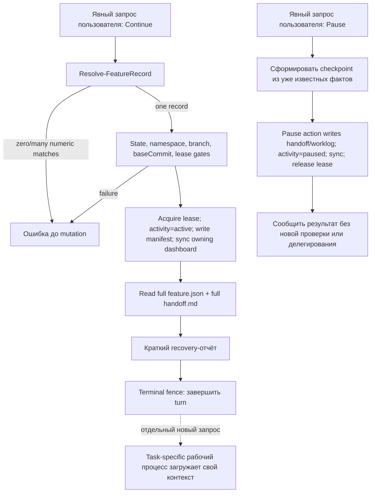

# Оптимизация работы с фичами

- Status: Draft for implementation
- Date: 2026-08-12
- Feature: TF-0009
- Source: `docs/Features/template/feature-workflow-optimization/product-requirements.md` (Approved), exact-byte SHA-256 `21f532cbb513151de710afb94b355d31948903009ebc807a9b82fa13735e33f2`

## 1. Цель и концепция

Оптимизация разделяет lifecycle-восстановление и последующую работу над
фичей. Отдельный `$feature-continue` только выполняет переход
`in_progress/paused -> in_progress/active`, восстанавливает writer lease,
синхронизирует owning dashboard и формирует краткий обзор из двух артефактов:
`feature.json` и `handoff.md`. После отчёта Continue-only turn завершается.

`$feature-pause` только фиксирует уже известное состояние текущего агента. Он
не создаёт новую реализацию или verification evidence и не делегирует
checkpoint сабагенту.

Рабочий контекст остаётся ленивым: requirements, specification, planning,
implementation, review, audit и verification загружают собственные источники
только после отдельного явного запроса пользователя. Lifecycle-команды не
предугадывают следующий процесс.

Спецификация также вводит детерминированное разрешение ссылки вида `0009`:
сокращение допустимо только при единственном совпадении полного ID среди всех
видимых feature namespace.

## 2. Контекст и границы области

Репозиторий является reusable template. Изменения принадлежат template
namespace и не меняют Roblox runtime, `place.rbxl`, Rojo mapping, manifest
schema или формат dashboard.

Внутри области находятся:

- `.agents/rules/index.md` и `.agents/rules/feature-workflow.md` как
  высокоприоритетный lifecycle-контракт;
- `.agents/skills/feature-continue/SKILL.md` и
  `.agents/skills/feature-pause/SKILL.md` как исполняемые агентом границы;
- `scripts/FeatureWorkflow.psm1` как владелец feature resolution;
- `scripts/feature-workflow.ps1` как владелец deterministic lifecycle
  transition и его CLI output;
- `scripts/validate-feature-workflow.ps1` и
  `scripts/tests/feature-workflow.tests.ps1` как enforcement;
- `AGENTS.md`, `README.md`, `docs/Features/README.md` и
  `docs/FeatureDevelopmentForBeginners.md` как текущая документация;
- новый `docs/adr/template/0044-bound-feature-lifecycle-work.md`, обновление
  `docs/adr/template/README.md` и разрешённое обновление supersession metadata
  в `docs/adr/template/0037-reserve-feature-state-transitions-for-users.md`.

Существующие `.agents/skills/feature-continue/agents/openai.yaml` и
`.agents/skills/feature-pause/agents/openai.yaml` уже задают
`allow_implicit_invocation: false` и нейтральные lifecycle prompts. Их байты
не требуется менять; validator и tests продолжают проверять их policy.

Внешние по отношению к L0 владельцы:

- следующий явно вызванный requirements/specification/planning/implementation,
  review, audit или verification process;
- установленный GameDev pipeline и его controller/revision state;
- Roblox Studio, Rojo и subsystem test runners;
- содержимое возобновляемой продуктовой фичи: её PRD, specification, полный
  worklog, исходники и тесты.

Изменения внешнего GameDev pipeline, его plugin/repository, controller schema,
revision-freeze или drift-classification не входят в scope этого репозитория.
Допустимо только документировать в текущей документации границу: lifecycle-only
изменения manifest/dashboard не являются разрешением запускать pipeline, а
последующий явно вызванный pipeline сам применяет собственный drift-контракт.
Спецификация не заявляет, что внешний pipeline уже умеет игнорировать такой
drift, и не требует правок `.agentic-pipeline/**`.

Готовые исторические артефакты
`docs/Features/template/agent-agnostic-feature-workflow/**` не изменяются.
Новый ADR использует Approved PRD TF-0009 и implementation-ready specification
со статусом `Draft for implementation` как текущий design source вместо
ретроспективного переписывания завершённой TF-0007.

### 2.1. Карта привязки к источникам

| Источник | Нормативная область спецификации |
|---|---|
| PRD §5 FR-1..FR-4 | §4.2 Continue contract, §4.3 Continue action, §7.1–§7.2 |
| PRD §5 FR-5 | §4.2 Pause contract, §4.3 Pause action, §7.3 |
| PRD §5 FR-6 | §4.3 `Resolve-FeatureRecord`, §5.1, §7.4 |
| PRD §5 FR-7..FR-8 | §4.2 routing rules, §8 constraints, §9 acceptance criteria |
| PRD §6 NFR-1..NFR-5 | §4.4 enforcement, §5 models, §8 constraints, §9 verification |
| PRD §7 acceptance criteria | §9.3 AC-001..AC-012 |
| Явные решения пользователя | Terminal fence, baseline из двух файлов, factual-only Pause, отсутствие lifecycle tests/delegation и lazy context ownership |
| Текущий repository code/tests/rules/ADR | Точные владельцы и пути в §4, сохранённые gate/mutation contracts в §4.3 |

## 3. Терминология и глоссарий

| Термин | Значение |
|---|---|
| Continue-only turn | Turn, в котором текущий пользователь явно запросил только Continue и не запросил отдельный рабочий процесс. |
| Pause-only turn | Turn, в котором текущий пользователь явно запросил только Pause. |
| Базовый обзор | Краткое общее понимание фичи, полученное только из полного `feature.json` и полного `handoff.md`. |
| Тяжёлый контекст | PRD, specification, полный worklog, Git history/diff/status inventory, controller state, source/tests, subsystem rules/docs/ADR и verification evidence возобновляемой фичи. |
| Terminal fence | Обязанность завершить Continue-only turn сразу после recovery-отчёта без выполнения записанного следующего шага. |
| Записанный следующий шаг | Информационное содержимое `## Next step` в handoff; не является authorization. |
| Factual checkpoint | Pause checkpoint, содержащий только факты, уже известные текущему агенту до вызова Pause. |
| Numeric suffix | Ровно четыре ASCII-цифры `####`, соответствующие числовой части канонического `TF-####` или `F-####`. |
| Видимые namespace | Template namespace и, в derived repository, project namespace, которые уже перечисляет feature workflow. |
| Рабочий процесс | Отдельно запрошенная стадия requirements, specification, planning, implementation, review, audit, verification или Finish. |

## 4. Декомпозиция

### 4.1. Level 0 — Репозиторный Feature Workflow

Репозиторный Feature Workflow владеет lifecycle state, portable checkpoint,
feature reference resolution, writer lease и owning dashboard transition. Он
не владеет реализацией продуктовой фичи и не владеет task-specific context
последующего процесса.

```text
Репозиторный Feature Workflow (L0)
├── Контракт lifecycle-агента (L1)
│   ├── Контракт Continue skill
│   ├── Контракт Pause skill
│   └── Правила маршрутизации Feature Workflow
├── Детерминированный lifecycle executor (L1)
│   ├── Resolve-FeatureRecord
│   ├── Continue action
│   └── Pause action and checkpoint writers
├── Enforcement lifecycle-контракта (L1)
│   ├── Validator Feature Workflow
│   └── Детерминированный набор contract tests
└── Каскад документации и решений (L1)
    ├── Текущая операторская документация
    └── template/ADR-0044

Вне L0: следующий рабочий процесс, внешний GameDev pipeline, Rojo, Studio,
subsystem verification и тяжёлый контекст продуктовой фичи.
```

### 4.2. Level 1 — Контракт lifecycle-агента

#### Контракт Continue skill

Тип: repository-owned explicit-only agent skill.

Расположение: `.agents/skills/feature-continue/SKILL.md` и существующий
`.agents/skills/feature-continue/agents/openai.yaml`.

Ответственность:

- подтвердить явное текущее пользовательское разрешение Continue;
- вызвать `scripts/feature-workflow.ps1 -Action Continue`;
- полностью прочитать только post-transition `feature.json` и `handoff.md` как
  feature-specific baseline;
- вывести namespace, ID/title, `status/activity`, recorded branch,
  `baseCommit`, общий результат, решения, blockers и записанный next step в
  объёме, доступном из этих двух файлов;
- явно назвать next step информационным и завершить turn.

Не владеет:

- чтением PRD/specification/worklog/Git/controller/source/tests возобновляемой
  фичи;
- выбором следующего рабочего процесса;
- implementation, review, audit или verification;
- Rojo/Studio операциями;
- созданием, запуском или привлечением сабагентов.

Контракт skill должен содержать стабильные явно проверяемые разделы
`Continue-only context boundary` и `Continue-only terminal fence`. Заголовки
остаются на английском как machine-checked contract markers; объясняющий текст
остаётся однозначным и не должен содержать фразу, допускающую source edits
после recovery-отчёта.

Внутри этих разделов должны присутствовать точные machine-checked предложения:

```text
Continue-only context: read only feature.json and handoff.md as feature-specific recovery context.
Continue-only terminal fence: after the recovery report, end the turn without executing the recorded next step.
Continue-only forbidden work: do not implement, review, audit, run a pipeline, edit source, run tests or validators, run Rojo or Studio, or create or use subagents.
```

`agents/openai.yaml` сохраняется без изменения и продолжает задавать
`policy.allow_implicit_invocation: false`. Description в front matter
`SKILL.md` должен описывать только lifecycle recovery, а не продолжение
реализации.

#### Контракт Pause skill

Тип: repository-owned explicit-only agent skill.

Расположение: `.agents/skills/feature-pause/SKILL.md` и существующий
`.agents/skills/feature-pause/agents/openai.yaml`.

Ответственность:

- подтвердить явное текущее пользовательское разрешение Pause;
- сформировать `Summary`, `Decisions`, `VerificationSummary` и `NextStep`
  только из уже известного в текущем turn состояния;
- явно указать проверки, которые уже выполнялись, и проверки, которые не
  выполнялись; отсутствие нового evidence не является ошибкой Pause;
- вызвать существующий `-Action Pause` и сообщить сохранение branch
  reservation.

Не владеет:

- новым Git/source/controller исследованием ради заполнения checkpoint;
- запуском тестов, validators, Rojo preflight/build, Studio, pipeline или иной
  проверки;
- созданием нового verification evidence;
- делегированием обычного checkpoint сабагенту.

Контракт skill должен содержать стабильный раздел
`Pause-only factual checkpoint boundary`, запрещающий новую работу и
делегирование, и точное machine-checked предложение:

```text
Pause-only factual checkpoint: use only facts already known before Pause; do not create new verification evidence, run new work or checks, or create or use subagents.
```

`agents/openai.yaml` сохраняется без изменения и продолжает задавать
explicit-only policy.

#### Правила маршрутизации Feature Workflow

Тип: repository governance contract.

Расположение: `AGENTS.md`, `.agents/rules/index.md` и
`.agents/rules/feature-workflow.md`.

Правила должны различать pure lifecycle transition и последующую работу:

- Continue/Pause-only требуют только общих repository instructions и
  feature-workflow lifecycle rule, необходимых для безопасного transition;
- `architecture.md`, `architecture-decisions.md`, `testing.md`, subsystem
  rules/docs/Accepted ADR и source-specific context не загружаются только по
  факту Continue/Pause;
- при отдельном запросе на изменение source, архитектуры, тестов или
  документации обычные path/concern triggers применяются заново полным
  рабочим процессом;
- `Next step` всегда информационный и не расширяет authorization;
- Continue-only завершается после recovery-отчёта;
- Pause-only фиксирует факты и не создаёт evidence или делегирование.

#### Взаимодействие на уровне контракта lifecycle-агента

`index.md` выбирает узкое lifecycle rule. `feature-workflow.md` задаёт
нормативную границу. Continue/Pause skill выполняет эту границу и вызывает
deterministic executor. Ни один из этих владельцев не передаёт управление
следующему процессу автоматически.

### 4.3. Level 1 — Детерминированный lifecycle executor

#### `Resolve-FeatureRecord`

Тип: существующая экспортируемая PowerShell-функция.

Расположение: `scripts/FeatureWorkflow.psm1`.

Публичная сигнатура сохраняется:

```powershell
Resolve-FeatureRecord -RepositoryRoot <path> -Feature <string>
```

Алгоритм:

1. Выполнить `Trim()` входа.
2. Если вход соответствует `^[0-9]{4}$`, не применять slug/title/folder
   matching. Получить все видимые manifests и выбрать только ID, равные
   `TF-<suffix>` или `F-<suffix>` без учёта регистра.
3. При одном совпадении вернуть найденную canonical record.
4. При нуле совпадений бросить диагностическую ошибку, требующую полный ID или
   корректное имя. Не возвращать `$null`, чтобы `Start` не создал новую feature
   из numeric-only ввода.
5. При нескольких совпадениях бросить диагностическую ошибку до mutation.
   Сообщение перечисляет canonical IDs в стабильном ordinal порядке и требует
   полный ID.
6. Для нечислового ввода сохранить существующее exact case-insensitive
   разрешение по ID, slug, title и folder. Несколько совпадений по-прежнему
   fail closed; ноль совпадений по-прежнему возвращает `$null` для штатного
   создания новой именованной feature через Start.

Разрешение выполняется до switch по `Action`, поэтому zero/ambiguous numeric
suffix не может приобрести lease, изменить manifest/worklog/handoff/dashboard
или создать branch/directory.

Функция не выбирает namespace по current branch, repository role, порядку
файловой системы или writable ownership. Уникальность определяется по всем
видимым manifests; последующий action отдельно применяет существующий writable
namespace gate.

#### Действие Continue

Тип: существующая ветвь `Continue` в `scripts/feature-workflow.ps1`.

Существующий порядок gate и mutation сохраняется:

1. resolved record существует и принадлежит writable namespace;
2. состояние равно `in_progress/paused`;
3. current branch точно равен recorded branch;
4. `baseCommit` является ancestor текущего `HEAD`;
5. другая in-progress feature не резервирует ветку;
6. feature-scoped lease приобретается;
7. activity меняется на `active`, обновляется `updatedAt`, записывается
   manifest и синхронизируется только owning dashboard.

CLI output после успеха должен направлять только к `feature.json` и
`handoff.md`. Строки `Worklog:` и `Git range:` удаляются из Continue output.
Action не читает содержимое product artifacts и не запускает внешние команды
проверки.

#### Действие Pause и writers checkpoint

Тип: существующая ветвь `Pause` в `scripts/feature-workflow.ps1` и функции
`Write-FeatureHandoff`/`Append-FeatureWorklog` в
`scripts/FeatureWorkflow.psm1`.

Сигнатуры CLI и writers, обязательные checkpoint sections, append-only
worklog, recorded branch/lease gates, owning dashboard sync и release lease не
меняются. Executor принимает готовые factual strings и не пытается добывать
или проверять их доказательства. Он не запускает verification commands и не
взаимодействует с сабагентами.

#### Взаимодействие на уровне детерминированного lifecycle executor

`Resolve-FeatureRecord` возвращает единственную record или останавливает
action до mutation. Continue/Pause action владеет только state transition.
Agent skill владеет human-readable report/checkpoint, но не может расширять
command scope.

### 4.4. Level 1 — Enforcement lifecycle-контракта

#### Validator Feature Workflow

Тип: repository static contract validator.

Расположение: `scripts/validate-feature-workflow.ps1`.

Validator сохраняет проверки user authorization и
`allow_implicit_invocation: false` и добавляет fail-closed проверки:

- Continue skill содержит оба stable contract marker section;
- baseline перечисляет только `feature.json` и `handoff.md`;
- Continue terminal fence явно требует завершить turn и запрещает
  implementation/review/audit, pipeline, source edits, tests/validators,
  Rojo/Studio и сабагентов;
- Pause skill содержит factual checkpoint marker и явно запрещает новое
  исследование/verification evidence, проверки и сабагентов;
- отсутствие любого обязательного фрагмента выдаёт диагностическую ошибку с
  именем skill и нарушенной границей.

Validator проверяет декларативный skill contract, а не заявляет наблюдение за
фактическим context window или runtime tool trace агента.

#### Детерминированный набор contract tests

Тип: PowerShell contract tests.

Расположение: `scripts/tests/feature-workflow.tests.ps1`.

Suite расширяет существующие fixtures и проверяет:

- успешный Continue сохраняет lifecycle invariants и его output содержит
  Manifest/Handoff, но не Worklog/Git range;
- validator проходит на canonical skills;
- удаление по одному обязательных context/fence/factual-only fragments из
  copied skill fixture приводит к ожидаемому validator failure;
- workflow script не содержит вызовов test/validator/Rojo/Studio команд внутри
  lifecycle action; это статическая command-boundary проверка, не agent trace;
- unique numeric suffix для template-only fixture возвращает `TF-####`;
- derived fixture с единственным совпадением только в project или template
  namespace возвращает правильный canonical ID, после чего writable gate
  независимо разрешает или запрещает action;
- ноль numeric matches завершает Start/Continue/Pause/Finish/Context до
  mutation и не создаёт новую feature;
- одновременные `TF-0001` и `F-0001` завершаются ошибкой со стабильно
  перечисленными кандидатами до mutation;
- полные ID, slug, title и folder сохраняют существующее поведение;
- hash/byte snapshots manifest, handoff, worklog и обоих dashboards, branch и
  lease inventory доказывают отсутствие mutation на rejected numeric input;
- template/project namespace isolation, branch reservation, schema-v2 lease и
  owning-only dashboard regression tests остаются зелёными.

Tests не могут доказать, что произвольный агент физически не прочитал файл.
Они защищают repository-owned command output и обязательный текст skill/rules;
поведенческая граница агента обеспечивается их более высоким контрактом.

#### Взаимодействие на уровне enforcement lifecycle-контракта

Validator защищает статическую полноту skills. Contract suite проверяет
validator negative fixtures и исполняемое PowerShell-поведение. Ни один тест не
подменяет user authorization или автоматически меняет feature lifecycle.

### 4.5. Level 1 — Каскад документации и решений

#### Текущая операторская документация

Тип: текущая repository документация.

Обновляемые файлы:

- `AGENTS.md`;
- `README.md`;
- `docs/Features/README.md`;
- `docs/FeatureDevelopmentForBeginners.md`.

Документация обязана согласованно показывать два отдельных сообщения:
Continue-only recovery, затем отдельный пользовательский вызов нужного
процесса. Она не обещает загрузку полного worklog/Git/rules/ADR на Continue и
не предлагает Pause запускать проверки или привлекать сабагента.

#### `template/ADR-0044`

Тип: новый Accepted template ADR.

Расположение:
`docs/adr/template/0044-bound-feature-lifecycle-work.md`.

ADR-0044 supersedes ADR-0037, переносит без ослабления его user-only
authorization, agent-neutral artifacts, namespace/lease/branch/dashboard
решения и добавляет:

- terminal Continue-only recovery;
- baseline только из manifest/handoff;
- lazy ownership последующего контекста;
- factual-only non-delegated Pause;
- unique-only numeric suffix resolution.

Implementation обновляет `Superseded by` metadata ADR-0037 и status/link в
`docs/adr/template/README.md`, не переписывая историческое тело решения.
ADR-0044 перечисляет в Enforcement точные rules, skills, scripts, docs и tests
этой спецификации.

#### Взаимодействие на уровне каскада документации и решений

ADR хранит причину durable boundary, rules/skills являются текущей нормой,
scripts исполняют deterministic часть, docs объясняют операторский поток, а
tests защищают исполнимые и статические контракты.

## 5. Модели данных

### 5.1. Числовая ссылка на feature

Persistent schema не добавляется. Входная строка `Feature` классифицируется
локально внутри `Resolve-FeatureRecord`:

| Поле | Тип | Правило |
|---|---|---|
| `raw` | string | Исходный CLI argument; durable state не хранит. |
| `needle` | string | `raw.Trim()`. |
| `kind` | `numeric-suffix` или `named-reference` | `numeric-suffix` только при `^[0-9]{4}$`. |
| `candidates` | transient record array | Для numeric input только records с ID `TF-<needle>` или `F-<needle>`. |
| `result` | zero/one/many | zero и many завершаются до mutation; one возвращает canonical record. |

Candidate ordering для diagnostics должен быть ordinal и не зависеть от
filesystem enumeration или locale.

### 5.2. Базовый набор Continue

Новая persisted структура не создаётся.

| Источник | Используемые данные | Владелец |
|---|---|---|
| `feature.json` | namespace через record path, ID/title, status/activity, branch, `baseCommit`, blockers | lifecycle command + Continue skill |
| `handoff.md` | result/current state, decisions/discussions, verification summary как уже записанный контекст, blockers projection, next step | Continue skill |

После перехода manifest является authority текущего `active` state. Handoff
остаётся последним checkpoint snapshot и может закономерно содержать
`in_progress/paused`; это не конфликт и не требует его перезаписи на Continue.

`worklog.md` остаётся complete append-only history, но не входит в Continue
baseline. Если handoff неполон, Continue сообщает доступный краткий обзор и
заканчивает turn; он не компенсирует пробел тяжёлым чтением. Исправление
handoff/worklog относится к отдельно запрошенной работе или будущему Pause.

### 5.3. Входные данные Pause checkpoint

Существующие CLI-поля сохраняются:

| Поле | Содержание |
|---|---|
| `Summary` | Уже известный результат и текущее состояние. |
| `Decisions` | Уже состоявшиеся важные решения/обсуждения или явное `None`. |
| `VerificationSummary` | Только проверки, выполненные до Pause, и явно отмеченные not-run checks. |
| `NextStep` | Одна информационная рекомендация для будущего пользовательского запроса. |

Manifest schema, handoff headings и worklog entry schema не меняются.

## 6. Диаграмма



## 7. Поведенческие потоки

### 7.1. Успешный Continue-only

1. Пользователь явно запрашивает Continue и однозначно указывает feature.
2. Skill читает только обязательные repository control instructions для
   lifecycle transition.
3. Lifecycle command разрешает record и выполняет существующие fail-closed
   gates.
4. Command приобретает lease, переводит feature в active, пишет manifest и
   синхронизирует owning dashboard.
5. Skill полностью читает только выведенные command пути `feature.json` и
   `handoff.md`.
6. Skill формирует краткий отчёт. Отсутствующее в этих файлах не добывается из
   других источников и не домысливается.
7. Skill сообщает, что recorded next step не выполнялся и требует отдельного
   запроса.
8. Turn завершается без tool calls для реализации, проверок или сабагентов.

### 7.2. Следующий рабочий процесс

1. В новом сообщении пользователь явно выбирает процесс.
2. Процесс применяет собственный skill/rules contract.
3. Только он загружает необходимые PRD/spec/plan/controller/worklog/Git/source,
   matched rules/docs/ADR и verification evidence.
4. Если процесс разрешает source edit, обязательный Rojo preflight выполняется
   непосредственно перед первым source-code edit по `AGENTS.md`.

Предыдущее выполнение Continue не считается preflight, approval или evidence
для этого процесса.

### 7.3. Успешный Pause-only

1. Пользователь явно запрашивает Pause активной feature.
2. Текущий агент составляет checkpoint из уже известного результата,
   решений, verification state, blockers и next step.
3. Неизвестные или не выполненные проверки отмечаются фактически; агент не
   запускает их ради более полного checkpoint.
4. Lifecycle command проверяет active state, recorded branch и exact lease,
   записывает handoff, append-only worklog и manifest, синхронизирует owning
   dashboard и освобождает lease.
5. Агент сообщает paused state и reserved branch. Сабагент не создаётся и не
   привлекается.

### 7.4. Однозначный numeric suffix

1. Пользователь передаёт ровно четыре цифры.
2. Resolver перечисляет ID-кандидаты по всем видимым namespace.
3. Ровно один кандидат заменяет сокращение canonical record.
4. Zero candidates выдаёт понятную ошибку с просьбой использовать полный ID
   или корректное имя.
5. Many candidates выдаёт стабильный список canonical IDs и просит полный ID.
6. Любой failure происходит до branch, lease или repository artifact mutation.

### 7.5. Границы ошибок

- Missing/malformed `handoff.md` после успешного state transition не разрешает
  чтение тяжёлого feature-контекста. Skill сообщает, что базовый обзор
  неполон, и завершает turn; исправление требует отдельного запроса.
- Ошибка state/branch/base/namespace/lease до Continue оставляет feature
  paused и не создаёт recovery-отчёт об успехе.
- Ошибка записи manifest/dashboard после приобретения lease использует
  существующую lifecycle error semantics; эта feature не меняет transaction
  model и не заявляет новый rollback.
- Pause с недостаточной factual информацией явно записывает отсутствие фактов,
  если обязательные non-empty CLI inputs можно сформулировать правдиво; он не
  создаёт evidence. Если правдивый обязательный checkpoint невозможен, Pause
  останавливается до mutation и просит пользователя определить состояние.

## 8. Ограничения реализации

- Сохранить `policy.allow_implicit_invocation: false` для всех lifecycle
  skills.
- Сохранить user-only authority Start/Continue/Pause/Reopen/Finish.
- Не менять schema version 2, manifest fields, canonical ID/branch formats,
  lease schema/location, dashboard format/rendering и worklog append-only
  структуру.
- Не менять foreign namespace ownership и derived initialization gates.
- Не добавлять chat/task/session/host/agent identity в artifacts или lease.
- Не добавлять transcript API или иной внешний context source.
- Не добавлять новый lifecycle script, Git hook или background process.
- Не добавлять external dependency.
- Не запускать Rojo/Studio tests для документационного этапа specification.
  Для будущей реализации применяются проверки из `.agents/rules/testing.md` и
  feature-workflow rules, но lifecycle Continue/Pause сами их не запускают.
- PowerShell behavior должно совпадать под Windows PowerShell 5.1 и
  PowerShell 7.x; numeric diagnostics не зависят от locale.
- Все изменяемые Markdown/PowerShell файлы сохраняют UTF-8 without BOM и
  repository line-ending policy.

## 9. Обязательный подход к реализации

### 9.1. Порядок изменений

1. Обновить `scripts/FeatureWorkflow.psm1`: unique-only numeric resolution без
   изменения exported command surface.
2. Обновить `scripts/feature-workflow.ps1`: убрать Continue output, ведущий к
   `worklog.md` и Git range; сохранить gate/mutation order.
3. Обновить Continue/Pause `SKILL.md`, сохранив их `agents/openai.yaml` без
   изменения, затем узкое lifecycle routing в `AGENTS.md`, `.agents/rules/index.md` и
   `.agents/rules/feature-workflow.md`.
4. Расширить `scripts/validate-feature-workflow.ps1` stable contract checks.
5. Расширить `scripts/tests/feature-workflow.tests.ps1` positive, negative и
   no-mutation fixtures.
6. Создать и принять `docs/adr/template/0044-bound-feature-lifecycle-work.md`,
   обновить ADR-0037 supersession metadata и template ADR index.
7. Обновить `README.md`, `docs/Features/README.md` и
   `docs/FeatureDevelopmentForBeginners.md`.
8. Выполнить документационный каскад TF-0009 и verification, требуемые
   matched rules, до отдельного пользовательского `$feature-finish`.

### 9.2. Матрица проверок

| Область | Обязательное доказательство |
|---|---|
| PowerShell syntax | Parse изменённых `.ps1`/`.psm1` в Windows PowerShell 5.1 и PowerShell 7.x. |
| Feature workflow behavior | `scripts/tests/feature-workflow.tests.ps1` проходит на обоих обязательных PowerShell hosts. |
| Static skill contract | `scripts/validate-feature-workflow.ps1` проходит; negative copied-skill fixtures падают по каждой удалённой границе. |
| Dashboard ownership | `scripts/sync-feature-index.ps1 -Check -Scope All` проходит без mutation. |
| Repository boundaries | `scripts/validate-repository-layout.ps1` проходит. |
| Text integrity | `git diff --check` проходит. |
| Rojo artifact | Временный `rojo build` выполняется как repository release gate после source changes, но не из Continue/Pause. |
| Studio | Не требуется, поскольку Roblox source, bootstrap, networking, save, Players и DataModel не меняются. |

Verification выполняет implementation workflow до Finish. Continue, Pause и
Finish не запускают эти проверки автоматически.

### 9.3. Критерии приёмки

- AC-001: Continue-only successful path читает feature-specific context только
  из полного `feature.json` и полного `handoff.md`.
- AC-002: Recovery report содержит доступные identity/state/branch/base,
  summary, decisions, blockers и informational next step.
- AC-003: Continue skill имеет terminal fence и не допускает implementation,
  review, audit, pipeline, source edits, checks, Rojo/Studio или subagents.
- AC-004: CLI output Continue не содержит `Worklog:` или `Git range:`.
- AC-005: Pause checkpoint factual-only, не запускает новые проверки и не
  использует сабагента.
- AC-006: `0009` разрешается только при одном видимом canonical ID.
- AC-007: Zero/many numeric matches не изменяют branch, lease, manifest,
  handoff, worklog или dashboards; many diagnostic перечисляет кандидатов.
- AC-008: Full ID/slug/title/folder behavior и существующие lifecycle gates не
  регрессируют.
- AC-009: Validator обнаруживает удаление каждого mandatory skill boundary.
- AC-010: User authority, namespace isolation, branch reservation, lease,
  append-only worklog и owning-only dashboard проходят regression suite.
- AC-011: Current docs описывают отдельный follow-up process и не обещают
  автоматический pipeline resume.
- AC-012: ADR-0044 принят, индексирован и содержит полный enforcement cascade.

## 10. Запрещённые формальные решения

- Нельзя считать термин `bounded context` разрешением прочитать несколько
  больших файлов «на всякий случай».
- Нельзя читать только начало/summary PRD, specification или worklog во время
  Continue-only; эти файлы полностью вне baseline.
- Нельзя выполнять Git status/diff/log или перечислять dirty paths для
  восстановления feature-контекста на Continue-only.
- Нельзя трактовать `Next step` как команду, approval, pipeline token или
  разрешение на tool call.
- Нельзя продолжать работу в том же turn после recovery-отчёта, даже если она
  кажется очевидной или уже описана в handoff.
- Нельзя запускать тесты или проверки из Continue/Pause/Finish ради заполнения
  evidence.
- Нельзя делегировать Pause checkpoint или Continue recovery сабагенту.
- Нельзя компенсировать слабый handoff чтением полного worklog; качество
  следующего handoff обеспечивается factual Pause contract.
- Нельзя выбирать `TF-####` или `F-####` по текущей ветке, writable namespace,
  repository role или порядку enumeration при неоднозначном suffix.
- Нельзя позволять numeric-only no-match попадать в Start как название новой
  feature.
- Нельзя изменять foreign dashboard/manifest или ослаблять existing fail-closed
  gates ради удобства сокращённого ввода.
- Нельзя править внешний GameDev pipeline, его controller state или
  `.agentic-pipeline/**` в рамках TF-0009; допустима только документация
  интеграционной границы в перечисленных current docs.
- Нельзя утверждать, что static tests наблюдают реальное чтение context window
  агентом; они проверяют repository-owned contracts и command behavior.

## 11. Открытые вопросы

Открытых вопросов нет. Source PRD и явные решения пользователя определяют
baseline, terminal fence, Pause boundary, numeric suffix behavior, exact
repository artifacts, ADR-0044 cascade и границу внешнего pipeline.
