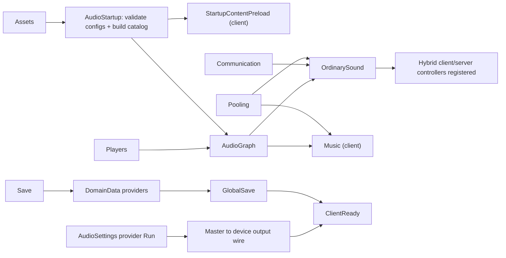
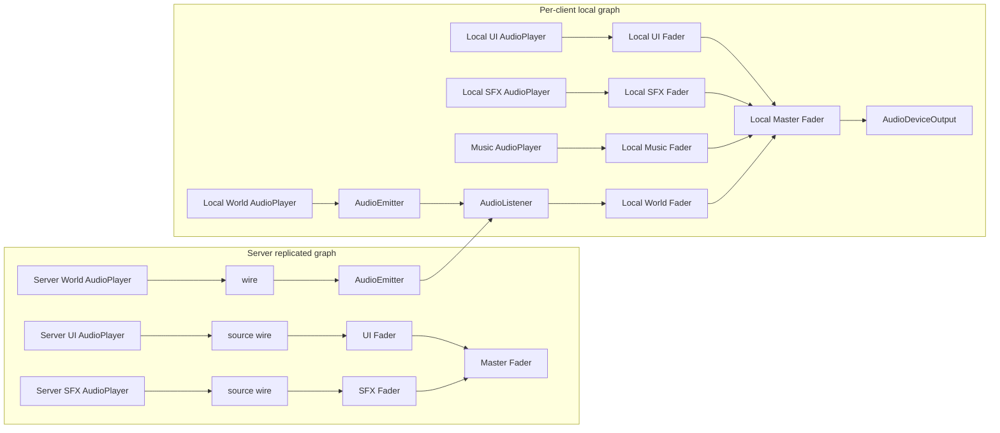
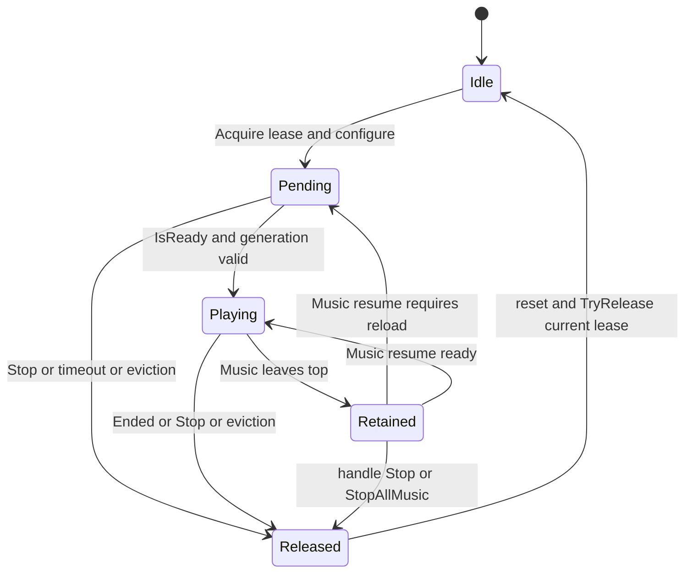

# Technical Specification

## 1. Goal and Concept

### 1.1. Цель

Реализовать в reusable template единую audio playback feature, поставляемую как `TF-0005 / sfx-system`, для Roblox Advanced Audio API, которая предоставляет:

- обычное локальное, server-all и ограниченное client-hybrid воспроизведение;
- непространственные, point-spatial и attached-spatial источники;
- отдельный client-only Music subsystem с bounded LIFO-стеком и переходами;
- локальные уровни и флаги категорий, сохраняемые через client-authority provider `AudioSettings`;
- детерминированный каталог, статические конфиги, startup preload и bounded generation-safe pools;
- единственный manifest-owned audio graph на каждой стороне и единый набор сетевых DTO поверх `Communication`/`Presentation`.

Система обязана интегрироваться с существующими владельцами инициализации, ассетов, preloading, pooling, communication, save, domain data, player lifecycle, конфигурации, сигналов, логирования и тестовой композиции. Она не создаёт параллельных bootstraps, remotes, save paths, player lifecycle listeners или service locators.

### 1.2. Авторитет продукта и граница решений

Единственный продуктовый источник этой спецификации — `docs/Features/template/sfx-system/product-requirements.md`, canonical approved revision `4`, exact-byte SHA-256 `9b46904c64242100c6aa61377cf5b9d0d79720a1a30865ffec13b2965c9c3dde`.

Эта спецификация конкретизирует архитектуру и контракты реализации, опираясь на действующие project rules, Accepted template ADRs, документацию и кодовые паттерны. Она не расширяет продуктовый scope PRD. Там, где PRD оставляет технический выбор, решение фиксируется здесь; там, где PRD требует отдельного архитектурного решения, source implementation остаётся закрыта до принятия соответствующего ADR.

`TS-DEC-008` конкретизирует закреплённый в PRD revision `4` технический механизм, не меняя public Point/Attached APIs, handles, pool identities и delivery semantics: каждый World playback является одной colocated композицией `SpatialAnchor + AudioPlayer + AudioEmitter + Wire`, а `AudioEmitter` использует default Parent positioning. Revision `11` имеет `draft-ok`: канонический PRD утверждён, его exact-byte trace подтверждён, открытых продуктовых и технических вопросов в этой спецификации нет.

### 1.3. Критерий технической готовности

Спецификация считается реализованной, когда:

1. Все нормативные ownership/contracts/invariants из §§4.2–4.4, модели и интерфейсы §5, graph/lifecycle invariants §§6.2–6.3, flows §7, constraints §8 и mandatory implementation approach §§9.1–9.10 реализованы; ни одно forbidden solution из §10 не присутствует.
2. Все `PRD-AC-001..079` прошли проверку по однозначным evidence identities и profiles полной матрицы §9.11.
3. Accepted ADR-0041, ADR-0039 и ADR-0040 продолжают закрывать `TS-GATE-001`; ADR-0041 supersedes ADR-0038 без потери local-config решения. До первой source-code правки `TS-GATE-002` обязан быть закрыт новым Accepted template ADR, который владеет durable fixed topology из `TS-DEC-008`; если новый record materially изменяет ADR-0040, он supersedes ADR-0040, иначе ADR-0040 остаётся Accepted, а новый ADR уточняет его spatial implementation boundary.
4. Сборка, статические validators, focused runners, aggregate runner и обязательные Studio scenarios завершены без незакрытых дефектов.
5. Канонический PRD revision `4` остаётся точным продуктовым trace; обязательный rules/current-docs/tests cascade согласован с fixed spatial composition до завершения feature и отражён в engineering handoff.

## 2. Context and Scope

### 2.1. Репозиторий и архитектурная база

Репозиторий является reusable template, а не derived game. Область архитектурных решений — `docs/adr/template/`; project-owned ADR namespace отсутствует по дизайну. Единственные глобальные точки запуска:

- `src/ServerScriptService/Bootstrap.server.luau`;
- `src/StarterPlayer/StarterPlayerScripts/Bootstrap.client.luau`.

Порядок startup определяется только `ServerManifest` и `ClientManifest`. Каждый аудиомодуль предоставляет constructor/API и/или manifest command, но не выбирает глобальный порядок самостоятельно.

### 2.2. В scope

- `SoundCatalog` из CSV и физические `Sound` assets под каноническим корнем.
- Типизированное разрешение `SoundRef` по `CueId`, `AssetId`, `AssetKey`, `ResourcePath` и `FolderPath`.
- Ordinary playback: client-local, trusted server-all и client-hybrid one-shot.
- World point/attached spatial playback и local character/camera listener binding.
- Одна fixed parent-positioning spatial composition вокруг wrapper-owned `SpatialAnchor`; другой public/configurable positioning mode нет.
- Отдельный Music subsystem с LIFO resume semantics.
- `AudioGraph`, category faders, private interaction group и device output binding.
- `AudioSettings` client-authority provider и интеграция с snapshot/client patch lifecycle.
- Startup validation, content preload, pool budgets, failure containment, Logger diagnostics.
- Static/deterministic/multi-client evidence, repository validators и документационный cascade.

### 2.3. Вне scope

- Voice chat, microphone input, recording, audio effects authoring и dynamic DSP chain editor.
- Серверная авторитетность пользовательских громкостей.
- Репликация полного каталога/конфига либо runtime audio state через save/network.
- Reliable delivery, ack/retry, replay, snapshot или dedup-cache для hybrid one-shot.
- Client-hybrid loops, attached starts или передача Roblox `Instance` через intent/Presentation.
- Обычные pause/resume/seek, ordinary mass-stop и серверная Music.
- AssetRegistry как runtime-world tracker, audio graph locator или generic service locator.
- Изменение `SoundService.AcousticSimulationEnabled` в runtime.
- Автоматическое редактирование бинарного `place.rbxl`.
- Альтернативный spatial positioning mode или runtime-выбор topology: единственная поддерживаемая composition зафиксирована ниже.

### 2.4. Зафиксированные технические решения

| ID | Решение | Основание |
|---|---|---|
| `TS-DEC-001` | Audio-конфиги остаются локальными Luau-модулями обеих сторон, валидируются и замораживаются независимо на bootstrap. | PRD и требуемое исключение из ADR-0017. |
| `TS-DEC-002` | Side aggregate ceilings остаются `MaxTotalActive=128`, `MaxTotalRetained=64` и `MaxWorstCasePlaybackObjects=768`. Консервативная формула `4 * (total active + total retained) <= 768` считает максимальную fixed World composition как четыре code-owned Instances: `SpatialAnchor`, `AudioPlayer`, `AudioEmitter`, `Wire`; 2D/Music wrapper стоит не больше этого maximum. | Shipped budgets дают максимум `4 * (128 + 64) = 768`; topology одна, и её полный per-wrapper inventory известен. |
| `TS-DEC-003` | Audio duplicate-key policy передаётся в `AssetRegistry` как точная manifest policy для `Shared/Sounds` и `Sound`; скан выполняется по canonical path order. | Сохраняет fail-closed поведение вне audio namespace и делает first-wins детерминированным. |
| `TS-DEC-004` | Сервер публикует graph generation целиком под стабильным runtime container только после полной валидации; клиент привязывается к одному опубликованному generation. | Atomic startup, отсутствие частично наблюдаемого graph. |
| `TS-DEC-005` | Общий `PlaybackWrapper` используется внутри двух раздельных pool registries/sets: Ordinary и Music никогда не делят pool или lease lifecycle. | PRD-REQ-006/020 и ADR-0007. |
| `TS-DEC-006` | TF-0005 добавляет в существующие save controllers optional provider-specific `ValidateEnvelope` с side-specific signatures и client-only `ReconcileSnapshotEnvelope`; оба реализует только `AudioSettings`, hooks не sanitizes/mutate input, а providers без них сохраняют прежний контракт. | Закрывает PRD exact-envelope/default-reconciliation contract без нового обязательного правила для всех provider/controller-пар. |
| `TS-DEC-007` | Public services называются `OrdinarySoundServer`, `OrdinarySoundClient`, `MusicClient`, `AudioSettingsClient`; manifest commands имеют соответствующие `*InitializationCommand` имена. | Совместимо с существующими side-specific module/command patterns и исключает смешение delivery modes. |
| `TS-DEC-008` | Каждый World wrapper является одним invisible anchored non-collidable `Part` с canonical name `SpatialAnchor`, напрямую parented к injected `Workspace` только пока lease active. `AudioPlayer`, `AudioEmitter` и `Wire` являются непосредственными children этого anchor; wire соединяет player с emitter, а emitter использует default `Enum.EmitterPositionType.Parent`. Point устанавливает `SpatialAnchor.CFrame` один раз; Attached обновляет его full source transform через один injected side-owned frame driver. Server active anchor и его subtree реплицируются Roblox как одна server lease; client-local anchor остаётся local. Idle wrapper unparented. | Official `AudioEmitter` Parent contract использует transform непосредственного `Attachment`, `Camera` или `PVInstance`; `Part` является `PVInstance`. Colocation исключает cross-tree source wiring и root ambiguity, сохраняет wrapper ownership, generation-safe cleanup и native one-lease server delivery. |

### 2.5. Машиноадресуемая трассировка продуктовых требований

Эта таблица является канонической двусторонней трассировкой всех нормативных
функциональных и качественных требований продукта на нормативные адреса TS и
идентификаторы проверки. Полные ID в первом столбце являются машинными ключами;
сокращённые числовые псевдонимы не используются. Идентификаторы проверки
разрешаются в полные записи доказательств через §9.11 и соответствующие
профили пространств имён §9.11.

| ID продукта | Нормативные адреса TS | Проверка |
|---|---|---|
| `PRD-REQ-001` | §§4.2 `AudioCatalog`, 5.2–5.3, 7.1–7.2, 8.5 | §9.11: `PRD-AC-001`, `PRD-AC-011`, `PRD-AC-024`, `PRD-AC-048` |
| `PRD-REQ-002` | §§5.2–5.3, 7.2 | §9.11: `PRD-AC-019`, `PRD-AC-025`, `PRD-AC-028`, `PRD-AC-036`, `PRD-AC-054` |
| `PRD-REQ-003` | §§5.1, 5.3, 7.2, 9.7 | §9.11: `PRD-AC-001`, `PRD-AC-038`, `PRD-AC-039` |
| `PRD-REQ-004` | §§5.1, 6.2, 7.3, 9.7 | §9.11: `PRD-AC-002` |
| `PRD-REQ-005` | `TS-DEC-008`; §§4.2 `SpatialAnchorBindingRegistry`, 5.1, 5.5, 7.3–7.4, 9.7 | §9.11: `PRD-AC-003`, `PRD-AC-016`, `PRD-AC-046`, `PRD-AC-051`, `PRD-AC-058` |
| `PRD-REQ-006` | §§4.2 `OrdinarySoundServer`/`OrdinarySoundClient`/`MusicClient`, 5.4, 6.3, 7.6–7.7, 8.4–8.5, 9.3 | §9.11: `PRD-AC-004`, `PRD-AC-012`, `PRD-AC-021`, `PRD-AC-034`, `PRD-AC-059`, `PRD-AC-060` |
| `PRD-REQ-007` | §§5.4–5.5, 6.2, 7.9, 9.7 | §9.11: `PRD-AC-005` |
| `PRD-REQ-008` | `TS-DEC-004`, `TS-DEC-008`; §§4.2 `AudioGraphServer`/`AudioGraphClient`, 5.5, 6.2, 7.1, 7.3–7.4 | §9.11: `PRD-AC-008`, `PRD-AC-011`, `PRD-AC-046`, `PRD-AC-050`, `PRD-AC-058`, `PRD-AC-069`, `PRD-AC-070` |
| `PRD-REQ-009` | §§4.2 `MusicClient`, 5.4, 5.7, 6.3, 7.6–7.7, 8.4–8.5 | §9.11: `PRD-AC-006`, `PRD-AC-032`, `PRD-AC-034`, `PRD-AC-062`–`PRD-AC-068`, `PRD-AC-075`, `PRD-AC-076` |
| `PRD-REQ-010` | §§4.2 `OrdinarySoundClient`, 7.3, 9.7 | §9.11: `PRD-AC-007`, `PRD-AC-040` |
| `PRD-REQ-011` | §§4.2 `OrdinarySoundServer`, 6.2, 7.4, 9.7 | §9.11: `PRD-AC-008`, `PRD-AC-018`, `PRD-AC-050`, `PRD-AC-052`, `PRD-AC-058` |
| `PRD-REQ-012` | §§4.2 hybrid controllers, 5.6, 7.5, 8.3–8.5, 9.7 | §9.11: `PRD-AC-009`, `PRD-AC-040`, `PRD-AC-043`–`PRD-AC-045`, `PRD-AC-049`, `PRD-AC-054`, `PRD-AC-061`, `PRD-AC-077`, `PRD-AC-079` |
| `PRD-REQ-013` | §§5.2–5.3, 5.6, 7.2, 7.5, 8.3, 8.5 | §9.11: `PRD-AC-010`, `PRD-AC-043`, `PRD-AC-054`, `PRD-AC-079` |
| `PRD-REQ-014` | §§4.4 `Communication`, 5.6, 7.5, 8.3, 8.5, 8.7 | §9.11: `PRD-AC-040`, `PRD-AC-044`, `PRD-AC-045`, `PRD-AC-049`, `PRD-AC-061`, `PRD-AC-079` |
| `PRD-REQ-015` | §§5.7, 6.3, 7.3–7.4, 7.6, 9.7 | §9.11: `PRD-AC-004`, `PRD-AC-016`, `PRD-AC-032`, `PRD-AC-039`, `PRD-AC-041`, `PRD-AC-049`, `PRD-AC-052`, `PRD-AC-060` |
| `PRD-REQ-016` | `TS-DEC-001`, `TS-DEC-002`; §§5.4–5.5, 7.1, 8.3–8.5 | §9.11: `PRD-AC-013`, `PRD-AC-033`, `PRD-AC-073` |
| `PRD-REQ-017` | §§5.1, 5.4, 7.2–7.5, 9.7 | §9.11: `PRD-AC-014`, `PRD-AC-026`, `PRD-AC-030`, `PRD-AC-032` |
| `PRD-REQ-018` | §§4.2 `AudioCatalog`, 5.1–5.3, 7.2 | §9.11: `PRD-AC-017`, `PRD-AC-023`, `PRD-AC-035`–`PRD-AC-037`, `PRD-AC-047`, `PRD-AC-054` |
| `PRD-REQ-019` | §§4.4 `ContentPreloader`, 5.3, 7.1, 9.2, 9.10 | §9.11: `PRD-AC-020`, `PRD-AC-072` |
| `PRD-REQ-020` | `TS-DEC-005`, `TS-DEC-008`; §§4.3, 5.4–5.5, 6.3, 7.3–7.4, 7.6, 9.3 | §9.11: `PRD-AC-021`, `PRD-AC-046`, `PRD-AC-050`, `PRD-AC-058`, `PRD-AC-059` |
| `PRD-REQ-021` | §§2.2, 4.3–4.4, 5.3, 7.1–7.2, 8.6, 9.2 | §9.11: `PRD-AC-022`, `PRD-AC-023`, `PRD-AC-035`, `PRD-AC-047`, `PRD-AC-048`, `PRD-AC-069`, `PRD-AC-074` |
| `PRD-REQ-022` | §§4.1, 4.3, 5.2, 7.10, 9.2, 9.9 | §9.11: `PRD-AC-025`, `PRD-AC-072` |
| `PRD-REQ-023` | §§5.2, 5.4, 7.3–7.5, 8.3 | §9.11: `PRD-AC-026` |
| `PRD-REQ-024` | §§4.2 graph/settings owners, 5.4–5.5, 6.2, 7.9 | §9.11: `PRD-AC-005`, `PRD-AC-056`, `PRD-AC-057` |
| `PRD-REQ-025` | `TS-DEC-006`; §§4.2 `AudioSettingsModule`/`AudioSettingsClient`, 5.8, 7.9, 8.5, 9.5, 9.7 | §9.11: `PRD-AC-027`, `PRD-AC-056`, `PRD-AC-057`, `PRD-AC-071` |
| `PRD-REQ-026` | §§5.2–5.3, 7.3, 7.6–7.7, 8.5 | §9.11: `PRD-AC-029`–`PRD-AC-031` |
| `PRD-REQ-027` | §§4.2 ordinary/Music owners, 5.4, 6.3, 7.3–7.4, 7.6–7.7, 8.5 | §9.11: `PRD-AC-032`, `PRD-AC-034`, `PRD-AC-060`, `PRD-AC-062`, `PRD-AC-065`, `PRD-AC-067`, `PRD-AC-075` |
| `PRD-REQ-028` | §§5.1, 7.2, 9.7 | §9.11: `PRD-AC-038` |
| `PRD-REQ-029` | §§4.2 ordinary owners, 5.7, 7.3–7.5, 9.7 | §9.11: `PRD-AC-039`, `PRD-AC-052` |
| `PRD-REQ-030` | `TS-DEC-007`; §§5.1, 5.7, 7.3–7.5, 9.7 | §9.11: `PRD-AC-040`, `PRD-AC-078` |
| `PRD-REQ-031` | §§5.7, 7.6, 9.7, 10 | §9.11: `PRD-AC-041` |
| `PRD-REQ-032` | `TS-DEC-005`, `TS-DEC-007`; §§4.2 `MusicClient`, 5.7, 7.7, 9.7 | §9.11: `PRD-AC-042`, `PRD-AC-053`, `PRD-AC-064`, `PRD-AC-068` |
| `PRD-REQ-033` | §§5.6, 7.5, 8.3, 8.5, 9.4 | §9.11: `PRD-AC-044`, `PRD-AC-054`, `PRD-AC-079` |
| `PRD-REQ-034` | §§5.6, 7.5, 8.4–8.5 | §9.11: `PRD-AC-044`, `PRD-AC-045`, `PRD-AC-049` |
| `PRD-REQ-035` | §§5.2–5.3, 7.2, 8.3 | §9.11: `PRD-AC-001`, `PRD-AC-023`, `PRD-AC-035`, `PRD-AC-047` |
| `PRD-REQ-036` | §§5.5, 6.2, 7.1, 8.5 | §9.11: `PRD-AC-011`, `PRD-AC-013` |
| `PRD-REQ-037` | §§5.5, 6.2, 7.3–7.4, 7.8, 8.2, 8.5 | §9.11: `PRD-AC-003`, `PRD-AC-046`, `PRD-AC-069` |
| `PRD-REQ-038` | `TS-DEC-003`; §§4.2 `AudioCatalog`, 4.4 `AssetRegistry`, 5.3, 7.1, 8.6, 9.2 | §9.11: `PRD-AC-024`, `PRD-AC-048`, `PRD-AC-074` |
| `PRD-REQ-039` | `TS-DEC-004`, `TS-DEC-005`, `TS-DEC-007`, `TS-DEC-008`; §§4.2, 6.2–6.3, 7.3–7.7, 9.3–9.4, 9.7 | §9.11: `PRD-AC-008`, `PRD-AC-040`, `PRD-AC-050`, `PRD-AC-053`, `PRD-AC-058`, `PRD-AC-061`, `PRD-AC-070`, `PRD-AC-071`, `PRD-AC-078` |
| `PRD-REQ-040` | §§4.1, 4.3, 5.2, 5.4–5.5, 7.1, 7.10, 8.6, 9.2 | §9.11: `PRD-AC-022`, `PRD-AC-025`, `PRD-AC-072`, `PRD-AC-074` |
| `PRD-REQ-041` | §§5.7, 6.3, 7.3–7.4, 7.6, 9.7 | §9.11: `PRD-AC-052`, `PRD-AC-077` |
| `PRD-REQ-042` | §§4.2 `MusicClient`, 6.3, 7.7, 8.5 | §9.11: `PRD-AC-032`, `PRD-AC-062`–`PRD-AC-064`, `PRD-AC-076` |
| `PRD-REQ-043` | §§4.2 `AudioGraphClient`, 6.2, 7.8, 8.2, 8.5 | §9.11: `PRD-AC-002`, `PRD-AC-055`, `PRD-AC-057` |
| `PRD-REQ-044` | §§5.1, 5.6–5.7, 7.3–7.5, 9.7, 10 | §9.11: `PRD-AC-040`, `PRD-AC-051`, `PRD-AC-078`, `PRD-AC-079` |
| `PRD-REQ-045` | §§5.7, 7.7, 8.3, 9.7 | §9.11: `PRD-AC-006`, `PRD-AC-063`, `PRD-AC-066`, `PRD-AC-075` |
| `PRD-REQ-046` | §§5.7, 7.7 | §9.11: `PRD-AC-006`, `PRD-AC-063`, `PRD-AC-066`, `PRD-AC-075` |
| `PRD-REQ-047` | §§5.7, 6.3, 7.6–7.7, 8.5 | §9.11: `PRD-AC-004`, `PRD-AC-060`, `PRD-AC-065`, `PRD-AC-067`, `PRD-AC-075` |
| `PRD-REQ-048` | `TS-DEC-005`, `TS-DEC-007`; §§4.2 ordinary/Music owners, 6.3, 7.3–7.7, 9.3–9.4, 9.7 | §9.11: `PRD-AC-004`, `PRD-AC-042`, `PRD-AC-053`, `PRD-AC-063` |
| `PRD-REQ-049` | §§4.3, 6.1, 7.1, 7.9, 8.1, 9.5–9.6 | §9.11: `PRD-AC-057`, `PRD-AC-071` |
| `PRD-REQ-050` | `TS-GATE-001`, `TS-GATE-002`; §§1.3, 8.8, 9.1, 9.9–9.11 | §9.11: `PRD-AC-074` |
| `PRD-NFR-001` | §§7.5, 8.4, 9.7–9.8 | §9.11: `PRD-AC-009`, `PRD-AC-043`, `PRD-AC-061` |
| `PRD-NFR-002` | `TS-DEC-002`; §§5.4, 7.6–7.7, 8.3–8.4 | §9.11: `PRD-AC-004`, `PRD-AC-012`, `PRD-AC-013`, `PRD-AC-034`, `PRD-AC-064`, `PRD-AC-073` |
| `PRD-NFR-003` | §§6.3, 7.3–7.4, 7.6, 8.4–8.5, 9.10 | §9.11: `PRD-AC-016`, `PRD-AC-021`, `PRD-AC-046`, `PRD-AC-059`, `PRD-AC-070` |
| `PRD-NFR-004` | §§5.1, 5.3, 5.6, 7.5, 8.3, 8.5, 8.7 | §9.11: `PRD-AC-010`, `PRD-AC-043`, `PRD-AC-079` |
| `PRD-NFR-005` | §§4.2 startup/graph/playback owners, 6.2–6.3, 7.1, 8.5 | §9.11: `PRD-AC-011`, `PRD-AC-013`, `PRD-AC-039`, `PRD-AC-069`, `PRD-AC-070`, `PRD-AC-073` |
| `PRD-NFR-006` | `TS-DEC-004`; §§4.2 graph owners, 6.2, 7.1, 8.1, 8.5 | §9.11: `PRD-AC-070` |
| `PRD-NFR-007` | §§4.4 `Logger`, 5.9, 8.5, 8.7 | §9.11 diagnostics profiles for `PRD-AC-001`, `PRD-AC-011`, `PRD-AC-039`, `PRD-AC-043`, `PRD-AC-073`, `PRD-AC-079` |
| `PRD-NFR-008` | §§5.9, 7.5, 8.7 | §9.11: `PRD-AC-010`, `PRD-AC-039`, `PRD-AC-079` |
| `PRD-NFR-009` | §§6.3, 7.3–7.4, 7.6–7.7, 8.5 | §9.11: `PRD-AC-004`, `PRD-AC-016`, `PRD-AC-021`, `PRD-AC-060`, `PRD-AC-065`, `PRD-AC-067`, `PRD-AC-075` |

## 3. Glossary

| Термин | Точное значение |
|---|---|
| `AudioGraph` | Persistent, manifest-owned набор `AudioFader`, `AudioListener`, `AudioDeviceOutput` и статических `Wire`, образующий глобальную маршрутизацию стороны. |
| `Ordinary` | Не-Music playback: UI, SFX или World; может быть local, server-all или hybrid в разрешённых формах. |
| `Music` | Client-only непространственный playback со своим pool set, LIFO stack и transition scheduler. |
| `PlaybackWrapper` | Однородный pooled aggregate вокруг `AudioPlayer` и его per-play wiring/emitter/anchor state. |
| `Lease` | `{Object, Generation}` из side-owned `PoolModule`; единственное доказательство актуального владения wrapper. |
| `Pending` | Активная lease, чей `AudioPlayer.IsReady` ещё не стал true; занимает active budget. |
| `Retained Music entry` | Остановленная нижняя запись Music stack, сохраняющая **active** lease и `TimePosition` для будущего resume; это не pool `MaxRetained`, который ограничивает idle wrappers после release. |
| `Top Music entry` | Последняя не удалённая запись LIFO-стека. Пока она pending, она остаётся вершиной структуры, но не обязана быть слышимой. |
| `Audible Music incumbent` | Единственная entry, которая уже звучит либо участвует в текущем переходе; она может быть non-top, пока `Top Music entry` pending. |
| `SoundRef` | Exact-one discriminated table для одного из пяти разрешающих ключей. |
| `CueId` | Логическая коллекция упорядоченных вариантов каталога. |
| `VariantId` | Уникальный внутри Cue идентификатор варианта, образующий точную пару `CueId+VariantId`. |
| `ResourcePath` | Нормализованный canonical путь физического `Sound` относительно `Shared/Sounds`. |
| `FolderPath` | Нормализованный canonical путь физической папки относительно `Shared/Sounds`, разрешаемый рекурсивно. |
| `AssetKey` | Статический key `AssetRegistry`; в audio namespace действует ограниченная first-wins policy. |
| `Client-hybrid` | Predicted client-local one-shot плюс best-effort серверная валидация и Presentation только другим ready clients. |
| `Presentation` | Существующая communication transport policy для эфемерных ненадёжных визуально-аудиальных сообщений без authoritative state. |
| `Ready client` | Клиент, завершивший стандартный `GlobalSave`/`ClientReady` lifecycle; только он может получить hybrid Presentation. |
| `Provider envelope` | Exact table `{Version = 1, Data = AudioSettingsData}` внутри save snapshot/patch provider entry. |
| `Generation` | Монотонный токен entry/lease/scheduler, которым late callbacks доказывают актуальность. |
| `SpatialAnchor` | Один invisible anchored non-collidable wrapper root `Part` для World playback. Он хранит world transform, является непосредственным parent `AudioEmitter` и содержит полную colocated composition `AudioPlayer + AudioEmitter + Wire`. |
| `Canonical place` | `place.rbxl`, в котором authoring-only global property `SoundService.AcousticSimulationEnabled=true`. |

## 4. System Decomposition and Ownership

### 4.1. Иерархия

```text
Audio playback feature (TF-0005 / sfx-system)
├─ Authoring
│  ├─ configs/audio/Sounds.csv
│  ├─ csv-to-luau generator invocation
│  ├─ Shared/Configs/Audio/SoundCatalog.luau
│  ├─ Shared/Configs/Audio/AudioRuntimeConfig.luau
│  ├─ Shared/Configs/Audio/RoutingConfig.luau
│  └─ Shared/Configs/Audio/SpatialProfiles.luau
├─ Shared runtime
│  ├─ AudioTypes / AudioProtocol
│  ├─ AudioSafetyLimits
│  ├─ AudioConfigValidator
│  ├─ AudioCatalog
│  ├─ AudioStartupInitializationCommand (server/client)
│  ├─ SpatialAnchor binding registry
│  └─ PlaybackWrapper helpers
├─ Server composition
│  ├─ AudioGraphServer
│  ├─ OrdinarySoundServer
│  ├─ HybridOneShotServerController
│  └─ AudioSettingsModule
├─ Client composition
│  ├─ AudioGraphClient
│  ├─ OrdinarySoundClient
│  ├─ HybridOneShotClientController
│  ├─ MusicClient
│  └─ AudioSettingsClient
├─ Existing owners
│  ├─ AssetRegistry / AssetsInitializationCommand
│  ├─ ContentPreloader / StartupContentPreloadCommand
│  ├─ PoolModule / PoolingInitializationCommand
│  ├─ Communication / Presentation
│  ├─ SaveModule / controllers / GlobalSave
│  ├─ DomainData / GameData
│  ├─ PlayersModule
│  ├─ Logger
│  └─ server/client manifests
└─ Evidence
   ├─ AudioCatalogTestRunner
   ├─ AudioPlaybackTestRunner
   ├─ AudioIntegrationTestRunner
   ├─ AllTestsRunner
   └─ Studio-E2E-AUDIO-* scenarios
```

### 4.2. Карточки компонентов

#### `AudioConfigValidator`

- **Владеет:** structural/semantic validation и immutable normalized view четырёх local config modules.
- **Вход:** raw Luau tables, `AudioSafetyLimits`, side (`Server`/`Client`), Logger.
- **Выход:** frozen `ValidatedAudioConfig` либо disabled result с stable reason code.
- **Не владеет:** runtime pools, graph instances, remote transport, Experience Config.
- **Инвариант:** validation завершается до создания audio pools/graph; invalid config отключает только audio side и не оставляет partial state.

#### `AudioCatalog`

- **Владеет:** immutable indexes `ByCueId`, `ByAssetId`, `ByAssetKey`, `ByResourcePath`, physical-folder candidates; weighted selection и anti-repeat state per side.
- **Вход:** validated generated rows, validated physical Sound descriptors, injected RNG.
- **Выход:** exact variant descriptor либо structured failure.
- **Не владеет:** `Instance` lifecycle, AssetRegistry scanning, playback.
- **Инвариант:** exact-id duplicate first-valid-row wins только соответствующий index; оставшиеся уникальные indexes той же строки продолжают работать.

#### `SpatialAnchorBindingRegistry`

- **Владеет:** одной side-owned регистрацией injected frame driver и generation-tagged registry только активных Attached bindings.
- **Создание:** `OrdinarySoundInitializationCommand` создаёт registry один раз перед ordinary pools и injects его в World wrappers; Point wrapper не регистрируется.
- **Вход:** `SpatialFrameDriver`, current lease generation, wrapper-owned `SpatialAnchor`, validated `Attachment`/`Camera`/`PVInstance` source и completion callback.
- **Выход:** full-transform update: `Attachment.WorldCFrame`, `Camera.CFrame` либо `PVInstance:GetPivot()` копируется в `SpatialAnchor.CFrame` только при current generation.
- **Граница владения:** registry не владеет wrapper, anchor, emitter, pool lease или completion. Target removal/transform-read failure вызывает единственный wrapper completion owner; release сначала unregister-ит current generation.
- **Инвариант:** одна frame subscription на сторону, zero subscription для Point и никакой per-wrapper frame connection; stale callback после release/reuse — no-op.

#### `AudioStartupInitializationCommand`

- **Владеет:** единственной startup-оркестрацией validation четырёх raw config modules, physical audio query после `Assets`, построением frozen `AudioCatalog` и публикацией immutable `AudioStartupState` в manifest context.
- **Вход:** injected `ReplicatedStorage`/config-root accessor, exact module names `AudioRuntimeConfig`, `RoutingConfig`, `SpatialProfiles`, `SoundCatalog`, `AudioSafetyLimits`, initialized `AssetRegistry`, side и injected Logger.
- **Выход:** ровно один `context.Services.AudioStartup`: `{Enabled=true, Config=ValidatedAudioConfig, Catalog=AudioCatalog}` либо `{Enabled=false, ReasonCode=...}`.
- **Не владеет:** graph/pools, preload execution, communication registration или playback API.
- **Инвариант:** command имеет `Id="AudioStartup"`, `DependsOn={"Assets"}` и является единственным manifest owner startup state. Внутри protected `Initialize` он non-yield traverses exact `ReplicatedStorage.Shared.Configs.Audio` path, проверяет четыре `ModuleScript`, выполняет каждый `require` через `pcall`, затем валидирует raw values. Missing/wrong/throwing module даёт disabled state, а не bootstrap exception. Downstream commands объявляют `DependsOn` на `AudioStartup`, читают exact `context.Services.AudioStartup` в `Initialize` и не выполняют configs/catalog work в constructors.

#### `AudioGraphServer`

- **Владеет:** replicated category/Master faders, fader wires, stable runtime container, graph generation и private interaction group assignment.
- **Вход:** validated routing config, server runtime parent, Logger.
- **Выход:** immutable graph ports для ordinary wrappers и graph readiness.
- **Инвариант:** graph публикуется atomically; повторный `Initialize` в одном bootstrap возвращает тот же graph либо тот же disabled result.

#### `AudioGraphClient`

- **Владеет:** local `AudioListener`, `AudioDeviceOutput`, listener/device wires, local fader replicas, character/camera rebinding.
- **Вход:** exact server graph generation, `PlayersModule`, injected camera accessor/render-frame driver/runtime parent, AudioSettings application callback.
- **Выход:** ports для client-local ordinary/Music wrappers и output bind gate.
- **Инвариант:** device output не подключён до синхронного применения `AudioSettings` в provider `Run`.

#### `OrdinarySoundServer`

- **Владеет:** trusted server-all API, server ordinary pools, wrapper completion, FIFO eviction, variant selection.
- **Вход:** catalog, graph, `PoolModule`, wait/clock/spawn dependencies, Logger.
- **Выход:** `DispatchResult` и optional handle только для loop.
- **Инвариант:** один dispatch создаёт одну server lease; replication, а не per-client play, доставляет server-all звук.

#### `OrdinarySoundClient`

- **Владеет:** local/hybrid predicted API, client ordinary pools, world anchors, handles, completion and eviction.
- **Вход:** catalog, graph, PoolModule, one-time bound hybrid intent-sender, injected async dependencies.
- **Выход:** всегда ровно один `PlaybackHandle`, активный либо inert; public reason отсутствует.
- **Инвариант:** local API не пишет в network; hybrid выбирает вариант один раз до intent.

#### `HybridOneShotServerController`

- **Владеет:** регистрацию exact Intent event-message schema через `CommunicationServer:RegisterHandler(messageType, validator, handler)`, per-type/per-owner/server aggregate rate limits, authoritative catalog revalidation и atomic fanout budget.
- **Вход:** event-message context, catalog/config, ready-recipient resolver, Presentation sender, clock.
- **Выход:** best-effort Presentation другим ready clients либо structured rejection log.
- **Инвариант:** ни Intent, ни Presentation не содержат `Instance`, player id, loop, attached target или client-chosen asset outside exact catalog pair. Server command регистрирует event handler через `CommunicationServer:RegisterHandler`, а не `RegisterRequestHandler`, после `Communication` и до `ClientReady`; disabled state exact-decodes event и возвращает/logs `AudioDisabled` без fanout, pool или graph access.

#### `HybridOneShotClientController`

- **Владеет:** единственной регистрацией `Audio.HybridOneShot.Presentation`, best-effort отправкой `Audio.HybridOneShot.Intent`, exact decode полученного DTO и сетевой границей «полученное Presentation не отправляет новый intent».
- **Вход:** constructor dependencies `CommunicationClient`, Logger и одна manifest-bound callback `PlayReceivedPresentation`, вызывающая recipient-only path `OrdinarySoundClient`; exact `AudioStartupState` передаётся `Initialize` command после `AudioStartup`.
- **Выход:** narrow intent-sender для `OrdinarySoundClient` и idempotent Presentation handler registration.
- **Не владеет:** catalog selection, pools/wrappers, ready-recipient state, retry/replay/dedup или public playback handles.
- **Инвариант:** `ClientManifest` сначала создаёт `OrdinarySoundClient` без network owner, затем создаёт controller с private recipient-only callback `OrdinarySoundClient:PlayReceivedPresentation`, затем один раз вызывает internal `OrdinarySoundClient:BindHybridIntentSender(controller)`. Rebinding и binding после initialization запрещены. `OrdinarySoundInitializationCommand` регистрирует handler финальным non-yield action после `Communication` и до `ClientReady`, включая disabled audio state. Handler принадлежит Communication registry до DataModel teardown, не заменяется и не unregister-ится в production. Disabled либо later-failed audio state exact-validates transport envelope, затем возвращает no-op `AudioDisabled` без pool/graph/network повторения; controller не владеет иных connections/tasks/resources, требующих partial cleanup. Isolated tests уничтожают целый Communication fixture; production reinitialize не поддерживается.

#### `MusicClient`

- **Владеет:** отдельные Music pools, bounded LIFO stack, retained entries, transition scheduler, entry/scheduler generations.
- **Вход:** catalog, graph Music port, PoolModule, injected wait/random/tween/clock/spawn.
- **Выход:** `MusicHandle`, `StopAllMusic`.
- **Инвариант:** не более двух adjacent Music players звучат одновременно и только во время Crossfade; после стабилизации звучит ровно top ready entry.

#### `AudioSettingsModule` / `AudioSettingsClient`

- **Владеет:** provider schema/version/defaults/validation и client domain model; client service дополнительно изменяет faders и публикует `MementoChanged`.
- **Вход:** Save provider lifecycle, validated defaults, graph faders.
- **Выход:** provider registration `AudioSettings`, public level/enabled setters/getters.
- **Инвариант:** Authority `Client`, ClientSnapshotPolicy `Include`; settings client-local и не управляют server faders.

### 4.3. Артефакты реализации

Ниже указаны обязательные logical artifacts. Реализация может разделить файл для тестируемости, но не может объединить владельцев так, чтобы нарушить границы.

| Область | Артефакт |
|---|---|
| Authoring | `configs/audio/Sounds.csv` |
| Generated | `src/ReplicatedStorage/Shared/Configs/Audio/SoundCatalog.luau` |
| Static configs | `AudioRuntimeConfig.luau`, `RoutingConfig.luau`, `SpatialProfiles.luau` рядом с catalog; positioning topology не является config field |
| Shared code | `src/ReplicatedStorage/Shared/Audio/{AudioTypes,AudioProtocol,AudioSafetyLimits,AudioConfigValidator,AudioCatalog}.luau`, `AudioPlaybackWrapper` и side-owned `SpatialAnchorBindingRegistry` для Attached full-transform follow |
| Server code | `src/ServerScriptService/Modules/Audio/{AudioGraphServer,OrdinarySoundServer,HybridOneShotServerController,AudioSettingsModule}.luau` |
| Client code | `src/ReplicatedStorage/Client/Audio/{AudioGraphClient,OrdinarySoundClient,HybridOneShotClientController,MusicClient,AudioSettingsClient}.luau` |
| Server commands | `AudioStartupInitializationCommand`, `AudioGraphInitializationCommand`, `OrdinarySoundInitializationCommand` в существующем command namespace |
| Client commands | `AudioStartupInitializationCommand`, existing `StartupContentPreloadCommand`, `AudioGraphInitializationCommand`, `OrdinarySoundInitializationCommand`, `MusicInitializationCommand` в существующем command namespace |
| Save/domain integration | Existing server/client manifests, both `DomainDataInitializationCommand` compositions, both `GlobalSaveInitializationCommand` provider compositions, `ServerSaveController`, `ClientSaveController` и client `GameDataClient.new` provider array; unused `Shared/GameData/GameDataIds.luau` не расширяется |
| Physical root | `ReplicatedStorage.Assets.Shared.Sounds`, namespace path `Shared/Sounds` |
| Tests | `AudioCatalogTestRunner`, `AudioPlaybackTestRunner`, `AudioIntegrationTestRunner`, зарегистрированные в `AllTestsRunner` |

`AudioPlaybackWrapper` допускается как отдельный shared internal module, если он содержит только side-agnostic reset/wiring logic и не хранит global state.

### 4.4. Взаимодействия существующих владельцев

| Владелец | Интеграция | Запрещённое расширение |
|---|---|---|
| `AssetRegistry` | Статически индексирует physical Sounds и отдаёт immutable startup descriptors. | Live descendants, runtime graph lookup, ModuleScript/remotes lookup. |
| `ContentPreloader` | Existing `StartupContentPreloadCommand` после `AudioStartup` преобразует sorted normalized IDs в ordered temporary unparented, non-playing `Sound` targets с exact `SoundId`, выполняет один дополнительный sticky startup request `AudioCatalog.Preload.v1` из validated catalog и уничтожает descriptor-only carriers после synchronous completion. | Background retries или runtime preload manager внутри audio. |
| `PoolModule` | Создаёт отдельные side/type pools, возвращает generation leases. | Shared server/client registry или raw-object ownership. |
| `Communication` | Регистрирует exact Intent и Presentation event-message shapes через существующие `RegisterHandler` APIs; Intent отправляется через `Queue`. | `RegisterRequestHandler`, direct RemoteEvent/RemoteFunction, отдельный ready registry. |
| `SaveModule` | Регистрирует provider/factory, snapshot и patch routing. | Знание конкретных fields `AudioSettings`. |
| `PlayersModule` | Единственный источник character add/remove для listener rebind. | Прямые `Players.PlayerAdded`, `CharacterAdded` listeners в audio. |
| `Logger` | Все diagnostics с stable scope/reason/safe fields. | `print`, `warn`, raw payload dump, stack traces для ожидаемого fail-soft. |

## 5. Data Model and Contracts

### 5.1. Public references

```luau
export type SoundRef =
    { CueId: string }
    | { AssetId: string }
    | { AssetKey: string }
    | { ResourcePath: string }
    | { FolderPath: string }
```

Runtime validation обязана подтвердить exact-one supported field, отсутствие unknown fields, строковую грамматику и лимиты §8.3. Неявная интерпретация bare string запрещена. Helper constructors допустимы и должны создавать только exact shape.

```luau
export type SpatialSource =
    { Kind: "Point", Position: Vector3 }
    | { Kind: "Attached", Instance: PVInstance | Attachment | Camera }
```

`SpatialSource` разрешён только для trusted local/server APIs. Он никогда не сериализуется в hybrid DTO.

```luau
export type PlayOptions = {
    VolumeMultiplier: number?, -- 0..2
    PlaybackSpeedMultiplier: number?, -- 0.5..2
    TimePosition: number?, -- absolute seconds
}
```

`PlayOptions` exact: только три указанных optional поля. Итоговые source volume и playback speed после применения catalog value и multiplier обязаны оставаться внутри startup-диапазона `PlayerType`; иначе конкретный вызов отклоняется до lease. `TimePosition` окончательно проверяется после readiness относительно effective playback region.

### 5.2. Catalog row

Одна CSV-строка описывает один вариант. Generated Luau сохраняет порядок строк.

```luau
export type SoundCatalogRow = {
    CueId: string,
    VariantId: string,
    AssetId: string?,
    AssetKey: string?,
    ResourcePath: string?,
    PlayerType: string,
    AllowClientHybrid: boolean?,
    Weight: number?,
    Volume01: number?,
    PlaybackSpeed: number?,
    Looping: boolean?,
    Preload: boolean?,
    PlaybackRegionStart: number?,
    PlaybackRegionEnd: number?,
    LoopRegionStart: number?,
    LoopRegionEnd: number?,
    SpatialProfile: string?,
}
```

Набор колонок и точные CSV type overrides обязаны соответствовать approved PRD и canonical header в `Sounds.csv`; generator invocation должен задавать все overrides явно. Значения по умолчанию после normalization:

- `Volume01=1`;
- `PlaybackSpeed=1`;
- `Weight=1`; невалидный `Weight` также заменяется на `1` с warning;
- `Looping=false`;
- `Preload=false`;
- `AllowClientHybrid=false`; для Music значение true игнорируется с warning;
- optional regions/profile отсутствуют.

`CueId`, `VariantId` и `PlayerType` обязательны и непусты в каждой CSV-строке; missing/invalid identifier либо duplicate `VariantId` внутри того же `CueId` исключает всю строку с stable warning. Как минимум одно скалярное поле `AssetId`, `AssetKey` или `ResourcePath` должно быть объявлено и разрешить конкретный Sound/asset. `FolderPath` является только public `SoundRef`, а не колонкой catalog row. Decimal `AssetId` хранится строкой. Для `World` отсутствие `SpatialProfile` выбирает встроенный default spatial profile.

### 5.3. Catalog indexes and conflict rules

`AudioCatalog` строит:

```luau
export type NormalizedRegion = {
    Start: number,
    End: number,
}

export type CatalogVariant = {
    RowIndex: number,
    CueId: string,
    VariantId: string,
    AssetId: string,
    ContentId: string, -- exact "rbxassetid://" .. AssetId
    AssetKey: string?,
    ResourcePath: string?,
    PlayerType: "UI" | "SFX" | "World" | "Music",
    AllowClientHybrid: boolean,
    Weight: number,
    Volume01: number,
    PlaybackSpeed: number,
    Looping: boolean,
    Preload: boolean,
    PlaybackRegion: NormalizedRegion?,
    LoopRegion: NormalizedRegion?,
    SpatialProfileId: string?,
}

type CatalogIndexes = {
    ByCueId: { [string]: { CatalogVariant } },
    ByAssetId: { [string]: CatalogVariant },
    ByAssetKey: { [string]: CatalogVariant },
    ByResourcePath: { [string]: CatalogVariant },
    ByFolderPath: { [string]: { CatalogVariant } },
}

export type AudioCatalogSnapshot = {
    Version: 1,
    Variants: { CatalogVariant },
    Indexes: CatalogIndexes,
    PreloadContentIds: { string },
}
```

Каждый `CatalogVariant`, его region tables, массивы и indexes deep-frozen до публикации. Все defaulted scalar/boolean значения обязательны в normalized variant; `CueId`, `VariantId`, `PlayerType`, `AssetId` и `ContentId` всегда присутствуют, валидны и согласованы. Physical scan создаёт только validated physical descriptors и связывает их с уже существующим logical `CatalogVariant` через exact catalog indexes; он не создаёт безымянный `CatalogVariant`. `SpatialProfileId` обязателен для valid World variant после применения `DefaultWorldProfileId` и равен nil для non-World. `RowIndex` — положительный source CSV order и служит identity для folder dedup, но не является public/network field. Mutable anti-repeat history находится в side-owned `AudioCatalog` service отдельно от immutable `AudioCatalogSnapshot`.

Правила:

1. Первая valid строка для точного `AssetId`, `AssetKey` или `ResourcePath` выигрывает только конфликтующий index; уникальные indexes той же строки сохраняются.
2. Первая valid строка Cue определяет `PlayerType` и `AllowClientHybrid`; последующие mismatch variants исключаются только из Cue random collection с warning, но остаются доступны через уникальные exact indexes.
3. `CueId` и `VariantId` проходят обязательную grammar/length validation; `VariantId` уникален внутри Cue, а missing/invalid/duplicate pair исключает всю строку. Exact hybrid pair обязана находить ровно один включённый Cue variant.
4. Physical scan канонизирует пути, сортирует по normalized `ResourcePath`, затем применяет first-wins для duplicate physical `AssetKey`/identity с warning.
5. First-wins не распространяется за `Shared/Sounds` и класс `Sound`; прочие duplicate `AssetKey` остаются fatal AssetRegistry errors.
6. Weighted selection использует injected `[0,1)` sample; границы вычисляются в catalog order. Anti-repeat state принадлежит side catalog instance отдельно для каждого Cue/folder.

### 5.4. Runtime configuration

```luau
export type OrdinaryPlayerTypeConfig = {
    PlayerType: "UI" | "SFX" | "World",
    ServerMaxActive: number,
    ServerMaxRetained: number,
    ClientMaxActive: number,
    ClientMaxRetained: number,
    HybridRatePerSecond: number,
    HybridBurst: number,
    SourceVolumeMin: number,
    SourceVolumeMax: number,
    PlaybackSpeedMin: number,
    PlaybackSpeedMax: number,
    LoadTimeoutSeconds: number,
}

export type MusicPlayerTypeConfig = {
    PlayerType: "Music",
    ClientMaxActive: number,
    ClientMaxRetained: number,
    MusicStackMaxDepth: number,
    SourceVolumeMin: number,
    SourceVolumeMax: number,
    PlaybackSpeedMin: number,
    PlaybackSpeedMax: number,
    LoadTimeoutSeconds: number,
}

export type PlayerTypeConfig = OrdinaryPlayerTypeConfig | MusicPlayerTypeConfig

export type FaderProfile = {
    DefaultLevel01: number,
    MinDb: number,
    MaxDb: number,
    Curve: "LinearDb",
}

export type AudioRuntimeConfig = {
    Version: 1,
    PlayerTypes: {
        UI: OrdinaryPlayerTypeConfig,
        SFX: OrdinaryPlayerTypeConfig,
        World: OrdinaryPlayerTypeConfig,
        Music: MusicPlayerTypeConfig,
    },
    Faders: {
        Master: FaderProfile,
        UI: FaderProfile,
        SFX: FaderProfile,
        World: FaderProfile,
        Music: FaderProfile,
    },
}
```

`AudioRuntimeConfig` и все nested records exact: `Version`, `PlayerTypes`, `Faders` обязательны, а unknown top-level/container/record fields запрещены. Spatial positioning key/enum/override отсутствует; любой такой unknown field отклоняется обычной exact-shape validation. Ключ каждой `PlayerTypes` record обязан совпадать с её discriminator `PlayerType`. Ordinary records `UI`, `SFX`, `World` обязаны содержать оба server budgets, оба client budgets и оба hybrid limits; `0/0` явно отключает соответствующую сторону либо hybrid delivery. Music record обязан содержать только client budgets и `MusicStackMaxDepth`; поля `ServerMaxActive`, `ServerMaxRetained`, `HybridRatePerSecond` и `HybridBurst` в нём запрещены. Все четыре встроенные records обязательны. `SourceVolumeMin/Max` должны удовлетворять `0 <= Min <= Max <= 10` (shipped `0..1`); `PlaybackSpeedMin/Max` — `0.05 <= Min <= Max <= 20` (shipped `0.5..2`); timeout — `0.5..30` секунд с shipped `UI=2`, `SFX=3`, `World=3`, `Music=15`. Config может настраивать только типы, заранее объявленные code/static-routing contract; player-to-fader mapping остаётся только в `RoutingConfig`.

Shipped ordinary budgets:

| Type | Server active/retained | Client active/retained | Hybrid rate/burst |
|---|---:|---:|---:|
| `UI` | `0/0` | `24/12` | `0/0` |
| `SFX` | `32/16` | `32/16` | `12/16` |
| `World` | `64/32` | `48/24` | `12/16` |

Music shipped limits: client active `8`, retained `2`, stack `8`. Code-owned absolute stack limit is `16`.

Shipped `AudioRuntimeConfig` обязан быть эквивалентен следующей полной форме; сокращённые records или implicit defaults на container level запрещены:

```luau
return {
    Version = 1,
    PlayerTypes = {
        UI = { PlayerType = "UI", ServerMaxActive = 0, ServerMaxRetained = 0, ClientMaxActive = 24, ClientMaxRetained = 12, HybridRatePerSecond = 0, HybridBurst = 0, SourceVolumeMin = 0, SourceVolumeMax = 1, PlaybackSpeedMin = 0.5, PlaybackSpeedMax = 2, LoadTimeoutSeconds = 2 },
        SFX = { PlayerType = "SFX", ServerMaxActive = 32, ServerMaxRetained = 16, ClientMaxActive = 32, ClientMaxRetained = 16, HybridRatePerSecond = 12, HybridBurst = 16, SourceVolumeMin = 0, SourceVolumeMax = 1, PlaybackSpeedMin = 0.5, PlaybackSpeedMax = 2, LoadTimeoutSeconds = 3 },
        World = { PlayerType = "World", ServerMaxActive = 64, ServerMaxRetained = 32, ClientMaxActive = 48, ClientMaxRetained = 24, HybridRatePerSecond = 12, HybridBurst = 16, SourceVolumeMin = 0, SourceVolumeMax = 1, PlaybackSpeedMin = 0.5, PlaybackSpeedMax = 2, LoadTimeoutSeconds = 3 },
        Music = { PlayerType = "Music", ClientMaxActive = 8, ClientMaxRetained = 2, MusicStackMaxDepth = 8, SourceVolumeMin = 0, SourceVolumeMax = 1, PlaybackSpeedMin = 0.5, PlaybackSpeedMax = 2, LoadTimeoutSeconds = 15 },
    },
    Faders = {
        Master = { DefaultLevel01 = 1, MinDb = -60, MaxDb = 0, Curve = "LinearDb" },
        UI = { DefaultLevel01 = 1, MinDb = -60, MaxDb = 0, Curve = "LinearDb" },
        SFX = { DefaultLevel01 = 1, MinDb = -60, MaxDb = 0, Curve = "LinearDb" },
        World = { DefaultLevel01 = 1, MinDb = -60, MaxDb = 0, Curve = "LinearDb" },
        Music = { DefaultLevel01 = 1, MinDb = -60, MaxDb = 0, Curve = "LinearDb" },
    },
}
```

Side aggregate code-owned ceilings из `TS-DEC-002` проверяются после суммирования всех configured types. Каждый active/retained World wrapper имеет ровно четыре code-owned Instances: root `SpatialAnchor` (`Part`) и его children `AudioPlayer`, `AudioEmitter`, `Wire`. Непространственный Ordinary/Music wrapper содержит не больше четырёх Instances, поэтому validator консервативно применяет `4 * (total active + total retained) <= 768` ко всем configured types. Shipped boundary `4 * (128 + 64) = 768` принимается; любое превышение целиком отключает side до graph/pools.

Каждый из `Master`, `UI`, `SFX`, `World`, `Music` также имеет в `AudioRuntimeConfig` exact fader profile `{DefaultLevel01, MinDb, MaxDb, Curve="LinearDb"}`. `DefaultLevel01` finite `0..1`; `-60 <= MinDb <= MaxDb <= 0`; shipped profile `-60..0 dB`, не усиливает сигнал. Для shipped `LinearDb`: `level=0` даёт gain `0`; иначе `db=MinDb+(MaxDb-MinDb)*level`, `gain=10^(db/20)`, и gain назначается `AudioFader.Volume`. `RoutingConfig` не владеет уровнями или кривыми.

Source volume до user faders вычисляется как `SourceVolumeMin + (SourceVolumeMax-SourceVolumeMin)*Volume01`, затем умножается на optional `VolumeMultiplier`; результат должен оставаться в startup source range. Effective playback speed равен catalog `PlaybackSpeed * PlaybackSpeedMultiplier` и также обязан оставаться в startup range.

### 5.5. Routing and spatial profiles

`RoutingConfig` — единственный статический источник category ports, fader parent links и private interaction group identifier. `SpatialProfiles` — единственный registry пространственных профилей и default World profile. Оба top-level contracts exact и versioned:

```luau
export type AudioCategory = "Master" | "UI" | "SFX" | "World" | "Music"
export type OrdinaryOrMusicCategory = "UI" | "SFX" | "World" | "Music"
export type RoutedPlayerType = "UI" | "SFX" | "World" | "Music"

export type RoutingConfig = {
    Version: 1,
    InteractionGroupId: "AudioPlayback.Private.v1",
    Faders: {
        Master: { ParentFaderId: nil },
        UI: { ParentFaderId: "Master" },
        SFX: { ParentFaderId: "Master" },
        World: { ParentFaderId: "Master" },
        Music: { ParentFaderId: "Master" },
    },
    Routes: {
        UI: { PlayerType: "UI", SourceKind: "Direct", FaderId: "UI" },
        SFX: { PlayerType: "SFX", SourceKind: "Direct", FaderId: "SFX" },
        World: { PlayerType: "World", SourceKind: "Spatial", FaderId: "World" },
        Music: { PlayerType: "Music", SourceKind: "Direct", FaderId: "Music" },
    },
}

export type SpatialProfile = {
    DistanceCurve: { { Distance: number, Gain01: number } }?,
    AngleCurve: { { Angle: number, Gain01: number } }?,
    AcousticSimulationEnabled: boolean,
}

export type SpatialProfilesConfig = {
    Version: 1,
    DefaultWorldProfileId: "WorldDefault",
    Profiles: { [string]: SpatialProfile },
}
```

Shipped `RoutingConfig` имеет literal values, показанные типом выше; implementation module возвращает ту же exact table. Shipped `SpatialProfiles` содержит `{Version=1, DefaultWorldProfileId="WorldDefault", Profiles={WorldDefault={DistanceCurve=nil, AngleCurve=nil, AcousticSimulationEnabled=true}}}`. Unknown top-level/container/record fields запрещены; profile ID использует grammar `PlayerType` и обязан совпадать с ключом registry.

Validation:

- `RoutingConfig.Version=1`, `SpatialProfiles.Version=1`, `InteractionGroupId` равен shipped private literal и не пуст;
- набор fader keys exact: `Master`, `UI`, `SFX`, `World`, `Music`; `Master.ParentFaderId=nil`, каждый другой parent существует, graph ацикличен и все узлы достигают `Master`;
- набор route keys exact: `UI`, `SFX`, `World`, `Music`; key, `PlayerType` и `FaderId` согласованы; `World.SourceKind="Spatial"`, остальные `"Direct"`; неизвестный player type/fader, missing route reference или routing cycle отключает side до graph publication;
- top-level `SpatialProfiles` schema/version/container invalid отключает side. После успешной top-level validation каждый profile record проверяется отдельно: invalid profile игнорируется с stable warning, а отсутствующая/invalid profile reference исключает только затронутые catalog variants. Missing/invalid `DefaultWorldProfileId` поэтому исключает World variants без explicit profile, но не отключает UI/SFX/Music или весь side;
- registry содержит не более `64` authored profile records и не использует implicit fallback помимо указанного `DefaultWorldProfileId`;
- `DistanceCurve`, если присутствует, содержит `0..400` points; empty distance curve означает platform default inverse-square;
- `AngleCurve=nil` означает constant gain `1`; присутствующий `AngleCurve` обязан содержать `1..400` points, а empty array делает только этот profile record invalid;
- distance finite, `>=0`, строго возрастает;
- angle finite, `0..180`, строго возрастает;
- gain finite, `0..1`;
- point source отвергает directional angle profile;
- attached source использует orientation validated `PVInstance`, `Attachment` или `Camera`.

`AcousticSimulationEnabled` применяется только к lease-owned `AudioEmitter`. Client-owned `AudioListener.AcousticSimulationEnabled=true` устанавливается один раз при валидном graph и не переключается между plays.

После validation arrays преобразуются в dictionaries только непосредственно перед вызовами `SetDistanceAttenuation`/`SetAngleAttenuation`.

Итоговая runtime configuration имеет один exact normalized contract:

```luau
export type ValidatedAudioConfig = {
    Version: 1,
    PlayerTypes: {
        UI: OrdinaryPlayerTypeConfig,
        SFX: OrdinaryPlayerTypeConfig,
        World: OrdinaryPlayerTypeConfig,
        Music: MusicPlayerTypeConfig,
    },
    FaderProfiles: {
        Master: FaderProfile,
        UI: FaderProfile,
        SFX: FaderProfile,
        World: FaderProfile,
        Music: FaderProfile,
    },
    InteractionGroupId: "AudioPlayback.Private.v1",
    FaderParentById: {
        Master: nil,
        UI: "Master",
        SFX: "Master",
        World: "Master",
        Music: "Master",
    },
    RouteByPlayerType: {
        UI: { PlayerType: "UI", SourceKind: "Direct", FaderId: "UI" },
        SFX: { PlayerType: "SFX", SourceKind: "Direct", FaderId: "SFX" },
        World: { PlayerType: "World", SourceKind: "Spatial", FaderId: "World" },
        Music: { PlayerType: "Music", SourceKind: "Direct", FaderId: "Music" },
    },
    SpatialProfilesById: { [string]: SpatialProfile },
    DefaultWorldProfileId: string?,
}
```

`ValidatedAudioConfig` и все nested tables/arrays deep-frozen; raw config tables никогда не выдаются. Spatial positioning отсутствует в raw и normalized config. Все defaults уже материализованы, route/fader links проверены, invalid profile records удалены, и every surviving `CatalogVariant.SpatialProfileId` разрешается в `SpatialProfilesById`. `DefaultWorldProfileId=nil` означает, что authored default record отсутствовал/был invalid и все зависевшие от него World variants уже исключены. Server/client с одинаковыми module bytes и physical catalog descriptors обязаны получить structural-equal normalized snapshots; cross-side parity покрывается deterministic fixtures.

### 5.6. Hybrid protocol

Единственная protocol version первой версии — `1`.

```luau
export type HybridSpatial =
    { Kind: "None" }
    | { Kind: "Point", Position: Vector3 }

export type HybridIntentV1 = {
    Version: 1,
    CueId: string,
    VariantId: string,
    VolumeMultiplier: number?,
    PlaybackSpeedMultiplier: number?,
    TimePosition: number?,
    Spatial: HybridSpatial,
}

export type HybridPresentationV1 = {
    Version: 1,
    CueId: string,
    VariantId: string,
    VolumeMultiplier: number?,
    PlaybackSpeedMultiplier: number?,
    TimePosition: number?,
    Spatial: HybridSpatial,
}
```

Обе таблицы exact: required fields обязаны присутствовать, optional override fields могут только отсутствовать либо иметь допустимое finite значение; unknown/mixed fields, wrong union, non-finite coordinates, looped/non-hybrid/Music variant и oversized payload отклоняются. Presentation передаёт те же server-validated overrides и Spatial без повторного выбора. Инициатор определяется только transport context. Presentation никогда не отправляется инициатору, не сохраняется, не replay-ится и ставится только готовым получателям, существующим в момент fanout.

Stable registry IDs: client-to-server event message `Audio.HybridOneShot.Intent`, server-to-client event message `Audio.HybridOneShot.Presentation`; оба объявляются в `AudioProtocol`, а не в общем `CommunicationProtocol`. Intent отправляется только через `CommunicationClient:Queue` и принимается только через `CommunicationServer:RegisterHandler(messageType, validator, handler)`; Presentation принимается только через `CommunicationClient:RegisterHandler(messageType, handler)`. `RegisterRequestHandler`/RemoteFunction request-response path запрещён для обоих сообщений. Они используют существующий priority literal `Presentation`; SFX не добавляет queue/TTL/freshness mode.

### 5.7. Playback handle and server result

```luau
export type PlaybackHandle = {
    IsActive: (self: PlaybackHandle) -> boolean,
    Stop: (self: PlaybackHandle) -> (),
}

export type MusicHandle = {
    IsActive: (self: MusicHandle) -> boolean,
    Stop: (self: MusicHandle, exitTransition: MusicTransition?) -> (),
}

export type MusicTransition =
    { Strategy: "Instant" }
    | { Strategy: "SequentialFade", FadeOutSeconds: number?, FadeInSeconds: number? }
    | { Strategy: "Crossfade", FadeOutSeconds: number?, FadeInSeconds: number? }

export type DispatchResult = {
    Accepted: boolean,
    ReasonCode: string?,
    Handle: PlaybackHandle?, -- только accepted server loop
}
```

Client local/hybrid API всегда возвращает ordinary handle; Music возвращает отдельный `MusicHandle`; failure даёт inert handle. `Stop` идемпотентен. Для hybrid инициатора `Stop` прекращает только predicted local playback и не отменяет уже отправленный intent/Presentation. Ordinary API не предоставляет pause/resume/seek/mass-stop.

### 5.8. AudioSettings provider

```luau
export type AudioSettingsDataV1 = {
    Levels: {
        Master: number,
        UI: number,
        SFX: number,
        World: number,
        Music: number,
    },
    Enabled: {
        UI: boolean,
        SFX: boolean,
        World: boolean,
        Music: boolean,
    },
}

export type AudioSettingsEnvelopeV1 = {
    Version: 1,
    Data: AudioSettingsDataV1,
}

-- Exact optional provider methods added by TF-0005:
AudioSettingsServerProvider:ValidateEnvelope(player: Player, envelope: any): (boolean, string?)
AudioSettingsClientProvider:ValidateEnvelope(envelope: any): (boolean, string?)
AudioSettingsClientProvider:ReconcileSnapshotEnvelope(envelope: any?): (boolean, AudioSettingsEnvelopeV1?, string?)
```

Provider contract:

- `Id="AudioSettings"`, `Version=1`, `Authority="Client"`, `ClientSnapshotPolicy="Include"`;
- TF-0005 расширяет server/client controllers optional hook-ами из signature block; `ValidateEnvelope` возвращает только `(accepted, reasonCode?)`, не возвращает sanitized value, не мутирует input и проверяет только plain exact outer keys `{Version,Data}`, `Version==1` и table-valued `Data`. Server передаёт authenticated `Player`, client — только envelope;
- controller вызывает каждый hook через protected `xpcall`. `false` либо exception преобразуется в stable `InvalidSettings` boundary без raw input: server stored-load/replacement aborts до provider mutation; server patch атомарно отвергает только `AudioSettings` и не меняет его document data (если других accepted providers нет, revision также не меняется); client initial/replacement snapshot aborts до capture/Stop/SetMemento/Run и сохраняет current runtime/revision. Providers без hook идут по прежнему пути byte-for-byte;
- server stored-load при missing provider использует существующий `CreateDefault(player)`, строит canonical candidate envelope и проводит его через `ValidateEnvelope`, затем `ValidateMemento(player, data)`. Present stored envelope сначала проходит `ValidateEnvelope`, затем existing `ReconcileMemento(player, data, version)` и `ValidateMemento(player, data)`; canonical persisted envelope строится только из принятого result. Client patch reconciliation не выполняет: present envelope проходит `ValidateEnvelope`, затем `ValidateMemento(player, data)`;
- client snapshot использует `ReconcileSnapshotEnvelope` только у provider, который его объявляет. Для missing envelope hook возвращает новый exact default envelope. Для present envelope controller сначала вызывает `ValidateEnvelope`, затем reconciliation hook; returned envelope повторно проходит `ValidateEnvelope`, затем `ValidateMemento(data)`. Hook не мутирует input, заполняет defaults только для missing `Levels`/`Enabled` tables и их missing known keys; missing/wrong `Version`, missing/non-table `Data`, unknown outer/nested fields или invalid present values возвращают `false,nil,"InvalidSettings"` без исправления;
- после provider reconciliation envelope и nested tables exact; unknown fields всегда reject whole memento. Providers без `ReconcileSnapshotEnvelope` сохраняют текущий client contract: provider envelope обязателен и сразу передаётся в обычный `ValidateMemento(envelope.Data)`;
- all levels finite `0..1`; enabled fields boolean;
- отсутствующий provider или отсутствующие известные AudioSettings data fields в persisted/replacement snapshot reconciliation дополняются defaults указанными side-specific paths; client patch exact и не допускает missing fields;
- default level берётся из valid local config `DefaultLevel01`, иначе `1`; shipped enabled defaults true;
- `Enabled=false` выдаёт effective mute, не меняя saved level;
- client setter atomically валидирует, меняет domain state, применяет fader и вызывает `MementoChanged`;
- server revalidates full exact provider envelope/version и затем применяет стандартный client patch flow;
- snapshot replacement применяет settings atomically и участвует в полном rollback;
- никакой audio runtime state, stack, active lease, catalog или graph state не сохраняется.

### 5.9. Logger event shape

Каждая запись использует общий `Logger` и стабильный scope:

- `Audio.Config`
- `Audio.Catalog`
- `Audio.AssetRegistry`
- `Audio.Preload`
- `Audio.Graph.Server`
- `Audio.Graph.Client`
- `Audio.Ordinary.Server`
- `Audio.Ordinary.Client`
- `Audio.Hybrid.Server`
- `Audio.Hybrid.Client`
- `Audio.Music`
- `Audio.Settings`

Safe fields ограничиваются category/type, normalized reason code, variant/cue hash или validated identifier, counts и generation. Raw untrusted payload, save data, secrets, full asset URL и stack trace для ожидаемого отказа не логируются.

## 6. Architecture and Graphs

### 6.1. Startup dependency graph



Единственный startup transfer object имеет exact union и публикуется только `AudioStartupInitializationCommand`:

```luau
export type AudioStartupState =
    { Enabled: true, Config: ValidatedAudioConfig, Catalog: AudioCatalog }
    | { Enabled: false, ReasonCode: string }
```

`ServerManifest` и `ClientManifest` сохраняют его как `context.Services.AudioStartup`; audio commands с явным `DependsOn={"AudioStartup", ...}` читают тот же immutable object только из initialization context. Manifest constructors передают лишь roots/accessors/module-name constants и не `require` raw audio configs. Никакой downstream constructor не делает startup work, скрытый повторный `require`, повторный physical scan или generic service lookup для получения catalog.

### 6.2. Runtime audio graph



Семантические инварианты:

1. World source никогда не подключается напрямую к `World`/`Master`; его путь обязательно проходит через emitter/listener.
2. Server 2D source подключается к replicated UI/SFX category fader; server не создаёт `Music` playback.
3. Persistent category/Master faders создаёт только сервер. Client применяет персональные levels к полученным локальным репликам этих instances и не создаёт параллельный persistent fader graph; изменения не реплицируются обратно и не меняют других клиентов.
4. Private audio interaction group предотвращает default double-output и взаимодействие с unrelated audio instances.
5. `Master -> AudioDeviceOutput` остаётся disconnected до provider `AudioSettings:Run`.
6. `SoundService.AcousticSimulationEnabled=true` — свойство canonical place до bootstrap. Runtime никогда его не меняет.

Exact replicated handoff первой версии:

1. `AudioProtocol` объявляет literals `RuntimeRootName="AudioRuntime"`, `PublishedGraphName="PublishedGraph"`, `ServerPlaybackName="ServerPlayback"`, `CompositionId="AudioGraph.v1"`, `SchemaVersion=1`, `Generation=1` и attribute names `CompositionId`, `SchemaVersion`, `Generation`, `Ready`.
2. `AudioGraphServer` строит **не parented** candidate `Folder` с будущим path `ReplicatedStorage.AudioRuntime`. Candidate содержит immutable `PublishedGraph/Faders/{Master,UI,SFX,World,Music}`, immutable `PublishedGraph/Wires` с validated category-to-Master wires и пустой dynamic `ServerPlayback` для nonspatial server wrappers. Active World wrappers не используют этот folder как position root: complete `SpatialAnchor` subtrees parent-ятся напрямую в injected server `Workspace` по §7.4.
3. После проверки exact names/classes, unique faders, route parent links, wire endpoints и private interaction group server ставит candidate attributes `CompositionId="AudioGraph.v1"`, `SchemaVersion=1`, `Generation=1`, затем `Ready=true` и последним действием parent-ит весь candidate в injected `ReplicatedStorage`. Existing child с именем `AudioRuntime`, wrong class/attribute или second generation даёт disabled result; runtime не заменяет и не чинит его частично.
4. `AudioGraphClient` получает injected `ReplicatedStorage` и bounded waiter, ожидает exact `AudioRuntime` path не более `AudioSafetyLimits.GraphBindTimeoutSeconds=10`, затем ожидает/проверяет всю immutable subtree и четыре attributes. Порядок replication descendants не считается атомарным: bind разрешён только после наблюдения полного exact composition с `Ready=true`.
5. Client memoizes exact root Instance и generation. Повторный bind того же command возвращает тот же result; replacement root, marker drift, missing/wrong child, generation не `1` или timeout выполняет idempotent cleanup local listener/output/wires и публикует client disabled state. Частичный graph никогда не получает source/output wire. Client-local World wrappers создают свои `SpatialAnchor` subtrees напрямую в injected client `Workspace`; они не добавляются в replicated `ServerPlayback`.
6. Manifests являются composition boundary: они inject runtime parents/accessors в graph commands. `AudioGraphServer`, `AudioGraphClient` и playback modules не используют `AssetRegistry` или hidden `GetService` как graph locator.

### 6.3. Ownership and lifecycle state



Один wrapper имеет ровно одного completion owner. `Ended`, timeout, target removal, `Stop`, FIFO eviction и stale callbacks сходятся в одну идемпотентную release function с проверкой generation. `SpatialAnchorBindingRegistry` не становится вторым completion owner: он хранит только wrapper identity + generation + anchor/target reference, а unregister текущей generation является обязательным первым шагом wrapper release. Удалённый target либо failure transform read уведомляет ту же wrapper completion function ровно один раз.

## 7. Runtime Flows

### 7.1. Bootstrap и disabled-side containment

1. Manifest constructor phase только injects `ReplicatedStorage`, exact config path/module names, `AssetRegistry`, `AudioSafetyLimits` и Logger в `AudioStartupInitializationCommand`; raw audio modules в constructor phase не загружаются.
2. После `Assets` protected command boundary exact-traverses config path, проверяет class каждого из четырёх modules, `pcall(require)`-ит их и передаёт successful raw values в `AudioConfigValidator`. Validator проверяет types, exact keys, shipped/default values, fixed four-object World wrapper ceiling и cross-table references. Positioning topology не входит в config; любой unknown field отклоняется exact-shape validation. Только после этого command создаёт deep-frozen `ValidatedAudioConfig`/`AudioCatalogSnapshot` и публикует enabled state.
3. Ошибка фиксируется Logger reason code и возвращает stable disabled `AudioStartupState`. Audio pools и graph не создаются; hybrid transport handlers всё равно регистрируются после `Communication` в exact disabled no-op/reject режиме до `ClientReady`.
4. `Assets` command сначала строит immutable catalog roots; затем `AudioStartup` выполняет physical audio query и catalog build. Для audio key conflict используется только ADR-approved exact policy.
5. Client собирает normalized unique preload IDs из valid generated rows и physical Sounds с `Preload=true`, сортирует их, создаёт в том же порядке temporary unparented, non-playing `Sound` targets с exact `SoundId`, и вызывает `ContentPreloader:Preload` с `RequestId="AudioCatalog.Preload.v1"`, policy `Warn`. Descriptor-only carriers никогда не входят в runtime playback graph и уничтожаются после synchronous completion/failure до SFX-ready; повторный command initialization сначала использует completed sticky result и не создаёт новый backend call.
6. Pooling registry существует до ordinary/Music commands; до готового graph никакие audio pools или spatial frame connections не создаются.
7. Server graph строит exact непубликованный `AudioRuntime` candidate из §6.2, полностью проверяет и последним действием parent-ит его в `ReplicatedStorage` как единственную generation.
8. Client bounded-waits exact `ReplicatedStorage.AudioRuntime` composition/markers, валидирует всю subtree, затем строит local listener/output/wires и остаётся с disconnected output; timeout/mismatch даёт no-op runtime с полным local cleanup.
9. Ordinary и Music commands bind только к готовому graph generation. `OrdinarySoundInitializationCommand` создаёт один side-owned `SpatialAnchorBindingRegistry`, затем homogeneous ordinary pools; disabled side не создаёт registry/pools/graph. После `Communication` command регистрирует server Intent event handler через `CommunicationServer:RegisterHandler` и client Presentation event handler через `CommunicationClient:RegisterHandler`; disabled side регистрирует те же exact handlers без playback/fanout. `RegisterRequestHandler` для hybrid не вызывается.
10. Save/DomainData регистрирует `AudioSettings` до `Version`; client provider `Run` синхронно применяет restored/default levels и подключает output до возврата.
11. `ClientReady` публикуется существующим GlobalSave lifecycle только после успешного provider Run.
12. Повторный Initialize в том же bootstrap возвращает тот же service/disabled result без rebuild. Production `Stop -> Initialize` не поддерживается.

### 7.2. Catalog resolution

1. Public boundary валидирует exact `SoundRef`.
2. Resolver выбирает ровно один index.
3. Cue/folder collection использует injected RNG и weighted ordered variants; anti-repeat исключает последний вариант, если есть другая positive-weight альтернатива.
4. Exact ids возвращают first-wins variant согласно §5.3.
5. Descriptor повторно проверяет разрешённый subsystem/type/delivery.
6. Physical `Sound.SoundId` нормализуется в decimal `AssetId`; mismatch catalog/physical identity отвергается как conflict, не молча переопределяется.
7. Failure возвращает structured reason; client получает inert handle, server rejected result.

Folder resolver принимает три эквивалентные входные формы: путь относительно `Sounds`, canonical AssetRegistry path `Shared/Sounds/...` или полный DataModel path к тому же корню. Он добавляет root не более одного раза и отвергает empty/forbidden segments, чужой root, `.`, `..`, repeated separators и повторное `Assets/Shared/Sounds` внутри normalized результата. Physical candidates дедуплицируются по logical catalog variant до weighted random.

### 7.3. Client-local ordinary play

1. API `PlayLocal`, `PlayLocalAt` или `PlayLocalAttached` валидирует ref/source/options и не yield-ит. Point требует только `Vector3`; attached принимает validated `PVInstance`, `Attachment` или `Camera` и не parent-ит emitter внутрь source.
2. Resolver выбирает variant; Music variant отклоняется.
3. Type queue reserve выполняет FIFO eviction oldest active/pending до `Acquire`, если active limit заполнен. Retained idle wrappers не считаются active.
4. World lease приобретает fixed `AudioPlaybackWrapper`, root которого является invisible anchored non-collidable `Part` с именем `SpatialAnchor`. До parent/Play wrapper полностью настраивает его children: `AudioPlayer.Asset` (не deprecated `AssetId`), source volume/speed/looping/regions, `AudioEmitter` profile/interaction group и colocated `Wire` с `SourceInstance=AudioPlayer`, `TargetInstance=AudioEmitter`. `AudioEmitter` остаётся непосредственным child anchor и использует default `Enum.EmitterPositionType.Parent`; playback code не читает и не пишет emitter `PositionType`/`PositionInstance`.
   - Point устанавливает `SpatialAnchor.CFrame=CFrame.new(position)` один раз, не регистрируется в frame driver и остаётся ненаправленным.
   - Attached до activation копирует full transform target (`Attachment.WorldCFrame`, `Camera.CFrame` или `PVInstance:GetPivot()`), затем регистрирует current generation в единственном side-owned `SpatialAnchorBindingRegistry`. Target removal, transform-read failure, Stop, timeout, Ended или eviction сначала unregister-ят current generation, затем идут через общий release; late frame callback — no-op.
   - Последним setup action active `SpatialAnchor` parent-ится напрямую в injected `Workspace`. На server это одна реплицируемая subtree lease; на client это local-only subtree. Anchor/emitter никогда не parent-ятся в gameplay target. Source wire не пересекает разные DataModel branches, потому что оба endpoints и wire colocated под одним anchor.
5. API немедленно возвращает active pending handle.
6. Injected bounded readiness waiter отслеживает `IsReady`; stop/timeout/generation change cancels continuation.
7. После ready фактический `TimeLength` используется для validation/clamp playback/loop regions и optional absolute `TimePosition`. Invalid loop region использует весь effective playback region для loop с warning; пустой playback region даёт no-op.
8. Wrapper подключается к category/emitter, запускается и подписывает current-generation completion.
9. End/stop/target removal/eviction выполняет single release path.

Если `IsReady` уже playing ordinary source меняется `true -> false`, current generation немедленно закрывается и освобождает lease; повторное позднее `true` не перезапускает её.

### 7.4. Trusted server-all play

1. Только server API принимает nonspatial, point или replicated attached source.
2. Server выбирает variant один раз, приобретает ровно одну server lease и полностью настраивает fixed composition из §7.3. Attached full-transform tracking использует один injected centralized server frame driver. Per-client lease и application fanout отсутствуют.
3. Последним setup action готовый `SpatialAnchor` subtree parent-ится напрямую в injected server `Workspace`; server вызывает `AudioPlayer:Play()` только для current ready generation.
4. Native Advanced Audio replication создаёт слышимое воспроизведение у клиентов; application fanout отсутствует.
5. One-shot возвращает accepted `DispatchResult` без handle. Loop возвращает handle, действующий ровно пока активна lease.
6. Release сначала unregister-ит Attached binding, вызывает `Stop`, disconnect-ит callbacks, очищает wire endpoints/asset/regions/profile/source refs, unparent-ит complete anchor subtree из `Workspace`, затем `TryRelease(currentLease)`.

### 7.5. Client-hybrid one-shot

До `ClientReady` один `OrdinarySoundInitializationCommand` регистрирует client Presentation event handler точным вызовом `CommunicationClient:RegisterHandler("Audio.HybridOneShot.Presentation", handler)` и server Intent event handler точным вызовом `CommunicationServer:RegisterHandler("Audio.HybridOneShot.Intent", validator, handler)`. Hybrid не использует `RegisterRequestHandler`. Client manifest composition использует private recipient-only playback callback и one-time intent-sender bind из component card; поэтому получение Presentation физически не имеет пути к повторной отправке Intent. Disabled audio использует те же protocol IDs, registration APIs и exact decode, но завершает handler через `AudioDisabled` без playback/fanout.

1. `PlayHybrid`/`PlayHybridAt` валидирует `PlayOptions`, разрешает ref и выбирает exact Variant один раз локально.
2. Client до prediction проверяет `AllowClientHybrid=true`, type hybrid budget, non-Music, non-looping, Spatial `None|Point`, effective overrides и schema ceilings.
3. Client начинает predicted local play и независимо один раз вызывает `CommunicationClient:Queue` для `HybridIntentV1`. Если Queue возвращает `false`, controller пишет один `Audio.Hybrid.Client` warning с stable reason `HybridQueueRejected`; predicted local playback/handle остаётся неизменным, retry/requeue/cancellation не выполняются и server/recipient work отсутствует.
4. Server exact-decodes payload, получает initiator из context, повторно разрешает `CueId+VariantId`, проверяет policy/limits и рассчитывает полный ready-recipient set без инициатора.
5. Per-type, per-owner aggregate (`20/s`, burst `30`), server accepted aggregate (`128/s`, burst `256`) и recipient fanout (`1024/s`, burst `2048`) проверяются до отправки. Fanout budget atomic: либо весь recipient set, либо никто.
6. Server не создаёт audio player/lease. Он посылает exact pair, validated overrides и Spatial в одном `HybridPresentationV1` каждому выбранному другому ready client.
7. Получатель exact-validates Presentation и запускает local one-shot без повторной сети.
8. Нет ack, retry, replay, dedup, snapshot, delivery confirmation или cancellation.

### 7.6. Pool, FIFO и callback safety

- Active slot резервируется до async load; pending участвует в FIFO order.
- Ordinary at-capacity всегда evicts oldest current active/pending entry перед Acquire; не отказывает только из-за active limit.
- Music отказывает новому push только при заполненном `MusicStackMaxDepth`/active budget; `ClientMaxRetained` ограничивает idle wrappers после release и не удаляет live stack entries.
- Side/type pool instances и queues не разделяются.
- Каждая callback closure захватывает lease generation, entry generation и при необходимости scheduler generation.
- Release идемпотентен: проверка lease active → пометка завершения → disconnect → reset → `TryRelease`.
- Late `IsReady`, `Ended`, target removal, timeout и tween completion старой generation — no-op.

### 7.7. Music stack and transitions

1. `PlayMusic` принимает только Music variant и optional exact transition: `Instant`, `SequentialFade` или `Crossfade`; default duration `0.5`, allowed `0..10`. До catalog resolution/pool acquire он проверяет `MusicStackMaxDepth` и active budget: заполненный stack возвращает inert `MusicHandle` с `MusicCapacity`, не меняя entries, transition, generations, incumbent или pool counts.
2. Принятый request создаёт pending `Top Music entry`. Пока она не ready, прежняя `Audible Music incumbent` продолжает играть; lower pending entry не обходит `Top Music entry`.
3. Ready top атомарно отменяет старый scheduler, делает rebase к фактическим multipliers и запускает стратегию:
   - `Instant`: `Audible Music incumbent` stop/retain и новая `Top Music entry` запускаются в одной synchronous commit без overlap;
   - `SequentialFade`: old `1→0`, затем new `0→1`, никогда два audible players;
   - `Crossfade`: только adjacent old/new, одновременно old `1→0` и new `0→1`, не более двух players.
4. Base catalog volume, user fader level и transition multiplier остаются отдельными множителями.
5. Lower entry сохраняет active lease и `TimePosition`; все live entries учитываются в `MusicStackMaxDepth=ClientMaxActive=8`. После release PoolModule удерживает не более `ClientMaxRetained=2` idle Music wrappers, не изменяя LIFO stack и не удаляя live entry из-за retained budget.
6. Stop `Top Music entry`, natural end или failed top удаляет entry, отменяет scheduler и возобновляет ближайшую нижнюю valid entry. Natural `Ended` удаляет `Audible Music incumbent` именно по audible-role даже тогда, когда она non-top под pending `Top Music entry`; pending top остаётся, и до его readiness может наступить тишина.
7. Если retained `AudioPlayer.IsReady=false`, resume выполняет bounded reload и только затем восстанавливает clamped position.
8. `MusicHandle:Stop` non-top удаляет только свою entry. `StopAllMusic` отменяет scheduler и освобождает всё без rebase.
9. Любая **принятая обычная** stack mutation (`push`, handle stop, natural end, timeout/failure removal) сначала синхронно отменяет transition и его callbacks. Runtime канонизирует pre-mutation state: текущая ready `Audible Music incumbent` — единственная playing entry с multiplier `1`, прочие transition participants остановлены с position и multiplier `0`, уже удаляемые entries освобождены. Затем увеличиваются stack/scheduler generations, применяется mutation и запускается максимум один transition. Capacity rejection не является mutation и не выполняет rebase/cancellation. `StopAllMusic` — исключение без rebase: немедленная invalidation и release all.
10. Потеря `IsReady` имеет обязательный pre-rebase порядок: runtime отменяет transition, **сначала** сохраняет position затронутой entry, останавливает её, ставит multiplier `0`, помечает bounded pending reload и исключает из incumbent selection; затем выбирает самую верхнюю оставшуюся ready entry, делает только её playing с multiplier `1` либо оставляет тишину. Только после этого увеличиваются generations. Последующая readiness/timeout использует обычные generation-safe правила и не возобновляет отменённый tween.

### 7.8. World listener and character lifecycle

1. `ClientManifest` injects `PlayersModule`, `Workspace` runtime parent, `GetCurrentCameraCFrame(): CFrame?` и `ListenerFrameDriver:Connect(callback)`. Audio modules не вызывают Roblox `Players` service или скрытый frame service.
2. После exact graph bind `AudioGraphClient` создаёт один client-owned `AudioListenerAnchor` (`Part`: `Anchored=true`, `Transparency=1`, `CanCollide=false`, `CanTouch=false`, `CanQuery=false`) под injected `Workspace`, ставит `AudioListener.PositionType=Enum.ListenerPositionType.Instance` и `PositionInstance=anchor`.
3. На каждом injected render-frame callback owner читает `PlayersModule:GetCharacter()` и non-yield ищет exact `HumanoidRootPart: BasePart`; active camera читается тем же callback через accessor, поэтому replacement `Workspace.CurrentCamera` подхватывается без отдельного listener. При наличии обоих anchor получает world `CFrame`, чья position равна `HumanoidRootPart.Position`, а rotation-only basis равен текущему camera `CFrame`; camera translation никогда не используется.
4. Если character/root/camera отсутствует, callback ставит `AudioListener.PositionInstance=nil`, сохраняя UI/SFX/Music. Когда все зависимости снова доступны, он обновляет anchor и возвращает тот же anchor в `PositionInstance`; новый graph generation, pool или settings reset не создаётся.
5. `CharacterRemoving`/`CharacterAdded` потребляются только через `PlayersModule` и служат немедленной invalidation/rebind подсказкой; frame path остаётся authoritatively idempotent. Third-person zoom не меняет distance origin, а camera rotation меняет listener orientation.
6. Partial initialization cleanup и test teardown disconnect frame connection, ставят `PositionInstance=nil`, возвращают `PositionType=Enum.ListenerPositionType.Parent`, уничтожают anchor/local wires/listener/output и очищают memoized bind. Production whole-system `Stop -> Initialize` отсутствует.

### 7.9. AudioSettings save lifecycle

1. Server/client provider lists добавляют `AudioSettings` перед `Version`; server включает `Wallet`, `Statistics`, `AudioSettings`, `Version`, client — `Wallet`, `AudioSettings`, `Version`.
2. Existing side composition явно включает `AudioSettings` в server/client manifest dependencies, обе `DomainDataInitializationCommand` module arrays, обе `GlobalSaveInitializationCommand` provider compositions и client `GameDataClient.new(controller, providers)` array. Неиспользуемый `Shared/GameData/GameDataIds.luau` не является runtime interface и не меняется; `SaveModule` остаётся registry/factory.
3. Client snapshot для `AudioSettings` выполняет точный provider-specific порядок: missing envelope передаётся `ReconcileSnapshotEnvelope(nil)`; present envelope сначала проходит `ValidateEnvelope(envelope)`, затем `ReconcileSnapshotEnvelope(envelope)`; returned exact envelope повторно проходит `ValidateEnvelope`, после чего `ValidateMemento(envelope.Data)`. Только после успешной подготовки всех providers controller captures current state, выполняет reverse Stop, forward SetMemento, forward Run; transaction failure запускает полный rollback. Hook false/exception, unknown field или invalid present value завершаются до mutation и сохраняют current runtime/revision. Providers без hooks используют прежний mandatory-envelope/no-reconciliation path.
4. `AudioSettings:Run` синхронно применяет все levels/enabled к faders и только после этого связывает Master с output.
5. Public setter обновляет domain data и fader atomically, затем `MementoChanged` помечает provider dirty.
6. Existing client patch scheduler отправляет стандартный `SaveClientPatch`; отдельный audio remote запрещён.
7. Server проверяет exact envelope/version, provider authority и data; rejected `AudioSettings` не меняет его document/runtime state, а revision остаётся прежней, когда patch не принимает другой provider. TF-0005 сохраняет текущую controller-wide patch/revision semantics и не добавляет новую проверку либо stale rejection по переданному `BaseRevision`.

### 7.10. CSV authoring flow

1. Автор меняет только `configs/audio/Sounds.csv`.
2. Запускается repository skill/script `csv-to-luau` в preview mode с array mode, exact source/target и всеми type overrides.
3. Проверяются три hash значения, schema/row diagnostics и целевой diff.
4. Тот же invocation запускается в apply mode.
5. Повторный preview обязан вернуть zero diff и те же hashes.
6. Generated Luau не редактируется вручную.

## 8. Constraints and Non-Functional Requirements

### 8.1. Initialization and atomicity

- Manifest order — единственный startup order; constructors объявляют explicit dependencies.
- Серверный порядок: `Assets -> AudioStartup -> Pooling -> Players -> Communication -> AudioGraph -> OrdinarySound`, после чего продолжаются существующие subsystems. `AudioStartup.DependsOn={"Assets"}`; `AudioGraph.DependsOn={"AudioStartup","Players"}`; `OrdinarySound.DependsOn={"AudioStartup","Pooling","Communication","AudioGraph"}`.
- Клиентский порядок: `Assets -> AudioStartup -> StartupContentPreload -> Pooling -> Players -> Communication -> AudioGraph -> OrdinarySound -> Music`, после чего продолжаются существующие subsystems. `StartupContentPreload.DependsOn={"AudioStartup"}` и по-прежнему выполняет existing startup request; `AudioGraph.DependsOn={"AudioStartup","Players"}`; `OrdinarySound.DependsOn={"AudioStartup","Pooling","Communication","AudioGraph"}`; `Music.DependsOn={"AudioStartup","Pooling","AudioGraph"}`.
- AudioSettings provider регистрируется в существующей Save/DomainData composition; он не создаёт отдельный startup script.
- `Initialize` one-shot и идемпотентен в одном bootstrap; production `Stop -> Initialize` не поддерживается.
- Любой partial graph/pool/catalog failure полностью очищает созданные resources до возврата disabled result.

### 8.2. Platform contracts

Реализация использует Roblox Advanced Audio instances и одну fixed parent-positioning spatial composition:

- `AudioPlayer.Asset`, `IsReady`, `LoopRegion`, `PlaybackRegion`, `PlaybackSpeed`, `TimePosition`, `TimeLength`, `Play`, `Stop`;
- `Wire.SourceInstance`, `TargetInstance`, `Connected`;
- `AudioFader.Volume`;
- `AudioEmitter` получает position/orientation от непосредственного wrapper-owned `SpatialAnchor: Part` в default Parent mode; playback path использует `AudioInteractionGroup` и attenuation setters, но не читает и не пишет emitter `PositionInstance`/`PositionType`;
- `AudioListener.PositionInstance`, `PositionType`, `AudioInteractionGroup`;
- `AudioDeviceOutput.Player`;
- `SoundService.AcousticSimulationEnabled` только как canonical-place authoring property.

Implementation review должен сверить используемые API с актуальными official references: [AudioPlayer](https://create.roblox.com/docs/reference/engine/classes/AudioPlayer), [AudioEmitter](https://create.roblox.com/docs/reference/engine/classes/AudioEmitter), [AudioListener](https://create.roblox.com/docs/reference/engine/classes/AudioListener), [Wire](https://create.roblox.com/docs/reference/engine/classes/Wire), [AudioFader](https://create.roblox.com/docs/reference/engine/classes/AudioFader), [AudioDeviceOutput](https://create.roblox.com/docs/reference/engine/classes/AudioDeviceOutput), [SoundService](https://create.roblox.com/docs/reference/engine/classes/SoundService).

### 8.3. Code-owned safety limits

`AudioSafetyLimits` — strict module вне `Configs`, недоступный для game-authored повышения. Он задаёт:

| Ограничение | Значение |
|---|---:|
| Player types | `32` |
| Faders | `32` |
| Routes | `64` |
| Spatial profiles | `64` |
| Graph bind timeout | `10s` |
| Ordinary configured active field | `256` absolute per type/side |
| Ordinary configured retained field | `128` absolute per type/side |
| Music stack | `16` absolute |
| Aggregate configured active per side | `128` |
| Aggregate configured retained per side | `64` |
| Worst-case playback objects per side | `768`; fixed maximum `4` Instances на active/retained wrapper |
| Hybrid per type | `30/s`, burst `60` |
| Hybrid per owner aggregate | `20/s`, burst `30` |
| Server accepted aggregate | `128/s`, burst `256` |
| Fanout recipients | `1024/s`, burst `2048` |
| Spatial curve points | Distance `0..400` if present; Angle `1..400` if present (`nil` means gain 1) |
| Transition duration | `0..10s` |
| World coordinate absolute | `1e6` |
| Normalized path bytes | `512` |
| Estimated hybrid intent bytes | `2048` |

`CueId`, `VariantId`, `AssetKey` используют case-sensitive ASCII `[A-Za-z0-9._-]`, начинаются с буквы/цифры и имеют `1..128` UTF-8 bytes; `PlayerType` использует ту же grammar и `1..64` bytes. Spatial positioning не является authored identifier/config field. Decimal AssetId — `1..32` digits, positive, no leading zero; prefix `rbxassetid://` удаляется без преобразования через number. Все числа должны быть finite. Rate limit buckets используют injected monotonic clock; wall-clock time запрещён.

### 8.4. Performance and boundedness

- Public play never yields.
- Runtime-growing queues, caches, connection registries и retry state обязаны иметь конечные code-owned бюджеты. Authored startup input уже конечен своими CSV/Instance данными: valid CSV rows, общий catalog size и recursive folder candidates не получают произвольного суммарного cap и не отклоняются только из-за заранее угаданного общего размера; они всё равно проходят все per-record grammar, schema, curve и safety validations.
- Preload IDs unique and sorted; request sticky по `RequestId`.
- Normal completion возвращает active/retained leases к baseline; retained Music ограничена.
- Object-cost validation считает `SpatialAnchor`, `AudioPlayer`, `AudioEmitter` и `Wire` как exact four-object World maximum; для всех wrapper types применяется тот же conservative multiplier `4`.
- Нет full provider-table network replacement; patches остаются compact explicit messages.
- Hybrid server делает одну authoritative resolution и один bounded recipient pass.

### 8.5. Failure policy

| Отказ | Поведение |
|---|---|
| Invalid local config/top-level schema/routing graph/ceiling | Side audio disabled before pools/graph; disabled transport handlers remain registered; stable error. |
| Unknown config field | Exact-shape config invalid; side audio disabled before pools/graph; fixed spatial composition не имеет configuration surface. |
| World composition construction fails | Current lease alone is fully cleaned and released; no partial anchor subtree is parented or played. |
| Invalid spatial profile record/reference | Invalid record unavailable; only variants that resolve to it are skipped with warning; unrelated audio remains enabled. |
| Missing/wrong physical root | Side audio disabled before AssetRegistry audio query. |
| Invalid catalog row | Row skipped with warning; другие valid rows продолжают работу. |
| Fatal catalog-wide invariant | Side audio disabled atomically. |
| Asset load timeout | Current play released; inert/rejected result; no retry loop. |
| Preload item failure | Warn policy; startup request completes, runtime play может позднее timeout. |
| Hybrid invalid/rate-limited/fanout exhausted | No Presentation; predicted initiator playback не откатывается. |
| Hybrid client Queue rejected | Predicted playback/handle остаётся неизменным; `HybridQueueRejected` logged once; no retry. |
| Character missing | World silent; non-world categories продолжаются. |
| Music new push at capacity | New request rejected; current stack unchanged. |
| Stale callback | No-op after generation checks. |
| Invalid AudioSettings snapshot/patch | Whole provider memento rejected; current settings/revision preserved. |

### 8.6. Rojo hybrid ownership and physical assets

- `ReplicatedStorage.Assets.Shared.Sounds` — единственный audio root.
- Его Rojo mapping создаёт только Folder и ставит `$ignoreUnknownInstances=true`; `Sound` descendants остаются place-owned в canonical `place.rbxl`.
- Source tree не дублирует place-owned Sounds и не создаёт второй root.
- `AcousticSimulationEnabled=true` выставляется только через authorized Roblox Studio change canonical `place.rbxl`, затем binary file коммитится.
- Generated `.rbxlx` и `sourcemap.json` не являются source.

### 8.7. Logging and observability

- Все ошибки/предупреждения — через `Logger`; прямые `print`/`warn` запрещены.
- Stable reason codes являются testable contract; минимум: `AudioDisabled`, `InvalidConfig`, `SpatialCompositionFailed`, `CatalogRowSkipped`, `CatalogConflictFirstWins`, `UnknownRef`, `TypeMismatch`, `HybridNotAllowed`, `HybridQueueRejected`, `RateLimited`, `FanoutBudgetExceeded`, `LoadTimeout`, `InvalidRegion`, `TargetRemoved`, `StaleCallback`, `MusicCapacity`, `InvalidSettings`.
- Ожидаемые client-originated rejects не создают stack trace и не повторяют raw input.
- Нет audio limiter/cache/cooldown, кроме явно заданных token buckets и anti-repeat state.

### 8.8. Архитектурные условия допуска

`TS-GATE-001` закрыт для существующей revision-7 implementation следующими Accepted template ADR:

1. ADR-0041 (supersedes ADR-0038) — локальный Luau exception для `ReplicatedStorage.Shared.Configs.Audio`, защищённый `AudioStartup` owner и обязательные disabled transport handlers, ограничивающие ADR-0017 и владеющие validator, code ceilings, rules/docs/tests;
2. ADR-0039 — audio-only deterministic first-wins AssetRegistry policy под `ReplicatedStorage.Assets.Shared.Sounds`, сохраняющая fail-closed вне audio;
3. ADR-0040 — AudioGraph/global acoustic/lifecycle ownership: one-shot bootstrap, no production `Stop -> Initialize`, canonical-place `AcousticSimulationEnabled=true`, runtime не меняет global property.

Accepted decisions не отменяют documentation/enforcement cascade: `.agents/rules/audio.md`, routed rule index, `docs/AudioSystem.md`, связанные architecture/configuration/assets/testing docs и enforcement tests обязаны оставаться согласованными с этой спецификацией.

`TS-GATE-002` является безусловным source-implementation gate: до первой source-code правки должен быть создан и принят новый template ADR, который владеет spatial concrete class, active parentage, colocation, transform update, single-driver ownership, cleanup, object inventory и rejected positioning alternatives из `TS-DEC-008`. Если этот record materially изменяет решение ADR-0040, он явно supersedes ADR-0040; иначе он ссылается на ADR-0040 как на продолжающий действовать graph/acoustic owner и уточняет только fixed spatial implementation boundary. Accepted history не переписывается. Этот gate не является открытым product, scope, boundary, ownership или public-contract вопросом: техническое решение уже полностью задано `TS-DEC-008`, а ADR фиксирует его до implementation.

Canonical PRD revision `4` и `TS-DEC-008` фиксируют spatial contract независимо от номера будущего ADR. После закрытия `TS-GATE-002` source implementation обязана пройти rules/current-docs/tests cascade и доказать native one-server-lease replication в mandatory Studio scenarios.

## 9. Mandatory Implementation Approach

### 9.1. Фаза A — архитектурные решения и правила

1. Сохранить Accepted ADR-0041/0039/0040 и их записи в template ADR index; ADR-0038 остаётся историческим Superseded record. При изменении durable decision создавать новый superseding ADR, не переписывать Accepted body.
2. До первой source-code правки закрыть `TS-GATE-002`: создать и принять новый template ADR, который безусловно владеет fixed spatial topology из `TS-DEC-008`, затем синхронизировать её в rules/current-docs/tests cascade. Новый ADR supersedes ADR-0040 только если materially изменяет его решение; иначе ADR-0040 остаётся Accepted, а новый record уточняет spatial implementation boundary. Accepted history не переписывать.
3. Сохранить `.agents/rules/audio.md` и route в `.agents/rules/index.md`, маршрутизирующие audio configs, catalog, graph, runtime, save и test requirements.
4. Обновить required descriptive docs, включая `docs/AudioSystem.md`, и документировать ограничение existing ADRs через новые Accepted decisions, не переписывая историю.

### 9.2. Фаза B — authoring/config/assets

1. Добавить canonical CSV и generated catalog.
2. Добавить три local config modules и code-owned `AudioSafetyLimits`; `AudioRuntimeConfig` не содержит spatial positioning key/enum/override.
3. Реализовать validator/freeze и deterministic catalog indexes.
4. Добавить hybrid Rojo `Sounds` folder mapping; физические Sounds редактировать только в Studio.
5. Реализовать exact audio duplicate policy в `AssetRegistry` и сохранить старые failure tests для non-audio duplicates.
6. Интегрировать sorted sticky preload request.

### 9.3. Фаза C — graph и pools

1. Реализовать shared types/protocol/wrapper reset.
2. Реализовать server graph atomic publish и client graph exact bind.
3. Создать side/type homogeneous pools через existing PoolModule.
4. Реализовать current-generation completion и ordinary FIFO.
5. Добавить character/camera listener binding через PlayersModule.
6. Заменить emitter `PositionType`/`PositionInstance` playback path одной fixed World wrapper composition: root `SpatialAnchor: Part` в injected `Workspace`, его children `AudioPlayer + AudioEmitter + Wire`, Point set-once и Attached через одну injected side frame-driver registration; public APIs, transport и pool identities не менять.

### 9.4. Фаза D — APIs и communication

1. Реализовать client ordinary local API и server trusted API.
2. Реализовать exact hybrid event-message schemas, Intent/Presentation `RegisterHandler` registration и queued Intent send; `RegisterRequestHandler` не использовать.
3. Реализовать token buckets, ready-recipient resolution и atomic fanout.
4. Реализовать Music LIFO/scheduler с injected async/time/tween/random dependencies.

### 9.5. Фаза E — save/domain data

1. Добавить `AudioSettings` ID/provider/domain client service и provider lists до `Version`.
2. Добавить optional provider-specific `ValidateEnvelope` в оба controller: server signature `(player, envelope) -> (boolean, string?)`, client signature `(envelope) -> (boolean, string?)`; protected false/exception fail closed до mutation, hook не sanitizes/mutate input, а provider без hook сохраняет прежнее поведение.
3. Добавить client-only optional `ReconcileSnapshotEnvelope(envelope?) -> (boolean, envelope?, string?)` и реализовать только для `AudioSettings`: nil provider создаёт defaults, present exact outer envelope может получить только missing known data defaults; unknown/invalid present input rejected. Выполнить exact order `ValidateEnvelope(present) -> ReconcileSnapshotEnvelope -> ValidateEnvelope(result) -> ValidateMemento(result.Data)`; providers без hook сохраняют mandatory snapshot envelope.
4. Сохранить существующий server `CreateDefault/ReconcileMemento` путь для stored load, но окружить `AudioSettings` exact outer validation до `ValidateMemento`; client patch не reconciles и отвергает неполный memento.
5. Применить restored/default settings и bind output синхронно до ClientReady.
6. Проверить hook false/exception, missing provider/fields, unknown/invalid present fields, rollback, unchanged revision, dirty patch coalescing и две независимые client configurations.

### 9.6. Фаза F — manifests

Server manifest обязан явно создать/передать services и commands в порядке:

```text
Assets -> AudioStartup -> Pooling -> Players -> Communication -> AudioGraph -> OrdinarySound
-> existing Teleport/Config/Statistics/Save/Migration/DomainData/GlobalSave/PersistenceSchedule
```

Client manifest:

```text
Assets -> AudioStartup -> StartupContentPreload -> Pooling -> Players -> Communication
-> AudioGraph -> OrdinarySound -> Music
-> existing Statistics/Teleport/Config/Save/DomainData/GlobalSave
```

Точный placement относительно existing unrelated commands может быть минимально скорректирован при реализации, но audio relative order и `DependsOn` из §8.1 нормативны. Assertions обязаны доказать: `Assets` до single-owner `AudioStartup`; `AudioStartup` до preload/graph/playback; Pooling до playback; Players до listener; Communication до hybrid handler registration; graph до playback; disabled handler registered before ClientReady; Save before provider composition; provider Run before ClientReady.

### 9.7. Public API surface

```luau
OrdinarySoundClient:PlayLocal(ref: SoundRef, options: PlayOptions?): PlaybackHandle
OrdinarySoundClient:PlayLocalAt(ref: SoundRef, position: Vector3, options: PlayOptions?): PlaybackHandle
OrdinarySoundClient:PlayLocalAttached(ref: SoundRef, target: PVInstance | Attachment | Camera, options: PlayOptions?): PlaybackHandle
OrdinarySoundClient:PlayHybrid(ref: SoundRef, options: PlayOptions?): PlaybackHandle
OrdinarySoundClient:PlayHybridAt(ref: SoundRef, position: Vector3, options: PlayOptions?): PlaybackHandle

OrdinarySoundServer:Play(ref: SoundRef, options: PlayOptions?): DispatchResult
OrdinarySoundServer:PlayAt(ref: SoundRef, position: Vector3, options: PlayOptions?): DispatchResult
OrdinarySoundServer:PlayAttached(ref: SoundRef, target: PVInstance | Attachment | Camera, options: PlayOptions?): DispatchResult

MusicClient:PlayMusic(ref: SoundRef, options: PlayOptions?, transition: MusicTransition?): MusicHandle
MusicClient:StopAllMusic(): ()

AudioSettingsClient:GetLevel(category: AudioCategory): number
AudioSettingsClient:SetLevel(category: AudioCategory, level01: number): boolean
AudioSettingsClient:IsEnabled(category: OrdinaryOrMusicCategory): boolean
AudioSettingsClient:SetEnabled(category: OrdinaryOrMusicCategory, enabled: boolean): boolean
```

Client API первой версии возвращает **только** указанный `PlaybackHandle`/`MusicHandle`; дополнительный tuple/object reason code публично не выдаётся. Inert handle имеет `IsActive()==false`, idempotent no-op `Stop()` и не раскрывает internal reason. Structured `ReasonCode` остаётся только в server `DispatchResult` и Logger diagnostics. Никакие другие public play entrypoints не допускаются без revision PRD/spec.

### 9.8. Required injections

Для deterministic tests constructors обязаны получать явно:

- `Clock`/monotonic time;
- bounded `WaitUntilReady`;
- `Spawn`/scheduler;
- RNG sample provider;
- tween/transition driver;
- communication transport/recipient resolver;
- injected `ReplicatedStorage`/`Workspace` runtime parents, bounded graph waiter и instance factory;
- camera accessor и render-frame listener driver;
- `SpatialFrameDriver:Connect(callback)` отдельно на каждой стороне: production client adapter использует render-frame cadence, production server adapter — Heartbeat cadence; spatial tests inject deterministic manual driver;
- Logger;
- PoolModule/catalog/graph/provider dependencies.

Production adapters создаются manifest composition. Модули не выполняют hidden `GetService` для архитектурных владельцев, кроме narrowly scoped Roblox instance constructors/accessors, переданных через composition там, где это необходимо для теста.

### 9.9. Static validation requirements

До runtime tests обязательно проверить:

- CSV preview/apply/re-preview freshness и три hashes;
- exact `Sounds` root/mapping и отсутствие дублирующего source-owned descendants;
- canonical place global property;
- manifest order/dependencies и отсутствие second bootstrap/startup scripts;
- отсутствие direct remotes/direct Players lifecycle/direct `print`/`warn`;
- protocol exact shape и absence forbidden fields;
- all budgets/limits/defaults against code-owned ceilings;
- fixed spatial composition без positioning config/enum, zero emitter `PositionType`/`PositionInstance` access и exact four-object object ceiling;
- provider order/authority/policy/version, exact side-specific envelope-hook signatures/order/failure semantics и AudioSettings-only client snapshot reconciliation;
- documentation/rule/ADR cascade.

### 9.10. Test composition and execution

`AllTestsRunner` должен включить focused runners до broad system/production runners:

1. `AudioCatalogTestRunner` — configs, catalog, CSV, AssetRegistry, paths, selection, preload.
2. `AudioPlaybackTestRunner` — wrappers, pools, graph, local/server ordinary, Music, spatial profiles, callback generations.
3. `AudioIntegrationTestRunner` — Communication schemas/rates/fanout, manifests, Players lifecycle, AudioSettings/save/rollback.

Каждый runner использует существующий `TestHarness`, finite timeout и cleanup. Нельзя заменять aggregate run набором selective runs. После source changes обязательны:

- Rojo build во временный output;
- repository validators;
- focused runners;
- полный `AllTestsRunner`;
- clean Studio Play с проверкой server и client output, так как меняются bootstrap/network/save/player lifecycle;
- multi-client Studio scenarios §9.12.

Fixed-spatial evidence обязательно и не заменяет существующие acceptance identities:

| Evidence identity | Обязательный результат |
|---|---|
| `AudioStatic/FixedSpatialCompositionOnly` | `AudioRuntimeConfig`, normalized config, public APIs и protocol не содержат positioning topology key/enum; runtime строит только fixed `SpatialAnchor` composition. |
| `AudioPlayback/SpatialAnchorFixedComposition` | World wrapper root — exact invisible anchored non-collidable `SpatialAnchor: Part` under injected active `Workspace`; exact children `AudioPlayer`, `AudioEmitter`, `Wire`; emitter direct child/default Parent; wire endpoints colocated. |
| `AudioPlayback/SpatialAnchorPointStatic` | Point anchor получает заданный `CFrame` один раз, frame registry не растёт, release unparent/reset generation-safe. |
| `AudioPlayback/SpatialAnchorAttachedFullTransformGenerationCleanup` | Manual client/server frame drivers копируют full transform `Attachment`/`Camera`/`PVInstance`; target removal/release unregister-ит binding; stale callback после reuse — no-op. |
| `AudioPlayback/SpatialPublicSurface` | Fixed topology использует существующие `PlayLocalAt`, `PlayLocalAttached`, `PlayAt`, `PlayAttached`, hybrid point DTO, pool IDs, handles и completion owner; дополнительного transport/API нет. |
| `AudioConfig/FixedSpatialCompositionObjectCeiling` | Exact World cost равна `4`; conservative formula `4 * (total active + total retained) <= 768`; превышение отключает side до graph/pools. |
| `Studio-E2E-AUDIO-01/HybridPrediction` | Hybrid Point слышен у initiator и другого ready client по прежнему one-intent/one-presentation contract; server player отсутствует. |
| `Studio-E2E-AUDIO-02/PointAttenuation`, `AttachedFollowOrientation`, `ServerAttachedReplication` | Реальные point/attached sources слышимы из wrapper-owned anchors; Attached следует position+orientation; server-all остаётся одной server lease/native replication. |

Дополнительные branch evidence identities ниже являются обязательными named cases focused runners. Они не вводят отдельные fixtures: каждая identity наследует fixture, cleanup и diagnostics своего `EP-*` profile из §9.11; runner обязан зарегистрировать exact case name, а aggregate result без этих case records не закрывает acceptance.

| Runner / profile | Обязательные branch identities | Дополнительный gate |
|---|---|---|
| `AudioPlaybackTestRunner` / `EP-PLAYBACK` | `AudioPlayback/ResolvedVariantAssetAndPlayerType`, `AudioPlayback/UnknownIdentifierNoAcquire`, `AudioPlayback/PerPlayOverridesIsolated`, `AudioPlayback/PerPlayEffectiveRangeRejectedBeforeAcquire`, `AudioPlayback/ForbiddenCatalogOverrideFieldsRejected`, `AudioPlayback/PendingReadyBeforeTimeoutStarts`, `AudioPlayback/PendingStopBeforeReadyCleanup`, `AudioPlayback/PendingLoadTimeoutCleanup`, `AudioPlayback/ActiveReadinessLossReleasesWithoutEnded`, `AudioPlayback/MusicStopAudibleIncumbentUnderPendingTop` | Positive cases требуют `DG-NONE`; unknown ref требует exact `UnknownRef`, invalid effective range/forbidden override — exact `TypeMismatch`, timeout — exact `LoadTimeout`; каждый rejected/stopped/timed-out case доказывает baseline pool/object/callback counts. |
| `AudioIntegrationTestRunner` / `EP-INTEGRATION` | `AudioIntegration/GlobalSnapshotExcludesPlaybackState` | Snapshot case требует `DG-NONE` и exact provider-key inventory без playback state. |

### 9.11. Acceptance evidence matrix

Evidence identity обязана существовать как named test case/static check/scenario; номер AC не может быть подтверждён только общей фразой.

Каждая identity ниже однозначно наследует fixture, cleanup и базовое ожидание diagnostics из namespace profile:

| Profile / identity prefix | Concrete fixture | Cleanup contract | Expected diagnostics |
|---|---|---|---|
| `EP-CATALOG`: `AudioCatalog/*`, `AssetRegistry/*`, `AudioCsv/*` | `FX-CATALOG`: frozen shipped configs, ordered generated rows, canonical in-memory `Shared/Sounds` tree и injected samples; named case задаёт единственную mutation. | `CL-UNIT`: destroy tree/registry, disconnect all signals, assert no leases/tasks и restore generated-file fixture bytes. | `DG-NONE` для positive case; named invalid/conflict cases обязаны assert exact `CatalogRowSkipped`, `CatalogConflictFirstWins`, `InvalidConfig` или `UnknownRef` и отсутствие unexpected warning/error. |
| `EP-PLAYBACK`: `AudioPlayback/*` | `FX-PLAYBACK`: frozen catalog, generation-aware fake PoolModule, fake AudioPlayer/emitter/wire/anchor, injected clock/readiness/tween/RNG и shipped graph ports. | `CL-UNIT` плюс active/retained/connection/object counts равны baseline, scheduled callbacks `0`. | `DG-NONE` для positive case; failure case assert соответствующий `UnknownRef`, `TypeMismatch`, `LoadTimeout`, `InvalidRegion`, `TargetRemoved`, `StaleCallback` или `MusicCapacity`. |
| `EP-INTEGRATION`: `AudioIntegration/*` | `FX-INTEGRATION`: isolated server + three fake clients, real communication/save/player module boundaries, deterministic transport queues/token buckets and fake character/camera. | `CL-UNIT` плюс queues/token buckets/providers/ready recipients cleared и revisions unchanged unless case says commit. | `DG-NONE` для accepted case; reject case assert `HybridNotAllowed`, `RateLimited`, `FanoutBudgetExceeded`, `InvalidSettings` или schema-specific `InvalidConfig`, with no raw payload. |
| `EP-CONFIG`: `AudioConfig/*` | `FX-CONFIG`: exact shipped tables plus one named boundary mutation and object-cost calculator. | `CL-UNIT`; no graph/pool instance may exist after disabled result. | `DG-NONE` для valid table; invalid case exact `InvalidConfig`/`AudioDisabled`, one stable diagnostic per failed boundary. |
| `EP-STATIC`: `AudioStatic/*` | `FX-STATIC`: exact candidate repository tree, manifests, canonical `place.rbxl` inspection result, Accepted ADR indexes and generated hashes. | `CL-READONLY`: no repository mutation; temporary build/inspection artifacts removed. | No runtime diagnostics; validator exit/status and exact offending path/contract are the observable. |
| `EP-STUDIO`: `Studio-E2E-AUDIO-*` | Exact topology/steps из §9.12 against reviewed revision and canonical place; named suffix identifies the observation. | Stop Play in the same selected Studio session, capture all server/client outputs, verify no surviving feature runtime outside canonical edit-time assets. | No unexpected `Warning`/`Error`; cases intentionally submitting invalid input require only the named safe Logger reason and no stack trace/raw payload. |

Таким образом, каждая строка матрицы содержит concrete evidence identity; её prefix выбирает exact fixture/cleanup/diagnostic profile, а suffix задаёт единственную mutation и observable result в третьей колонке. Реальный test/scenario record обязан сохранить все четыре значения и не может заменить их одним aggregate pass result.

| PRD AC | Evidence identity | Тип и проверяемый результат |
|---|---|---|
| `PRD-AC-001` | `AudioCatalog/RawAssetExactVariant` + `AudioCatalog/SoundRefExactOne` + `AudioCatalog/CanonicalPathNormalization` + `AudioCatalog/WeightedAntiRepeat` + `AudioCatalog/RequiredStableCueVariantPair` + `AudioPlayback/ResolvedVariantAssetAndPlayerType` + `AudioPlayback/UnknownIdentifierNoAcquire` | Deterministic: raw asset ID, `AssetKey` и canonical resource path разрешаются в ожидаемый exact variant; `CueId` выбирает только связанный variant; каждая принятая CSV-строка имеет валидную непустую пару `CueId`/`VariantId`; каждый успешный запрос назначает ожидаемый asset ID и получает lease из указанного строкой `PlayerType`. Неизвестный identifier возвращает соответствующий стороне rejected/inert result, не запускает playback, не меняет pool counters и создаёт ровно один `UnknownRef`; missing/invalid/duplicate pair исключает строку. |
| `PRD-AC-002` | `Studio-E2E-AUDIO-02/NonSpatialInvariant` | Multi-client: 2D громкость не зависит от позиции. |
| `PRD-AC-003` | `Studio-E2E-AUDIO-02/PointAttenuation` + `Studio-E2E-AUDIO-02/AttachedFollowOrientation` + `AudioPlayback/PointRejectsDirectionalProfile` + `AudioPlayback/SpatialAnchorFixedComposition` + `AudioPlayback/SpatialAnchorPointStatic` + `AudioPlayback/SpatialAnchorAttachedFullTransformGenerationCleanup` | Multi-client + deterministic: Point attenuation is nondirectional and directional Point rejects before acquire; fixed anchor composition is colocated; Attached follows full position/orientation with generation-safe cleanup. |
| `PRD-AC-004` | `AudioPlayback/OrdinaryFifoBudget` | Deterministic: active limit/FIFO/retain. |
| `PRD-AC-005` | `Studio-E2E-AUDIO-03/CategoryIsolation` | Multi-client: UI/Master effects isolated. |
| `PRD-AC-006` | `AudioPlayback/MusicInstantNoOverlap` + `AudioPlayback/MusicSequentialParticipantOrder` + `AudioPlayback/MusicCrossfadeAdjacentPair` + `AudioPlayback/MusicPostTransitionRetain` | Deterministic: all three strategies enforce their exact overlap/order rules; steady state has only Top Music entry playing and previous entry retains lease/position. |
| `PRD-AC-007` | `Studio-E2E-AUDIO-01/LocalOnly` | Multi-client: local only initiator. |
| `PRD-AC-008` | `AudioPlayback/ServerOneLeaseNoFanout` + `AudioPlayback/SpatialAnchorFixedComposition` + `AudioPlayback/SpatialPublicSurface` + `Studio-E2E-AUDIO-02/ServerAttachedReplication` | Deterministic + multi-client: fixed colocated composition retains one server lease/no app fanout and is proven through native replicated playback. |
| `PRD-AC-009` | `Studio-E2E-AUDIO-01/HybridPrediction` | Multi-client: initiator first, others best-effort once. |
| `PRD-AC-010` | `AudioIntegration/HybridRejectUnknowns` | Deterministic: unknown id/type/mode rejected. |
| `PRD-AC-011` | `AudioCatalog/InvalidRowIsolation` + `AudioConfig/RoutingCycleOrMissingTargetDisablesSide` + `AudioIntegration/ServerGraphNoPartialPublish` + `AudioIntegration/ClientGraphMismatchOrTimeoutNoOp` | Deterministic/integration: isolated bad row continues; invalid routing publishes no partial graph; client never binds partial/mismatched generation; both sides expose safe no-op audio while gameplay bootstrap continues. |
| `PRD-AC-012` | `AudioPlayback/OrdinaryFifoNPlusOne` | Deterministic: first N then oldest eviction on N+1. |
| `PRD-AC-013` | `AudioConfig/MissingTypesAndMusicBudgets` + `AudioStatic/FixedSpatialCompositionOnly` + `AudioConfig/FixedSpatialCompositionObjectCeiling` | Deterministic: required type/budget validation, absence of positioning overrides and exact fixed-composition side object ceiling fail closed before graph/pools. |
| `PRD-AC-014` | `AudioPlayback/CatalogDefaultsApplied` + `AudioPlayback/PerPlayOverridesIsolated` + `AudioPlayback/PerPlayEffectiveRangeRejectedBeforeAcquire` + `AudioPlayback/ForbiddenCatalogOverrideFieldsRejected` | Deterministic: ID-only использует все catalog values. Finite `VolumeMultiplier` в `0..2`, `PlaybackSpeedMultiplier` в `0.5..2` и valid initial `TimePosition` изменяют только выбранный lease и не мутируют catalog/другой playback. Множитель, выводящий effective value за startup range `PlayerType`, возвращает side-appropriate rejected/inert result до acquire, сохраняет pool counters и создаёт ровно один `TypeMismatch`. Любое поле, пытающееся переопределить source, `PlayerType`, bus, pool limit или preload policy, отклоняется exact-options validation с тем же no-acquire/no-op результатом и `TypeMismatch`. |
| `PRD-AC-015` | `AudioStatic/LocalConfigBuildBoundary` + `AudioStatic/FixedSpatialCompositionOnly` | Static/deterministic: local config is frozen for fresh bootstrap, contains no positioning topology field и всегда приводит к одной fixed composition. |
| `PRD-AC-016` | `AudioPlayback/AttachedTargetRemoval` + `AudioPlayback/SpatialAnchorAttachedFullTransformGenerationCleanup` | Deterministic: target deletion unregisters current anchor binding, releases once and leaves stale callbacks inert. |
| `PRD-AC-017` | `AudioCatalog/WeightedAntiRepeat` | Deterministic injected samples/anti-repeat. |
| `PRD-AC-018` | `Studio-E2E-AUDIO-01/ServerVariantOnce` + `AudioPlayback/ServerOneLeaseNoFanout` + `AudioIntegration/HybridVariantChosenOnce` + `Studio-E2E-AUDIO-01/HybridPrediction` | Multi-client + deterministic: server-all collection выбирается один раз на server, exact variant назначается одной server-owned lease и recipient DTO отсутствует. Hybrid initiator выбирает один exact named variant, запускает его локально и отправляет тот же pair; каждый другой ready recipient воспроизводит тот же variant один раз, initiator Presentation не получает и duplicate playback отсутствует. |
| `PRD-AC-019` | `AudioCatalog/OptionalDefaults` | Deterministic: volume/speed/weight/flags defaults. |
| `PRD-AC-020` | `AudioCatalog/StartupPreloadSet` | Deterministic: unique sorted IDs reach the backend as ordered temporary `Sound.SoundId` targets; callbacks are counted, actual destroyed state is verified without synchronous `Destroying` assumptions, exceptional cleanup/rethrow is covered, and repeated command initialization reuses one completed request/backend call before ready. |
| `PRD-AC-021` | `AudioPlayback/WrapperResetAcrossAssets` | Deterministic: no state leak across leases. |
| `PRD-AC-022` | `AudioCatalog/CanonicalPathNormalization` | Deterministic: relative/canonical paths resolve equally. |
| `PRD-AC-023` | `AudioCatalog/RecursivePhysicalFolder` | Deterministic: Sound descendants only, canonical order. |
| `PRD-AC-024` | `AssetRegistry/AudioFirstWinsOnly` | Deterministic: first key wins; non-audio remains fatal. |
| `PRD-AC-025` | `AudioCsv/TwoVariantRoundTrip` + `AudioCsv/RequiredCueVariantColumns` | Static/generated: representative CSV exact output preserves both required stable identifiers; missing/empty CueId or VariantId is rejected/skipped deterministically. |
| `PRD-AC-026` | `AudioPlayback/SourceVolume01` | Deterministic: 0/0.5/1 source multiplier. |
| `PRD-AC-027` | `Studio-E2E-AUDIO-03/ClientMusicSettingsSave` + `AudioIntegration/AudioSettingsEnvelopePatchMatrix` | Multi-client/save: local level, persistence, no other client effect; exact outer/data shape accepted, while wrong version/unknown/invalid/missing patch data rejects only AudioSettings without its data/revision mutation. |
| `PRD-AC-028` | `AudioCatalog/CuePolicyFirstRow` | Deterministic: mismatch excluded only from cue random. |
| `PRD-AC-029` | `AudioPlayback/RegionAbsentAndValid` | Deterministic: whole asset vs region. |
| `PRD-AC-030` | `AudioPlayback/RegionClampAfterReady` | Deterministic: end clamped by TimeLength. |
| `PRD-AC-031` | `AudioPlayback/InvalidLoopUsesEffectivePlaybackRegion` + `AudioPlayback/LoopRegionIgnoredWhenNotLooping` | Deterministic: invalid loop with `Looping=true` warns and loops the whole effective playback region; the same region with `Looping=false` leaves one-shot behavior unchanged. |
| `PRD-AC-032` | `AudioPlayback/PublicPlayNeverYields` + `AudioPlayback/PendingReadyBeforeTimeoutStarts` + `AudioPlayback/PendingStopBeforeReadyCleanup` + `AudioPlayback/PendingLoadTimeoutCleanup` + `AudioPlayback/MusicPendingKeepsIncumbent` + `AudioPlayback/ActiveReadinessLossReleasesWithoutEnded` | Deterministic: public play немедленно возвращает pending handle. Ready до deadline запускает звук ровно один раз; `Stop()` либо `LoadTimeout` до ready оставляет его навсегда незапущенным, делает handle inactive и возвращает lease/object/callback counts к baseline. Music timeout новой pending entry не останавливает предыдущую ready audible entry. Переход `IsReady` active ordinary playback `true -> false` закрывает lease и handle без ожидания `Ended`; последующий ready/ended callback no-op. Только timeout case создаёт один `LoadTimeout`, остальные positive/explicit-stop branches сохраняют `DG-NONE`. |
| `PRD-AC-033` | `AudioConfig/ShippedLoadTimeouts` | Static + deterministic: `2/3/3/15` timeouts. |
| `PRD-AC-034` | `AudioPlayback/PendingOccupiesActiveSlot` | Deterministic: pending participates in FIFO. |
| `PRD-AC-035` | `AudioCatalog/PhysicalCatalogIdentityConflict` | Deterministic: mismatch rejected. |
| `PRD-AC-036` | `AudioCatalog/WeightedBoundarySelection` | Deterministic: larger weight interval. |
| `PRD-AC-037` | `AudioCatalog/IndependentAntiRepeatOwners` | Deterministic: per Cue/folder and per side. |
| `PRD-AC-038` | `AudioCatalog/SoundRefExactOne` + `AudioCatalog/PhysicalDescriptorMapsToNamedVariant` | Deterministic: five valid shapes resolve one named catalog variant; zero/multiple/unknown refs and physical descriptors without an exact named variant mapping are rejected. |
| `PRD-AC-039` | `AudioPlayback/ClientFailSoftHandle` | Deterministic: inert handle, Logger, no throw. |
| `PRD-AC-040` | `AudioIntegration/DeliveryTransportSeparation` | Static/deterministic: local zero messages; hybrid exact one intent. |
| `PRD-AC-041` | `AudioStatic/NoOrdinaryMassStop` | Static API surface check. |
| `PRD-AC-042` | `AudioPlayback/MusicOrdinaryTypeSeparation` | Deterministic: wrong subsystem variants rejected. |
| `PRD-AC-043` | `AudioIntegration/HybridPolicyBeforePrediction` + `AudioIntegration/HybridQueueRejectedKeepsPrediction` | Deterministic: false policy yields no player/message; Queue rejection after allowed prediction preserves local handle/playback, logs `HybridQueueRejected` once and performs no retry/server work. |
| `PRD-AC-044` | `AudioIntegration/HybridNoRequestIdOrReplay` | Static/protocol: exact DTO and no dedup state. |
| `PRD-AC-045` | `AudioIntegration/ReadyRecipientsMomentary` | Deterministic: only ready-at-fanout recipients, no replay. |
| `PRD-AC-046` | `AudioPlayback/ConcurrentWorldPositions` + `AudioPlayback/SpatialAnchorPointStatic` | Deterministic: distinct emitter/anchor state; World leases never share one `SpatialAnchor`. |
| `PRD-AC-047` | `AudioCatalog/ResourcePathAssetIdNormalization` | Deterministic: physical SoundId normalized. |
| `PRD-AC-048` | `AudioCatalog/PerIndexFirstWins` | Deterministic: conflicting exact index only. |
| `PRD-AC-049` | `AudioIntegration/HybridStopLocalOnly` | Deterministic: Stop cannot cancel sent intent. |
| `PRD-AC-050` | `Studio-E2E-AUDIO-01/ServerSingleAudibleReplication` + `AudioPlayback/SpatialAnchorFixedComposition` + `AudioPlayback/SpatialPublicSurface` | Multi-client + deterministic: one audible event/client without duplicates from one server-owned fixed composition and unchanged one-server-lease delivery contract. |
| `PRD-AC-051` | `Studio-E2E-AUDIO-02/ServerAttachedReplication` + `AudioPlayback/SpatialAnchorAttachedFullTransformGenerationCleanup` | Multi-client + deterministic: server attachment follows full target transform, unregisters on removal and releases the single server lease. |
| `PRD-AC-052` | `AudioPlayback/ServerLoopLeaseLifetime` + `AudioPlayback/LoopedDeliveryMatrix` + `AudioIntegration/HybridAdversarialMatrix` + `AudioIntegration/GlobalSnapshotExcludesPlaybackState` | Deterministic/integration: server-all loop создаёт одну server lease без event registry и server handle выполняет native replicated stop/release; client-local loop существует только в local pool и его handle освобождает local lease. Любой client-hybrid method с `Looping=true` возвращает inactive handle, создаёт ровно один `HybridNotAllowed`, не запускает local/network playback и не создаёт distributed state. `GlobalSnapshot` содержит только пользовательские `AudioSettings` provider data: active playback, loop leases, Music stack и request/delivery state отсутствуют. |
| `PRD-AC-053` | `Studio-E2E-AUDIO-04/IndependentMusicStacks` | Multi-client: client-only stacks. |
| `PRD-AC-054` | `AudioIntegration/HybridVariantChosenOnce` + `AudioIntegration/HybridRequiresNamedVariant` | Deterministic: one valid non-empty CueId/VariantId pair is selected once and reused server/recipients; unnamed variants cannot enter hybrid flow. |
| `PRD-AC-055` | `Studio-E2E-AUDIO-02/CharacterPositionCameraOrientation` | Multi-client: zoom invariant, orientation updates. |
| `PRD-AC-056` | `Studio-E2E-AUDIO-03/IndependentFaders` | Multi-client: distinct Master/Music levels. |
| `PRD-AC-057` | `AudioIntegration/SettingsBeforeClientReady` + `AudioIntegration/AudioSettingsClientSnapshotReconciliation` + `AudioIntegration/AudioSettingsEnvelopeHookFailureIsolation` | Deterministic/Studio: missing provider/known fields produce exact defaults before output bind; hook false/exception and unknown/invalid present fields fail before mutation and preserve runtime/revision; providers without hooks retain mandatory-envelope behavior. |
| `PRD-AC-058` | `AudioPlayback/ServerWorldWrapperIsolation` + `AudioPlayback/SpatialAnchorPointStatic` | Deterministic: distinct server emitters and wrapper-owned anchors preserve independent positions. |
| `PRD-AC-059` | `AudioPlayback/ServerWrapperFullReset` + `AudioPlayback/SpatialAnchorAttachedFullTransformGenerationCleanup` | Deterministic: asset/play/wire/emitter/anchor parentage, frame registration and target references are cleared before reuse. |
| `PRD-AC-060` | `AudioPlayback/StaleServerEndedGeneration` | Deterministic: only current non-loop lease released. |
| `PRD-AC-061` | `Studio-E2E-AUDIO-01/HybridNoServerPlayer` | Multi-client: initiator one local, server zero, recipient one local. |
| `PRD-AC-062` | `AudioPlayback/MusicPendingKeepsIncumbent` | Deterministic: pending top does not interrupt audible. |
| `PRD-AC-063` | `AudioPlayback/MusicStableTopOnly` | Deterministic: exactly top after transition. |
| `PRD-AC-064` | `AudioPlayback/MusicLifoSequence` | Deterministic: A/B/C push-stop resume order. |
| `PRD-AC-065` | `AudioPlayback/MusicStaleCallbacks` | Deterministic: generations defeat ready/fade/timeout/end. |
| `PRD-AC-066` | `AudioPlayback/MusicStopNonTop` + `AudioPlayback/MusicStopAudibleIncumbentUnderPendingTop` + `AudioPlayback/MusicLifoSequence` + `AudioPlayback/MusicResumeReloadPosition` + `AudioPlayback/MusicStopAllDuringEveryPhase` | Deterministic: stop неслышимой non-top entry освобождает только её без изменения playback. Stop audible non-top incumbent под pending top останавливает и удаляет incumbent, оставляя тишину до ready top. Stop playing top применяет её exit transition, освобождает её и возобновляет следующую ready entry с сохранённого `TimePosition`. `StopAllMusic` во всех pending/fade phases отменяет callbacks, освобождает весь stack, оставляет baseline counts и повторный вызов является idempotent no-op. |
| `PRD-AC-067` | `AudioPlayback/MusicResumeReloadPosition` | Deterministic: bounded reload and clamped restore. |
| `PRD-AC-068` | `Studio-E2E-AUDIO-04/BackgroundForegroundLifo` | Studio: window/background scenario preserves LIFO. |
| `PRD-AC-069` | `AudioStatic/CanonicalAcousticProperty` + `AudioPlayback/SpatialCurveBoundaryMatrix` + `AudioPlayback/InvalidProfileVariantIsolation` + `AudioPlayback/ListenerEnabledOnceEmitterProfileIsolation` + `AudioPlayback/DirectionalPointAttachedSplit` + `Studio-E2E-AUDIO-05` | Static/deterministic/Studio: canonical property true and never mutated; distance 0..400, Angle nil-as-gain-1 and present 1..400 bounds including empty-Angle rejection; invalid profile skips only affected variants; listener enabled once while per-emitter flags remain isolated; Point rejects direction and Attached uses orientation. |
| `PRD-AC-070` | `AudioIntegration/InitializeIdentity` + `AudioStatic/FixedSpatialCompositionOnly` | Deterministic: repeat Initialize returns the same graph/services/handlers without another registry/driver или positioning configuration state. |
| `PRD-AC-071` | `AudioIntegration/ManifestDependencyAssertions` | Static/deterministic: exact audio dependency order. |
| `PRD-AC-072` | `AudioCsv/PreviewApplyPreviewFreshness` | Static: zero diff and stable three hashes. |
| `PRD-AC-073` | `AudioConfig/StartupCeilingsAndFailures` + `AudioStatic/FixedSpatialCompositionOnly` + `AudioConfig/FixedSpatialCompositionObjectCeiling` | Deterministic: shipped budgets/hard ceilings, absent positioning override and fixed four-object ceiling disable atomically before graph/pools when invalid. |
| `PRD-AC-074` | `AudioStatic/RequiredAcceptedAdrs` + `AudioStatic/AudioRuleAndDocumentationCascade` + `AssetRegistry/NonAudioDuplicateStillFatal` + `AudioConfig/AuthoringCannotRaiseSafetyLimits` + `AudioStatic/CanonicalAcousticOwnership` + `AudioStatic/FocusedRunnersRegistered` + `AudioStatic/AllAcceptanceEvidenceMapped` | Static/deterministic gate: three Accepted ADRs, rule/docs/tests cascade, preserved non-audio fail-closed behavior, immutable code ceilings, canonical-place acoustic ownership, aggregate runner registration and complete 79-row evidence matrix. |
| `PRD-AC-075` | `AudioPlayback/MusicTransitionMutationMatrix` + `AudioPlayback/MusicReadinessLossPreRebase` + `AudioPlayback/MusicStopAllDuringEveryPhase` | Deterministic: push/stop/end/timeout, incoming/outgoing readiness loss and StopAll during every SequentialFade/Crossfade phase cancel stale callbacks, never create a third player and end in the exact canonical state. |
| `PRD-AC-076` | `AudioPlayback/MusicPendingTopIncumbentEnded` | Deterministic: A ended while B pending resolves correctly. |
| `PRD-AC-077` | `AudioPlayback/LoopedDeliveryMatrix` | Deterministic/Studio: local/server loop allowed; hybrid loop rejected. |
| `PRD-AC-078` | `AudioStatic/NoForbiddenRuntimeOrTransportSurface` + `AudioStatic/FixedSpatialCompositionOnly` + `AudioPlayback/SpatialPublicSurface` | Static/deterministic: APIs/DTO/manifests contain no forbidden fields/owners, positioning configuration or hybrid attached/runtime-object surface. |
| `PRD-AC-079` | `AudioIntegration/HybridAdversarialMatrix` | Deterministic: malformed/oversized/looped/unauthorized/rate/fanout rejection. |

### 9.12. Mandatory Studio scenarios

| Scenario | Topology | Обязательные наблюдения |
|---|---|---|
| `Studio-E2E-AUDIO-01` | Server + 2 clients | local isolation; hybrid initiator/other-ready recipient; no echo/duplicate/server player; server-all one replicated audible event. |
| `Studio-E2E-AUDIO-02` | Server + 2 clients + moving/attached targets; fresh bootstrap с fixed `SpatialAnchor` composition | nonspatial invariant; hybrid/server/client point attenuation; client/server attached full-transform follow; per-source isolation; character-position/camera-orientation listener; respawn rebind; playback emitter не использует `PositionType`/`PositionInstance`. |
| `Studio-E2E-AUDIO-03` | Server + 2 clients + save backend available | independent faders/enabled; AudioSettings restored before ready; standard patch; leave/rejoin persistence; rollback on invalid snapshot. |
| `Studio-E2E-AUDIO-04` | 2 clients | independent Music stacks; transitions; stop/pop/resume; background/foreground; no cross-client Music instances. |
| `Studio-E2E-AUDIO-05` | Canonical place clean Play | `AcousticSimulationEnabled=true` before bootstrap; server/client graph readiness; runtime property unchanged; clean Logger output. |

Каждый scenario сохраняет: exact reviewed commit/tree identity, place identity, client count, steps, timestamp, server output, каждый client output и pass/fail observations. Нельзя подменять multi-client Studio evidence mock-тестом.

## 10. Forbidden Solutions

- Второй bootstrap, standalone startup `Script`/`LocalScript` или module self-registration outside manifests.
- Прямые audio remotes, legacy gameplay remotes или transport parallel `Communication`.
- Full catalog/config/provider table replication вместо compact explicit DTO/save patch.
- Client-authoritative selection по arbitrary asset id; server обязан разрешать exact catalog pair.
- `Instance`, player identity, attached target, loop state, stack state или request id в hybrid payload.
- Server-created player/lease для hybrid one-shot.
- Per-recipient server-all playback или app replay server-all события.
- Shared pool registry между server/client, Ordinary/Music или concrete wrapper types.
- Возврат raw pooled object без generation lease либо release без generation check.
- Unbounded pool/stack/queue/cache/retry; allocation beyond configured budget.
- Нарушение FIFO ordinary eviction или LIFO Music resume.
- Tween/callback, способный менять новую generation после reuse/rebase.
- Один volume scalar, в который необратимо перемножены catalog, user и transition values.
- World source, подключённый напрямую к World/Master без emitter/listener.
- Runtime изменение `SoundService.AcousticSimulationEnabled`.
- Прямое потребление Roblox `Players` lifecycle в audio.
- AssetRegistry как live watcher, runtime graph locator, remote registry или generic service locator.
- Ослабление duplicate AssetKey policy глобально либо недетерминированный first-wins по `GetDescendants` order.
- Хранение audio configs в Experience Config, сетевое обновление или mutation после bootstrap.
- Любой public/configuration/runtime positioning-topology key, enum или extension point, способный обойти fixed `SpatialAnchor` composition.
- Чтение либо запись playback-emitter `AudioEmitter.PositionType`/`PositionInstance`; emitter не должен использовать gameplay target вместо непосредственного wrapper-owned `SpatialAnchor` parent.
- Cross-tree `AudioPlayer -> AudioEmitter` source wire, отдельный pool/public API/remote/DTO/completion owner либо per-wrapper frame connection ради spatial positioning/Attached tracking.
- Повышение code ceilings из game-authored configs.
- Ручное редактирование generated catalog, generated `.rbxlx`, `sourcemap.json` или programmatic patch binary place.
- Сохранение active playback, Music stack, graph/pools/catalog или server fader values.
- Прямые `print`/`warn`, raw untrusted payload logging или отдельный audio diagnostics pipeline.
- Производственный lifecycle `Stop -> Initialize` либо второй graph generation в одном bootstrap.

## 11. Open Questions

- Нет.

## 12. Assumptions and Risks

### 12.1. Assumptions

| ID | Допущение | Проверка |
|---|---|---|
| `A-001` | Core Advanced Audio Parent positioning contract доступен в release target: direct `AudioEmitter` parent типа `PVInstance` предоставляет world position/orientation. Playback не зависит от emitter `PositionType`/`PositionInstance`. | Official API review + fixed-composition deterministic checks + Studio-E2E-AUDIO-02/05. |
| `A-002` | Существующий `Communication` поддерживает exact event-message validators/handlers через `CommunicationServer:RegisterHandler`, initiator context, client event handlers через `CommunicationClient:RegisterHandler`, queued Intent через `CommunicationClient:Queue` и Presentation fanout; hybrid не использует `RegisterRequestHandler`. | AudioIntegration runner + Studio-E2E-AUDIO-01. |
| `A-003` | Existing save snapshot/rollback protocol допускает client-authority provider при exact envelope hardening. | AudioIntegration settings tests + Studio-E2E-AUDIO-03. |
| `A-004` | Physical Sounds могут оставаться Studio-owned descendants при Rojo-owned ignored folder. | Rojo build + static ownership check + Studio-E2E-AUDIO-05. |
| `A-005` | Shipped budgets помещаются в выбранные side aggregate ceilings. | Config startup validation. |

### 12.2. Risks

| ID | Риск | Severity | Mitigation/evidence |
|---|---|---|---|
| `R-001` | Advanced Audio replication/interaction-group semantics отличаются от ожидаемых между Studio и production. | High | Official API review, clean Play и multi-client E2E; no custom fallback transport. |
| `R-002` | Неверная graph wiring даёт double-output или silent World path. | High | Graph structural assertions, private group, E2E-02/05. |
| `R-003` | Async callback после pool reuse освобождает/меняет чужую lease. | High | Lease+entry+scheduler generations, mutation matrix tests. |
| `R-004` | Audio first-wins случайно ослабляет глобальный AssetRegistry invariant. | High | Exact path/class policy, canonical sorting, preserved non-audio duplicate fatal tests. |
| `R-005` | Client-hybrid amplifies traffic или обходит catalog policy. | High | Exact DTO, layered token buckets, atomic fanout, adversarial matrix. |
| `R-006` | AudioSettings применяются после ClientReady и вызывают audible default leak. | High | Synchronous provider Run/output bind ordering assertions and E2E-03. |
| `R-007` | Music transition races оставляют три players или неверный resumed entry. | High | Atomic rebase, scheduler generations, exhaustive phase mutation matrix. |
| `R-008` | Canonical place/Rojo hybrid ownership drift удаляет Sounds или global acoustic property. | High | ADR, `$ignoreUnknownInstances`, binary scene review, static + E2E-05. |
| `R-009` | Side-local configs diverge и дают разные catalog/routing interpretations. | Medium | Identical required modules on both sides, independent validation/freeze, protocol exact pair revalidation. |
| `R-010` | Preload set велик или содержит malformed content IDs. | Medium | Per-record schema/grammar/curve/safety validation, normalize/dedupe/sort, Warn policy и runtime timeout; arbitrary aggregate CSV-row/catalog/folder-candidate ceiling запрещён. |
| `R-011` | Aggregate object ceiling считается неверно и позволяет превысить side budget. | Medium | Exact four-Instance World inventory, conservative multiplier `4` для всех wrapper types, boundary/over-bound validator tests. |
| `R-012` | Server `SpatialAnchor` subtree реплицируется, но не становится слышимой на одном или обоих клиентах. | High | One-server/two-client native replication scenario с one-lease/no-mirror inventory, objective graph evidence и отдельной hearing confirmation. |
| `R-013` | Централизованный Attached registry обновляет released/reused anchor или создаёт per-wrapper frame subscriptions. | High | One injected driver per side, generation-tagged registrations, unregister-first release, stale-frame deterministic matrix. |

### 12.3. Generator finding

Предыдущие generator/review findings `F-001..F-030` применены в revision `7`. Revision `11` синхронизирует normative topology с canonical approved PRD revision `4` и exact hash: одна colocated `SpatialAnchor` composition, один server lease, native Roblox replication, no mirror/application fanout. Нормативное решение интегрировано в §§2.4, 4.2, 5.4, 7.3–7.4, 8.2–8.5 и evidence matrix. Незакрытых generator/review findings нет.

Историческое Studio evidence о недоступном emitter `PositionType` остаётся фактом прежней реализации, но fixed Parent positioning playback от этой capability не зависит. `HybridPrediction`, `PointAttenuation`, `AttachedFollowOrientation` и `ServerAttachedReplication` всё равно должны пройти fresh mandatory Studio evidence после implementation; документационная правка не переименовывает старые Pending/blocked записи в PASS. `.agents/rules/audio.md`, current docs, source и test cascade требуют отдельной authorized follow-up operation; эта specification-only операция их не редактирует.
